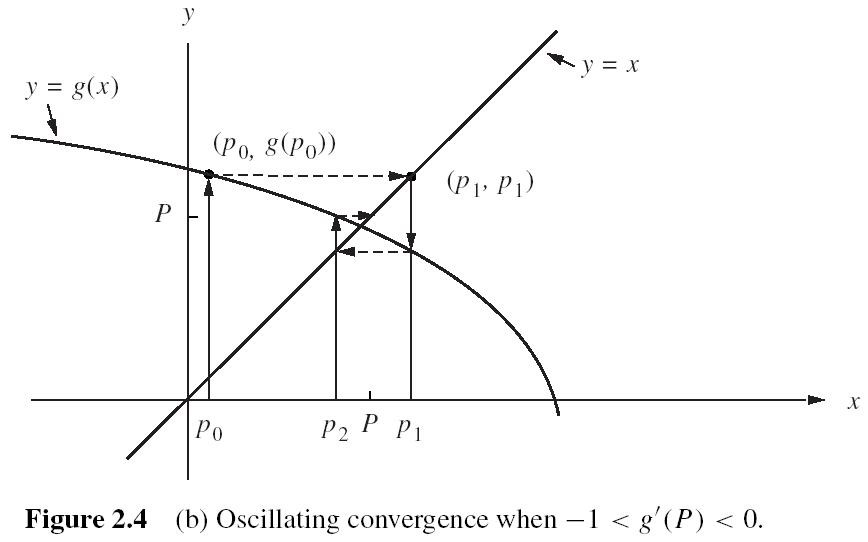
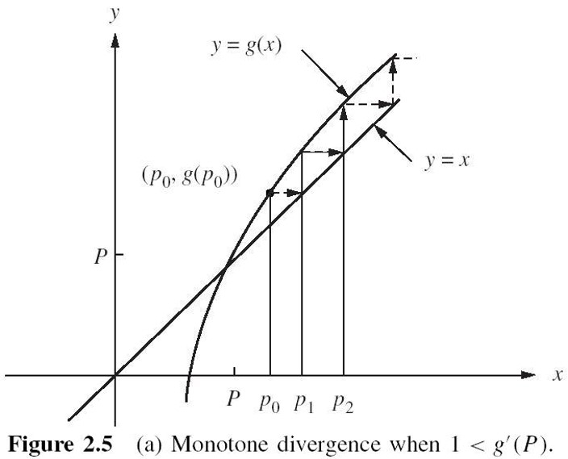
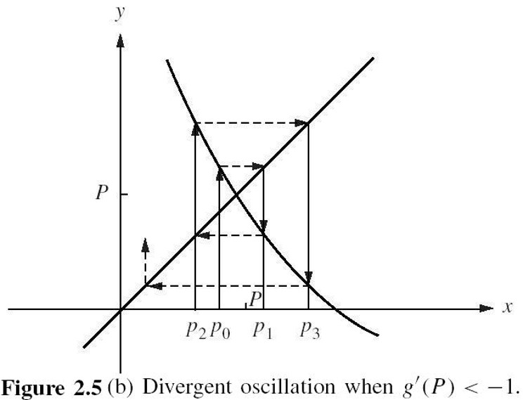

# 2019.9.2

> 课前回顾
>
> - 霍纳算法
> - 有效位数
> - Big Oh（复杂度）

## 有效位数

$\hat{p}$ 被称作**近似**（***approximate***）  
$$
\frac{|p - \hat{p}|}{|p|} < \frac{10^{1 - d}}{2}
\text{其中 $d$ 是 $\hat{p}$ the largest nonnegative integer }
$$

## Big Oh $O(h^n)$ Order of Approximation

> 纯粹的数学，并不实际；实际的数学，并不纯粹。 --爱因斯坦

- 定义

$$
\frac{|f(h) - p(h)|}{|h^n|} \leq M
\text{, for sufficiently small $h$}
$$

$p(h)$ approxiamtes $f(h)$: $f(h) = p(h) + {\bf{O}} (h^n)$

- 相关运算

$$
{\bf{O}} (h^n) · {\bf{O}} (h^m) = {\bf{O}} (h^{m+n})
$$

假设 $f(h) = p(h) +{ \bf{O}} (h^n)$ 、 $g(h) = q(h) + {\bf{O}} (h^m)$ 并且 $r = \text{min} \lbrace m, n \rbrace$，那么

$$
f(h) + g(h) = p(h) + q(h) + {\bf{O}} (h^r) \\
f(h)g(h) = p(h))q(h) + {\bf{O}}(h^r) \\
\frac{f(h)}{g(h)} = \frac{p(h)}{q(h)} + {\bf{O}} (h^r)
$$

> $C$ 代表 *Continous*，即连续（区间），例如：$C^{n+1}[a, b]$

- 泰勒展开

泰勒定理：假设 $f \in C^{n+1} \left\[ a, b \right\]$，如果 $x_0$ 和 $x = x_0 + h$ 都处在 $\left\[ a, b \right\]$中，那么：
$$
f(x_0 + h) = \sum_{k = 0}^{n} \frac{f^{(k)}(x_0)}{k!} h^k + {\bf{O}} (h^{n+1})
$$
<!---->
应用：计算机计算函数的简化（**大于误差**的都不会用管）

## 作业

|P 13|P 37|
|:-:|:-:|
|14|1, 3, 9|

> 考试范围  
>
> |期中考试|期末考试|
> |:-----:|:-----:|
> |ppt 1~5|ppt 1~9|

## 非线性方程 Nonlinear Equations

> 作用：**解非线性方程**

要点：

1. Fixed Point Iteration 固定点 / 不动点迭代 $x_{i+1} = g(x_i)$
2. Bisection 二分法（略讲）
3. **Newton 牛顿法**（是不动点迭代的一个特例）：$x_{i+1} = x_i - \frac{f(x_i)}{f'(x_i)}$

牛顿法可以：若能有解则前提需要**收敛**

- 求解非线性方程
- 求解矩阵逆
- 求解矩阵开平方根
- 等等

例子

1. 
2. 

> - attractive fixed point: convergence（收敛）
> - repelling fixed point: divergence(发散)

两种收敛

- Monotone(单调) Convergence  

- Oscillating(震荡) Convergence  

两种发散

- Montone(单调) Divergence  

- Oscillating(震荡) Divergence  

