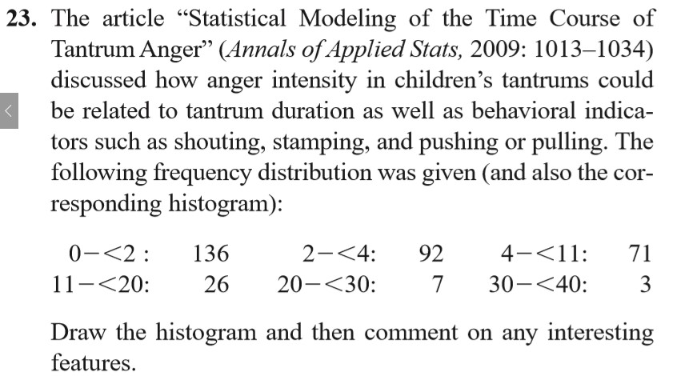
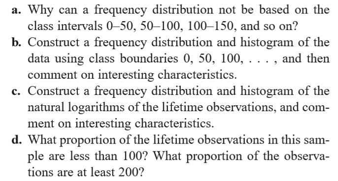
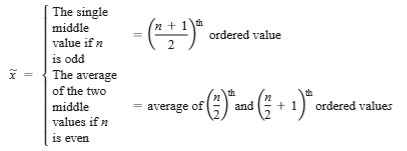

# 2019.8.28

前情回顾

- 作业：
    - 形式：交**纸**
    - 时间：上课交，**两周**收一次
    - 量：不会太多

[//]: # (老师说他自己大学的时候能够熬夜到5、6点，7、8点起来之后继续去上学)
[//]: # (老师：如果身体不行的话，推荐你考个研，然后去找个事业单位的工作（比如说公务员）；精力不够，学历来凑)

- 描述性的数据：
    - 茎叶图 *stem-and-leaf displays*
    - 克利夫兰（*Cleveland*提出）点图 *dotplots*

> 点图存在理论缺陷：  
>    - 无法特别精确地定位到位置/点精度过高时无法在轴上放点
>    - 但是现实生活中获取到的数据是有精度截取的

## Dotplots

The data set is reasonably small or there are relatively few *distinct* data values. 

## 直方图 *Histogram*

变量类型：  
- Discrete (离散) Variable: either is **finite** or else can be **listed in an infinite sequence** (有限个/无限序列可列中）
- Continuous Variable: Consisit of **an entire interval** on the number line. （数轴上的一个区间，不可列）

### 相对频率

相对频率 = 特定值的数量 / 观测值的数量  
  
> 计算相对频率时，由于真实数据需要四舍五入，最终总频率**可能不为1**（可能超过也可能少于）  

- 根据数据是否离散
    - 离散情况下可以直接算出频率
    - 连续情况下需要寻找/划分一个**合理的区间**  
    
        - 区间划分常规在`5 ~ 20`类或者`根号x`类
        - 部分数据分布**不均衡**（某些比较集中，某些不叫稀疏）的情况下，采用**非等长**的分隔（可变区间长度）
        - 直方图`长 * 宽`能够得到相对频率  
          
        
- 根据直方图的形状  
    - 单峰 / 多峰  
    - 对称 / 非对称  

- 数据分类
    - Qualitative Data （定性数据/一元数据）：等间隔
    - Multivariate Date （多元数据）
    > 参考第11~14章

## 作业

Ex. 14, 19, 23, 27

  
  
  
  
  

## 1.3 Measures of Location

### The Mean 均值

- Sample Mean 样本均值：  
    - **线性**：数据**不敏感** - 样本中的每一个值都对其有贡献  
    - 复杂度：O(*n*)  

- Sample Median 样本中值（中位数）：  
    - **非线性**：数据敏感 - 少量数据能够极大影响该值  
    - 复杂度：最少 O(*n*log(*n*))   

在单峰曲线图中，均值与中值的关系  

### Other Measures of Location

- Quartiles 四分位数：以中值/均值为中点，进行**四等分**  
- Percentiles  百分数位：把数据分成**一百等分**，一般是样本数量为`100的倍数`
- Trimmed Means 修正后的均值：A compromise between *sample mean* & *sample median* （抛弃异常点）  
  e.g 去掉最高位 & 最低位

## 作业

Ex. 36, 40, 41  

  
  
  

[//]: # (老师：我在中大读大一的时候，体育分别选了：篮球、足球、棒球；棒球选了一年，分数还很低。。。)
[//]: # (老师口癖：会在说完话之后加个“对”)