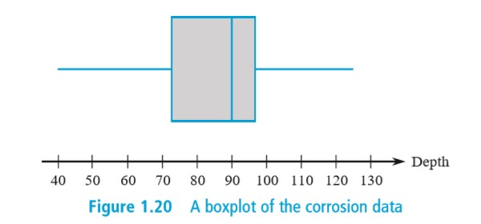
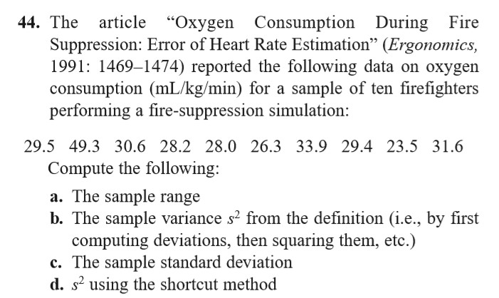
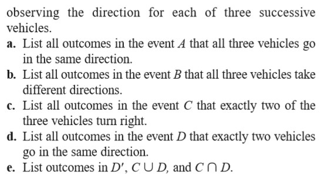

# 2019.9.4

课程公共邮箱

> 邮箱：sysu_19_ptms@163.com  
> 密码：sysu2019

> 统计量：统计的**变量**

[\\]: # (我国数学传承自苏联，普遍描述概念，再告诉你怎么做；西方是先告诉你怎么做，在告诉你为什么)

## 1.4

### 方差

补充：线性规律

1. If $y_1 = x_1 +c, y_2 = x_2 + c, \cdots, y_n = x_n + c$, then $s_y^2 = s_x^2$
2. If $y_1 = cx_1, \cdots, y_n = cx_n$, then $s_y^2 = c^2s_x^2, s_y = | c |s_x$

### Boxplot

特点

- *Center*
- *Spread*
- the *extent* and *nature of an departure form symmetry*
- identification of "*Outliers*" (离群点)

#### Outliers 离群点

根据算法，可以算出**异常点**和正常点

相关操作

- Outlier: 点到四分数的距离大于1.5*fs* - 离群点
- Extreme: 距离大于3*fs*的离群点 - 极端离群点
- Mild: 距离小于3*fs*的离群点 - 轻度/中度离群点

表示

- **实心点**表示轻度/中度离群点
- **空心点**表示极端离群点

## 2.1

什么是**概率** *probability*

- 可量化的
- refers to the study of **randomness** and **uncertainty**
- 概率论 provides methods for **quantifying** the changes, or likehoods

Experiment: 结果不确定，但一定有结果  
Sample Space (样本空间): **所有**可能结果的集合  
> The sample space of an experiment, denoted by , is the set of all possible outcomes of that experiment. 

Event (事件)：是样本空间的**子集**（包含样本空间中的**至少一个结果**）。**简单事件**只包含**一个**结果；**复杂事件**包含**多个**结果。  
> An event is any **collection (subset)** of outcomes contained in the sample space $\zeta$ . An event is simple if it consists of exactly **one outcome and compound** if it consists of more than one outcome. 

三种关系

- Union (并集): $A \bigcup B$ "A and B"
- Intersection (交集): $A \bigcap B$ "A or B"
- complement (交集): $\overline{A} or A'$ "not A"

互斥事件（不相交）：$A \bigcap B = \emptyset$, **mutually exclusive** or **disjoint** events

## 2.2

> 以下公理只能对应**离散、可列**的样本情况，对不可列样本不能成立

AXIOM 1: 对于任意事件A，$P(A) \geq 0$  
AXIOM 2: $P(\zeta) = 1$  
AXIOM 3: $P(A_1 \bigcup A_2 \bigcup A_3 \bigcup \cdots) = \sum_{i = 1}^{\infty} P(A_i)$

## 作业

1.4 - 44, 54  
2.1 - 2, 4, 9

| 章节  | 题目  |                          图片                          |
| :---: | :---: | :----------------------------------------------------: |
|  1.4  |  44   |                                 |
|       |  54   |   |
|  2.1  |   2   |       |
|       |   4   |                                     |
|       |   9   |                                     |
