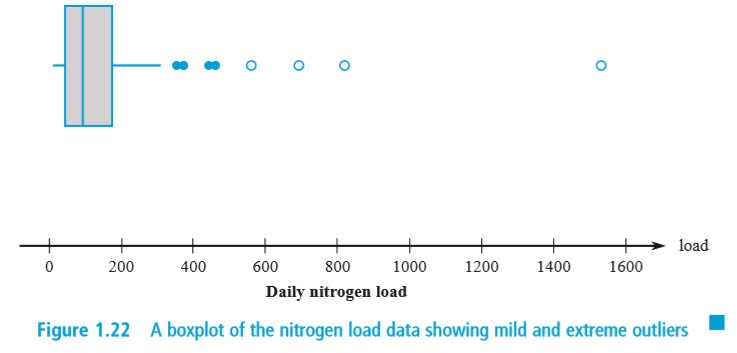
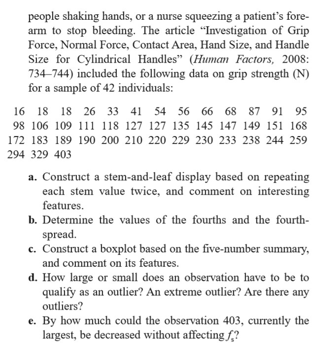

# 2019.9.4

课程公共邮箱

> 邮箱：sysu_19_ptms@163.com  
> 密码：sysu2019

> 统计量：统计的**变量**

[\\]: # (我国数学传承自苏联，普遍描述概念，再告诉你怎么做；西方是先告诉你怎么做，在告诉你为什么)

## 1.4

### 方差

补充：线性规律

1. If $y_1 = x_1 +c, y_2 = x_2 + c, \cdot, y_n = x_n + c$, then $s_y^2 = s_x^2$
2. If $y_1 = cx_1, \cdots, y_n = cx_n$, then $s_y^2 = c^2s_x^2, s_y = \left| c \right|s_x$

### Boxplot

特点

- *Center*
- *Spread*
- the *extent* and *nature of an departure form symmetry*
- identification of "*Outliers*" (离群点)

#### Outliers 离群点

根据算法，可以算出**异常点**和正常点

相关操作

- Outlier: 点到四分数的距离大于1.5*fs* - 离群点
- Extreme: 距离大于3*fs*的离群点 - 极端离群点
- Mild: 距离小于3*fs*的离群点 - 轻度/中度离群点

表示

- **实心点**表示轻度/中度离群点
- **空心点**表示极端离群点

## 作业

Section 1.4 44, 54

|章节|题目|图片|
|:-:|:-:|:-:|
|1.4|44||
||54| |

## 2.1

什么是**概率** *probability*

- 可量化的
- refers to the study of **randomness** and **uncertainty**
- 概率论 provides methods for **quantifying** the changes, or likehoods
