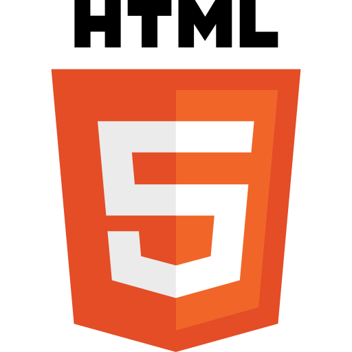
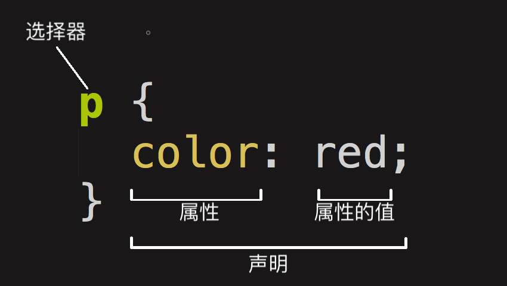

# Web 入门基础

## 内容

* Web 三件套： HTML，CSS，JavaScript
  * HTML
  * CSS
  * JS
* 框架介绍：Angular
* 设计/架构模式：MVC，MVP，DDD
  * MVC
  * MVP
  * DDD
* 参考资料

## 前言

web 技术现在已经遍布我们身边的方方面面，无论是移动端还是PC端，我们总在和 web 打交道，从最简单的展示页面（比如说老式的博客），到逐渐被抛弃的页游（比如说赛尔号和奥比岛，时代的眼泪啊），再到现在琳琅满目的 APP （比如说现在的 Matrix，甚至我们现在用来打代码的 VSCode），这些都是 web 技术的体现。

学习 web 需要了解：

1. 文本标记语言，HTML
2. 样式表语言，比如 CSS，Less，Stylus
3. 唯一指定动态编程语言，JavaScript

其中，`文本标记语言`负责表述页面的结构，`样式表语言`负责整个页面的装饰效果，而 `JavaScript` ，则控制着整个页面的行为与交互

我们可以发现，想要学习 Web ，相比与 C 和 C++ 等编程语言，我们需要学习的东西有很多，但是，和初学编程语言时只能碰到黑乎乎的命令行窗口不同，Web 倒是一种“最容易”让你的代码脱离命令行窗口的方式了。

不过在此之前，我们还需要了解一下 Web 是如何运作的，请看下面这张图：


简单来讲，Web 的运作方法就是：
* 你（客户端）向 服务器 提交请求（例如 Http Request）
* 服务器解析请求，并返回对应的响应（例如 Http Response）
* 客户端解析文件，并向用户展示解析结果（表现形式可以是网页/动画等）
* ......（循环上面三个步骤）

## Web 基础三件套

### HTML（超文本标记语言）



#### 1. HTML 是什么

超文本标记语言 (英语：Hypertext Markup Language，简称：HTML ) 是一种用来结构化 Web 网页及其内容的标记语言。网页内容可以是：一组段落、一个重点信息列表、也可以含有图片和数据表。

HTML 由一系列的元素（elements）组成，这些元素可以用来包围不同部分的内容，使其以某种方式呈现或者工作。 一对标签（ tags）可以为一段文字或者一张图片添加超链接，将文字设置为斜体，改变字号，等等。

如果你学过 markdown ，那么了解对 HTML 的那一套模式也不太难

#### 2. HTML 元素（Element）

一般来讲，一个元素的结构如下图：


元素中还可以携带属性，我们一般在开始标签中插入属性，具体如下图：

.png)

HTML 的元素有很多，在此不一一说明，我们常用一些的有：

```HTML
<!-- 1. 包含整个页面内容 -->
<html></html>

<!-- 2. 该元素的内容不是直接展示给用户，这里我们可以引入 CSS 文件 -->
<head></head>

<!-- 3. 该元素的内容包含期望让用户访问页面是看到的内容 -->
<body>整个页面的内容</body>

<!-- 4. 表示段落 -->
<p>这是一个段落</p>

<!-- 5. 一个块级元素 -->
<div>一个块级元素</div>

<!-- 6. 一个行内元素 -->
<span>一个行内元素</span>

<!-- 7. 插入一个js文件 -->
<script>
    // 这里面是 JavaScript 代码
</script>

<!-- 一个完整的 HTML 文档结构 -->
<!DOCTYPE html>
<html>
  <head>
    <meta charset="utf-8">
    <title>测试页面</title>
  </head>
  <body>
    测试内容
    
  </body>
</html>
```

HTML 中除了嵌入文本之外，还能够嵌入图片，音频/视频等，没有你想不到，只有你做不到。

### CSS（层叠样式表）


#### CSS 是什么

层叠样式表（Cascading Style Sheet，简称：CSS）是为网页添加样式的代码。

人们可以用它来选择性地为 HTML 元素添加样式。

#### CSS 怎么用



选择器不仅可以通过 HTML 元素的名字来选择对应的元素，还可以通过这个 HTML 元素的 class / id 来进行选择，还可以选择这个元素的第几个子元素，从而实现更加自定义的样式控制，例子如下

```HTML
<!DOCTYPE html>
<html>
  <head>
    <meta charset="utf-8">
    <title>测试页面</title>
  </head>
  <body>
    <P class="test1">这是测试段落</p>
    <p id="test2">
        测试段落2
        <span>测试子元素</span>
        <span>测试子元素2</span>
    </p>
  </body>
</html>
```

```CSS
/* 选中 class 为 test1 的段落 */
.test1 {
    color: red;
}

/* 选中 id 为 test2 的段落 */
#test2 {
    color: yellow;
}

/* 选中所有的 span */
span {
    color: green;
}

/* 选中 id 为 test2 的段落中的第二个子元素 */
#test2:nth-child(2) {
    color: grey
}
```

需要注意的是，如果需要上述 CSS 的效果，

CSS 还能制作出许多特效，比如说按钮的动态交互效果，以及其他动画效果，比如说走马灯，在此不一一赘述，有兴趣的同学可以去我列出的参考资料里面的 mdn 网站去学习

### JavaScript


JavaScript 是一门完备的`动态编程语言`，当应用于 HTML 文档时，可为网站提供动态交互特性。（例如：游戏、动态样式，动画，以及在按下按钮或收到表单数据时做出的响应，等）。

> 这里为什么要注明是应用于 HTML 文档呢，因为 JS 存在很多的版本，其中有个叫做 Node.js ，这个版本 JS 是可以拿来写后端和服务器的。而且 JS 还有很多其他的用法。
> 
> 

开发者们基于 JavaScript 核心编写了大量实用工具，可以使 开发工作事半功倍。其中包括：
* 浏览器应用程序接口，可以用来动态创建 HTML 和修改 CSS 样式，生成图像和音频等。
* 第三方 API ，让开发者可以在自己的网站中使用其他开发者提供的功能。
* 第三方库，用来构建网站和应用

#### JS 的学习

JS 是一门动态编程语言，和静态编程语言的 C 和 C++ 不同的是，JS 不需要通过编译器进行编译，来生成可执行文件，而是能够直接在环境中直接执行，或者说，一行一行的执行，在哪里出现错误就在哪里停下来。如果你学过 python 的话，对这个概念应该会比较了解。

如果你想尝试一下简单的 JS 代码，可以直接在浏览器按`F12`打开开发者工具，在控制台（console）输入即可，非常方便。

JS 常见的数据类型有：
* 字符串 String
* 数字 Number
* 布尔值 Boolean
* 数组 Array
* 对象 Object

JS 的语法大致可以照搬 C 的，但是格式要求可能没那么严格，比如说每行后面加不加分号，当然，我个人建议还是加上的；并且， JS 的变量并没有要求声明数据类型，这点和 Python 很相似，因此数据类型的坑近乎人人初学的时候都踩过。下面列出了一些常见的 JS 语句：

```JavaScript
var a = 1; // 声明变量
let b = 2; // 也是声明变量，不过个人更喜欢用这个，因为 var 似乎存在的作用域问题
c = 1; // 这样也同样是可以的，但是作用域会变成全局，很多人踩过这个坑

// 选择语句
if (a) {
    a++;
}
else if (b === c) { // 为什么是 === 呢？
    console.log(c--); // 在 JS 中我们更常用这个 print() 相关的信息
}

// 循环语句
while(a == b) {
    a--;
}

// 获取到在 HTML 文档中 id 为 marguee 的 HTML 元素对象
document.getElementById('marquee'); 
// 获取在 HTML 文档中 class 为 marquee 的 HTML 元素，返回一个数组
document.getElementByClassName('marquee'); 
```

我们可以看到，这个例子的后面几行，展示了通过 JS 动态控制 HTML 和 CSS 的可能性，而在现实中，我们常常也这么干，`document,getElementById()`是原生 JS 的写法，写起来还是比较麻烦的，这就存在 jQuery 这种现成的库帮助简化操作，不过这就需要你们自己去了解了，毕竟我自己也只是个新人。

> 我们可以通过 `<script></script>` 标签在 HTML 中引入 JS 文件，但是一般都放在 `<body></body>` 元素的最后，这是因为：由于浏览器动态加载的原因，如果我们在 `<head></head>` 标签中引入的话，在这个这个标签中的内容没有下载完成的情况下， `<body></body>` 的内容没法完全展示给用户看，当 JS 文件又大有多的时候，这个网页的空白时间就会非常的常，十分的 `user-unfriendly`

#### 关于 Node.js

前面我们说到，Node.js 可以拿来写后端，事实上，大多数 web 开发者，都选择在使用 Node.js 搭建的简易服务器环境下，模拟网络的环境，从而在本地电脑上进行调试的。

对于简单的网页，我们只需要编写 .js 文件，让 node.js 运行这个文件即可，下面是一个简单的例子：
```JS
let http = require("http");
let url = require("url");
let fs = require("fs");

http.createServer(async (request, response) => {
    if (request.url == "/") { // 主页
        fs.readFile("./index.html", "utf-8", (err, html) => {
            response.writeHead(200, {"Content-Type" : "text/html"});
            response.end(html);
        });    
    }
}).listen(8000); // 设置监听端口为 8000
```

当服务器启动后，会一直监听这个端口，得到请求后进行解析，最终返回合适的数据，是不是觉得和之前我们讲的 web 运作原理很一模一样

## Angular 框架