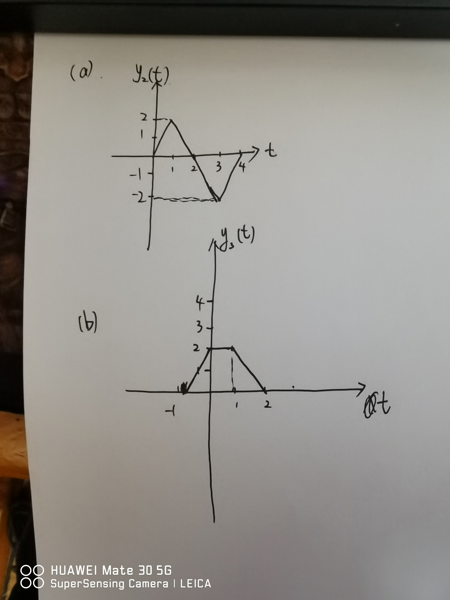

# 信号与系统第一周作业

## 第一章习题

### 14

$$
    \begin{aligned}
        \frac{ \ {\rm d} x(t)}{ \ {\rm d} t} & = 3 \delta(t - 2k) + (-3) \delta (t - 2k + 1) \\
                                    & = 3 g(t) - 3 g(t - 1)
    \end{aligned}
    \\
\therefore
    \begin{cases}
        A_1 = 3, \\
        A_2 = -3, \\
        t_1 = 0, \\
        t_2 = 1
    \end{cases}
$$

### 15

(a)
$$
    \begin{aligned}
        S: y[n] & = y_2[n] \\
                & = y_1[n - 2] + \frac{1}{2} y_1[n - 3] \\
                & = (2 x[n - 2] + 4 x[n - 3]) + \frac{1}{2} (2x[n - 3] + 4x[n - 4]) \\
                & = 2 x[n - 2] + 5 x[n - 3] + 2 x[n - 4]
    \end{aligned}
$$

(b)
$$
    \begin{aligned}
        S: y[n] & = y_1[n] \\
                & = 2 y_2[n] + 4 y_2[n - 1] \\
                & = 2 (x[n - 2] + \frac{1}{2} x[n - 3]) + 4 (x[n - 3] + \frac{1}{2} x[n - 4]) \\
                & = 2 x[n - 2] + 5 x[n - 3] + 2 x[n - 4]
    \end{aligned}
$$

没有变化

### 20

(a)

已知
$$
1：
    \begin{cases}
        x_a(t) = e^{i2t} = {\rm cos} \ (2t) + i \ {\rm sin} \ (2t) \\
        y_a(t) = e^{i3t} = {\rm cos} \ (3t) + i \ {\rm sin} \ (3t)
    \end{cases}
$$

$$
2：
    \begin{cases}
        x_b(t) = e^{-i2t} = {\rm cos} \ (-2t) + i \ {\rm sin} \ (-2t) \\
        y_b(t) = e^{-i3t} = {\rm cos} \ (-3t) + i \ {\rm sin} \ (-3t)
    \end{cases}
$$

可以得到
$$
    \begin{cases}
        x_1(t) = {\rm cos} \ (2t) = (e^{i2t} + e^{-i2t}) / 2 \\
        y_1(t) = (e^{i3t} + e^{-i3t}) / 2 = {\rm cos} \ (3t)
    \end{cases}
$$

(b)

已知
$$
    \begin{aligned}
        x_2(t) & = {\rm cos} \ (2 (t - \frac{1}{2}))\\
            & = {\rm cos} \ (2t - 1) \\
            & = {\rm cos} \ (2t) \cdot {\rm cos} \ 1 + {\rm sin} \ (2t) \cdot {\rm sin} \ 1 \\
            & = x_1(t) \cdot {\rm cos} \ 1 + (- i \ x_a(t) + i \ x_b(t)) / 2 \cdot {\rm sin} 1
    \end{aligned}
$$

所以
$$
    \begin{aligned}
        y_2(t) & = y_1(t) \cdot {\rm cos} \ 1 + (- i \ y_a(t) + i \ y_b(t)) / 2 \cdot {\rm sin} \ 1\\
            & = {\rm cos} \ (3t) \cdot {\rm cos} \ 1 + {\rm sin} \ (3t) \cdot {\rm sin} 1 \\
            & = {\rm cos} \ (3t - 1)
    \end{aligned}
$$

### 25

(a) 是，$N = \frac{\pi}{2}$

(b) 不是

### 26

(b) 不是

(d) 是，$N = 8$

### 31

