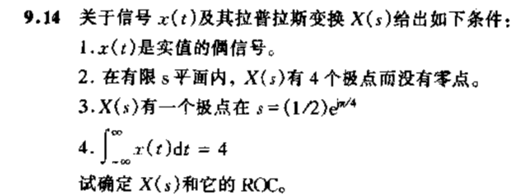
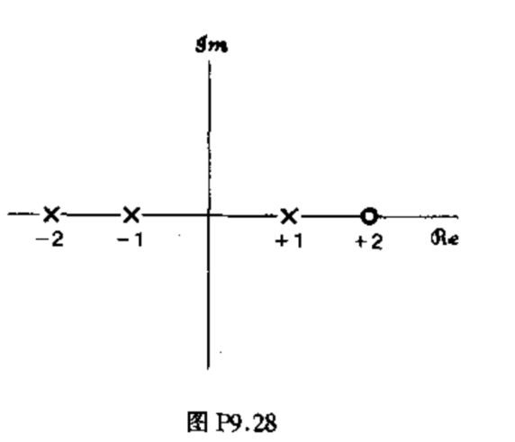

# 信号与系统

- [信号与系统](#信号与系统)
  - [第九章](#第九章)
    - [9.3](#93)
    - [9.6](#96)
    - [9.11](#911)
    - [9.14](#914)
    - [9.20](#920)
    - [9.28](#928)

## 第九章

### 9.3

得到

$$
\begin{aligned}
  X(t) & = \frac{1}{s + 5} + \frac{1}{s + \beta_{1}}, {\cal Re} \{s\} > -3
\end{aligned}
$$

也就是说 ${\cal Re} \{ \beta \} = 3$ ，而 ${\cal Im} \{\beta\}$ 没有限制

### 9.6

(a) 不可能

(b) 是

(c) 不是

(d) 是

### 9.11

$$
|X(j\omega)| = 1
$$

### 9.14

$$
X(j\omega) = \frac{1}{4} \cdot \frac{1}{s^2 - s/\sqrt{2} + 1/4} \cdot \frac{1}{s^2 + s/\sqrt{2} + 1/4}, \quad {\cal Re} \{s\} \in (-\frac{\sqrt{2}}{4}, \frac{\sqrt{2}}{4})
$$

### 9.20

(a) 

当输入为 $x(t) = e^{-2t}u(t)$ 时，零状态响应为

$$
e^{-t}u(t) - e^{-2t}u(t)
$$

(b)

当 $y(0^-) = 1$ 时，对于 $t > 0^-$ 是的零输入响应为 $e{-t}u(t)$

(c)

输入电流为 $x(t) = e^{-2t}u(t)$ ，初始条件 $y(0^-) = 1$ 时，对于 $t > 0^-$ 是的零输入响应为 $e{-t}u(t) + e^{-t}u(t) - e^{-2t}u(t) = 2e^{-t} - e^{-2t}u(t)$

### 9.28

通过极点 ${\cal Re} \{s\} = 2$ 判断

- ${\cal Re} \{s\} < 2$ 时，存在如下情况的收敛域
  - $1 < {\cal Re} \{s\} < 2$，非因果不稳定
  - $-1 < {\cal Re} \{s\} < 1$，非因果稳定
  - $-2 < {\cal Re} \{s\} < -1$，非因果不稳定
  - ${\cal Re} \{s\} < -2$，非因果不稳定
- ${\cal Re} \{s\} > 2$ 时，只有这一种情况构成收敛域，因果不稳定
