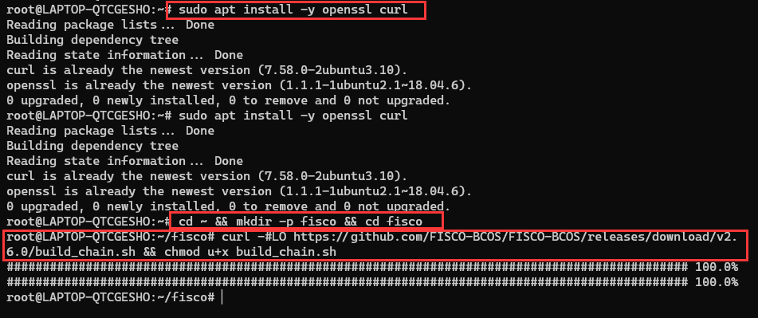
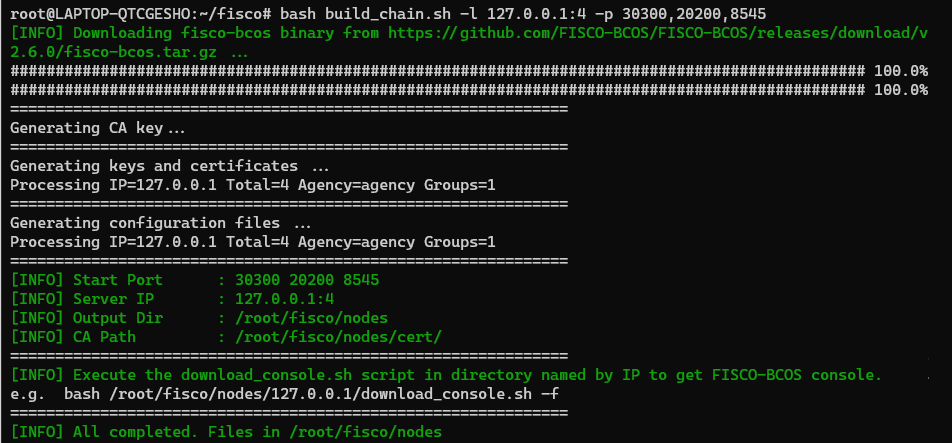
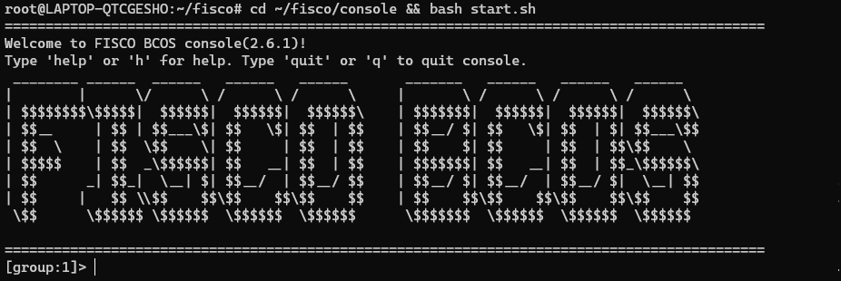
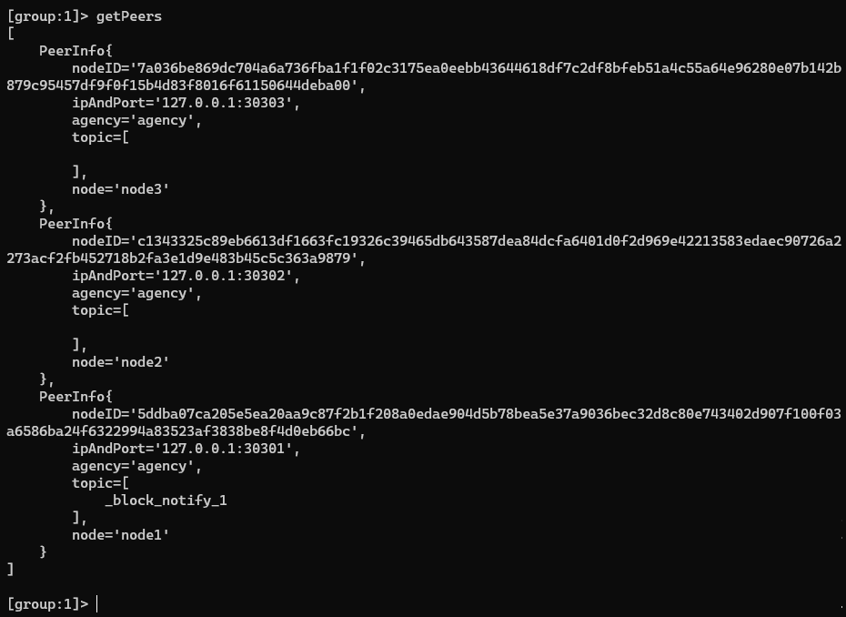
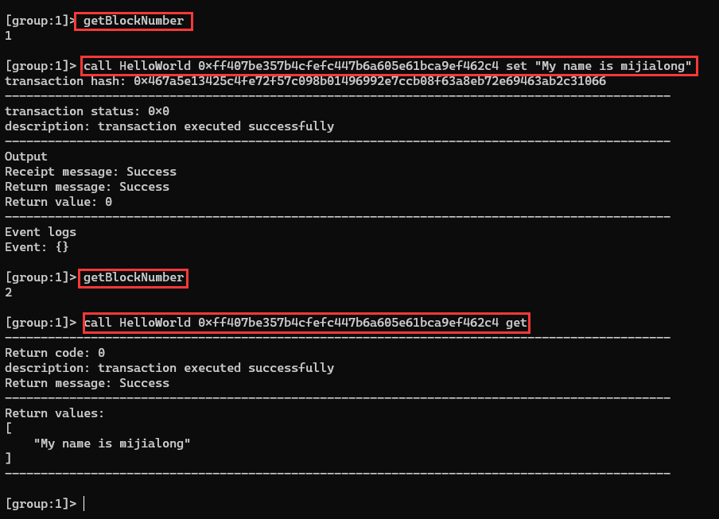

# 区块链期末项目热身

[TOC]

## 内容

1. 使用已有的开源区块链系统FISCO-BCOS，完成私有链的搭建以及新节点的加入。（截图说明搭建流程）
2. 自行编写一个智能合约并部署到私有链上，同时完成合约调用。（截图说明部署流程）
3. 使用命令查看一个区块，并对各个字段进行解释。

## 环境和参考

> 环境说明：使用的是 win10 环境下的 wsl ，linux 版本为 ubuntu 18.04
```bash
root@LAPTOP-QTCGESHO:/mnt/d/blog# uname -a
Linux LAPTOP-QTCGESHO 4.4.0-19041-Microsoft #488-Microsoft Mon Sep 01 13:43:00 PST 2020 x86_64 x86_64 x86_64 GNU/Linux
```

> 教程参考为 [fisco 官方文档](https://fisco-bcos-documentation.readthedocs.io/zh_CN/latest/docs/installation.html#fisco-bcos)

## 单群组 FISCO BCOS 联盟链的搭建

#### 准备环境

根据教程步骤
- 安装 `curl` 依赖
- 创建操作目录
- 下载对应脚本 `build_chain.sh`

```bash
sudo apt install -y openssl curl
cd ~ && mkdir -p fisco && cd fisco
curl -#LO https://github.com/FISCO-BCOS/FISCO-BCOS/releases/download/v2.6.0/build_chain.sh && chmod u+x build_chain.sh
```

结果如下



#### 搭建单群组4节点联盟链

命令为
```bash
bash build_chain.sh -l 127.0.0.1:4 -p 30300,20200,8545
```

> - -p 指定起始端口，分别是 p2p_port, channel_port, jsonrpc_port
> - -l 指定对应 ip 和端口

结果如图：



#### 启动联盟链

执行如下命令：
```bash
bash nodes/127.0.0.1/start_all.sh
```

结果如图：


#### 检查进程和日志输出

检查进程：
```bash
ps -ef | grep -v grep | grep fisco-bcos
```


检查日志输出：
```bash
tail -f nodes/127.0.0.1/node0/log/log*  | grep connected
```


> 图中分别查看了两个节点 node0 和 node1 的日志

## 配置并且使用控制台

> 选择的基于 `Java JDK` 实现的控制台2.6

### 准备依赖

> 需要安装 JDK，命令如下
```bash
sudo apt install -y default-jdk # ubuntu系统安装java
```

- 获取控制台：
```bash
cd ~/fisco && curl -#LO https://github.com/FISCO-BCOS/console/releases/download/v2.6.1/download_console.sh && bash download_console.sh
```

结果如下：


- 拷贝控制台配置文件：
```bash
cp -n console/conf/config-example.toml console/conf/config.toml # 最新版本控制台使用如下命令拷贝配置文件
```

> 若节点未采用默认端口，请将文件中的20200替换成节点对应的channel端口。

- 配置控制台证书：
```bash
cp -r nodes/127.0.0.1/sdk/* console/conf/
```

### 启动控制台

- 启动控制台：
```bash
cd ~/fisco/console && bash start.sh
```

输出如下，说明控制台配置成功：



### 通过控制台获取信息

在控制台执行 `getNodeVersion` 和 `getPeers` 获取客户端版本和节点信息

获取客户端版本：


获取节点链接信息：



## 部署和调用智能合约

### 部署 HelloWorld 合约

在控制台目录下 `/contracts/solidity/` 已经已经有 `HelloWorld.sol` ，查看代码如下：


部署该合约，得到如下输出


> 返回的合约地址 `0xff407be357b4cfefc447b6a605e61bca9ef462c4` 比较重要，因为后续调用合约需要用到

### 调用 HelloWord 合约

#### 查看变量

调用 get 接口，获取 `name` 变量，输出如下：


#### 修改变量

> 修改变量会导致块增加

进行如下操作
- 先查看一次当前区块数量
- 设置 `name` 变量值为 `My name is mijialong.`
- 再次查看当前区块数量
- 再次调用 get 接口查看 `name` 变量的值

操作结果如下：



## 查看区块

可以通过 `getBlockByNumber` 方法查看每个区块：


参考文档中的 [getBlockByNumber](https://fisco-bcos-documentation.readthedocs.io/zh_CN/latest/docs/api.html#getblockbynumber) 函数接口，具体如下：

- 参数
  - `groupID`: `unsigned int` - 群组ID
  - `blockNumber`: `string` - 区块高度(十进制字符串或0x开头的十六进制字符串)
  - `includeTransactions`: `bool` - 包含交易标志( true 显示交易详细信息，false 仅显示交易的 hash )
- 返回值
  - object - 区块信息，字段如下：
    - `extraData`: `array` - 附加数据
    - `gasLimit`: `string` - 区块中允许的gas最大值
    - `gasUsed`: `string` - 区块中所有交易消耗的gas
    - `hash`: `string` - 区块哈希
    - `logsBloom`: `string` - log 的布隆过滤器值
    - `number`: `string` - 区块高度
    - `parentHash`: `string` - 父区块哈希
    - `sealer`: `string` - 共识节点序号
    - `sealerList`: `array` - 共识节点列表
    - `stateRoot`: `string` - 状态根哈希
    - `timestamp`: `string` - 时间戳
    - `transactions`: `array` - 交易列表，当 `includeTransactions` 为 false 时，显示交易的哈希。当 `includeTransactions` 为 true 时，显示交易详细信息

以 `getBlockByNumber 2` 的结果为例：
```json
Block{
    transactions=[
        TransactionHash{
            value='0x467a5e13425c4fe72f57c098b01496992e7ccb08f63a8eb72e69463ab2c31066' // 转移的值
        }
    ], // 交易列表
    number='0x2', // 区块高度
    hash='0xf86626e353ead50156d7c96f2d7df38a634366510188a2bf82ee7d81edae6d84', // 区块哈希
    parentHash='0x6274e7d182cd650a7b2856d3119ecfc2e3d6dfea7941b16d69f1fc8eb1cfdf53', // 父区块哈希
    logsBloom='0x00000000000000000000000000000000000000000000000000000000000000000000000000000000000000000000000000000000000000000000000000000000000000000000000000000000000000000000000000000000000000000000000000000000000000000000000000000000000000000000000000000000000000000000000000000000000000000000000000000000000000000000000000000000000000000000000000000000000000000000000000000000000000000000000000000000000000000000000000000000000000000000000000000000000000000000000000000000000000000000000000000000000000000000000000000000', // log 的布隆过滤器值
    transactionsRoot='0xcba2142fdab56cb2bec3cc8767f42314310cd1371cb3fe985f9006ae4b997a40', // 交易根哈希
    receiptsRoot='0x19f74c42ffdefeb89f001750d7873b3f7be6bfadad0b224bf7eea8135915d59b', // 接受根哈希
    dbHash='0x4174f68bad68593a0207af45839c1dc435cccb4b30922fa166a23542fc24757a', // 数据库哈希
    stateRoot='0x4174f68bad68593a0207af45839c1dc435cccb4b30922fa166a23542fc24757a', // 状态根哈希
    sealer='0x1', // 共识节点序号
    sealerList=[
        5ddba07ca205e5ea20aa9c87f2b1f208a0edae904d5b78bea5e37a9036bec32d8c80e743402d907f100f03a6586ba24f6322994a83523af3838be8f4d0eb66bc,
        6a668a88c1a4866ed77c5d7160ad199837d8841231a003444bdc3bf80530ae52fab5cdd593ecd271dd228b20220c42f5648189b985f3713b2cf5ff99a9ae215f,
        7a036be869dc704a6a736fba1f1f02c3175ea0eebb43644618df7c2df8bfeb51a4c55a64e96280e07b142b879c95457df9f0f15b4d83f8016f61150644deba00,
        c1343325c89eb6613df1663fc19326c39465db643587dea84dcfa6401d0f2d969e42213583edaec90726a2273acf2fb452718b2fa3e1d9e483b45c5c363a9879
    ], // 共识节点列表
    extraData=[

    ], // 额外数据
    gasLimit='0x0', // 区块中允许的 gas 最大值
    gasUsed='0x0', // 区块中所有交易消耗的 gas
    timestamp='0x175e62ef211', // 时间戳
    signatureList=null // 签名列表
}
```