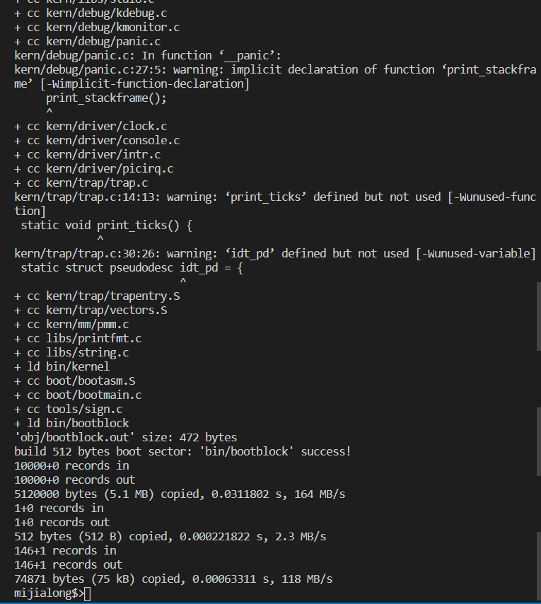
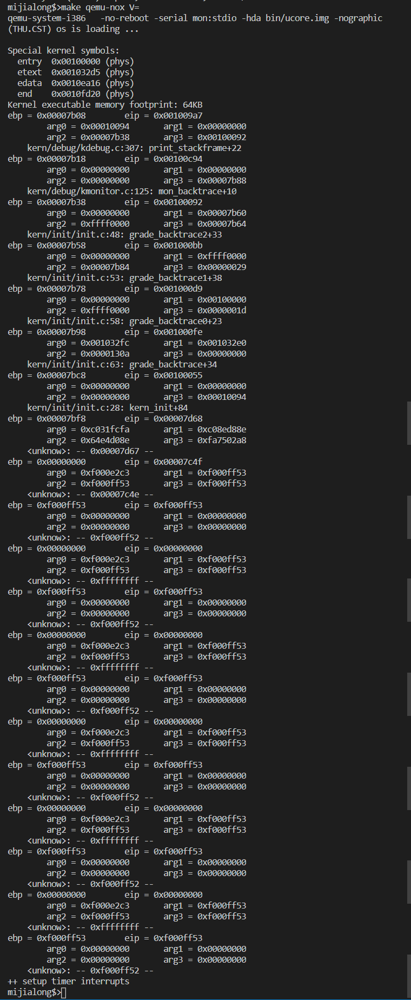
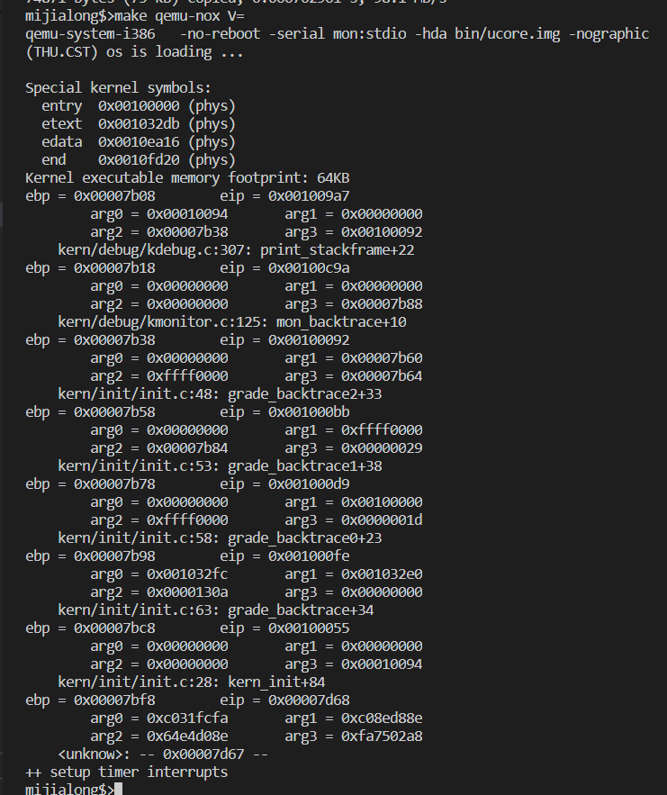
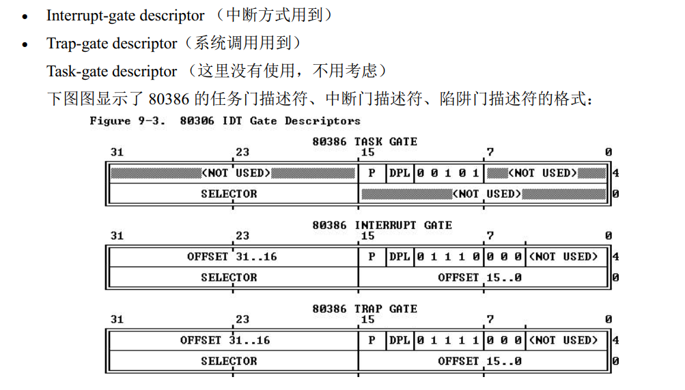
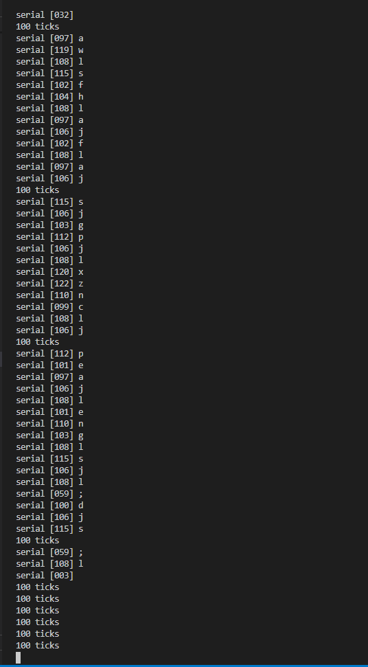
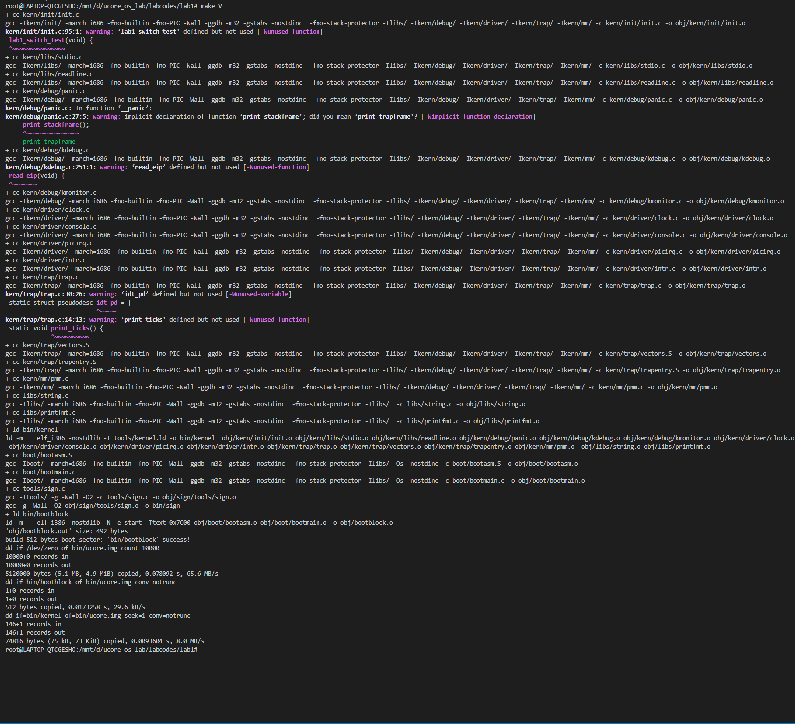
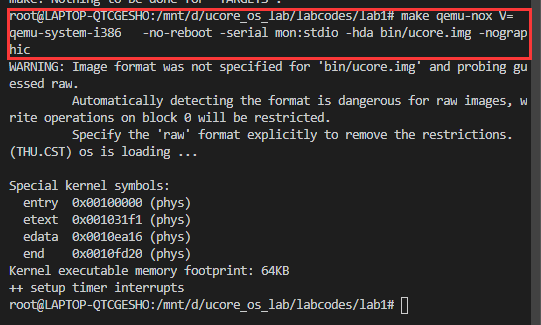

# 实验 2 第 1 部分

- [实验 2 第 1 部分](#实验-2-第-1-部分)
  - [个人信息](#个人信息)
  - [实验名称](#实验名称)
  - [实验目的](#实验目的)
  - [实验要求](#实验要求)
  - [实验环境](#实验环境)
    - [1. 虚拟机](#1-虚拟机)
    - [2. WSL](#2-wsl)
  - [实验过程](#实验过程)
    - [练习3 分析 bootloader 进入保护模式的过程](#练习3-分析-bootloader-进入保护模式的过程)
      - [1. 宏定义](#1-宏定义)
      - [2. 寄存器清零](#2-寄存器清零)
      - [3. 开启 A20](#3-开启-a20)
        - [阶段1](#阶段1)
        - [阶段2](#阶段2)
      - [4. 开启保护模式](#4-开启保护模式)
      - [5. 执行32位代码](#5-执行32位代码)
      - [6. 初始化 gdt](#6-初始化-gdt)
    - [练习4 分析 bootloader 加载 ELF 格式的 OS 过程](#练习4-分析-bootloader-加载-elf-格式的-os-过程)
      - [1. bootloader 如何读取硬盘扇区的](#1-bootloader-如何读取硬盘扇区的)
      - [2. bootloader 如何加载 ELF 格式的 OS 的](#2-bootloader-如何加载-elf-格式的-os-的)
    - [练习5 实现函数调用堆栈跟踪函数](#练习5-实现函数调用堆栈跟踪函数)
    - [练习6 完善中断初始化和处理](#练习6-完善中断初始化和处理)
      - [中断向量表中一个表项占多少字节](#中断向量表中一个表项占多少字节)
      - [其中哪几位代表中断处理代码的入口](#其中哪几位代表中断处理代码的入口)
      - [完善 trap.c 中的 idt_init()](#完善-trapc-中的-idt_init)
      - [完善 trap.c 中的 trap()](#完善-trapc-中的-trap)
  - [实验结果](#实验结果)
  - [实验总结](#实验总结)
    - [问题1：尝试在 WSL 环境下运行相应代码](#问题1尝试在-wsl-环境下运行相应代码)

## 个人信息

- 数据科学与计算机学院
- 2018级 米家龙

## 实验名称

系统软件启动过程 - 第2部分

## 实验目的

- 熟悉并掌握 Ubuntu 系统的相关操作
- 了解并掌握硬件模拟器 Qemu 的操作
- 熟悉并掌握 gdb 的相关操作
- 学会使用 Qemu 和 gdb 运行和调试程序
- 了解 bootloader 进入保护模式的过程
- 了解 bootloader 加载 OS 的过程
- 了解并熟悉操作系统的中断和堆栈调用

## 实验要求

1. 练习3：分析 bootloader 从实模式进入保护模式的过程
2. 练习4：分析 bootloader 加载 ELF 格式 OS 的过程
   1. bootloader 如何读取硬盘扇区的？
   2. bootloader 如何加载 ELF 格式的 OS 的？
3. 练习5：实现函数调用堆栈跟踪函数
4. 练习6：完善中断初始化和处理

## 实验环境

### 1. 虚拟机

使用老师提供的`mooc-os-2015.vdi`，在虚拟机中创建 64 位的 Ubuntu 虚拟机并加载该 vdi ，获得了版本为：

```bash
Linux moocos-VirtualBox 3.13.0-24-generic #46-Ubuntu SMP Thu Apr 10 19:11:08 UTC 2014 x86_64 x86_64 x86_64 GNU/Linux
```

的虚拟机操作系统

并且使用 vscode 配合 Remote SSH 插件，实现通过远程终端在 windows 环境的对文件的编辑

### 2. WSL

WSL 配置如下：

```bash
root@LAPTOP-QTCGESHO:/mnt/d/blog/work/matrix/step1/001# uname -a
Linux LAPTOP-QTCGESHO 4.4.0-19041-Microsoft #1-Microsoft Fri Dec 06 14:06:00 PST 2019 x86_64 x86_64 x86_64 GNU/Linux
```

## 实验过程

### 练习3 分析 bootloader 进入保护模式的过程

从前两个练习中可以分析得到， bootloader 在接手 BIOS 之后，开始执行 `bootasm.S` 中的源码，此时系统处于实模式的运行状态，地址为16位，需要通过修改 A20 地址线进行引导进入保护模式，从而扩大地址到32位并且内存扩大到4G

查看 bootasm.S 的代码，了解 bootloader 是如何从实模式转到保护模式的

#### 1. 宏定义

```s
.set PROT_MODE_CSEG,        0x8                     # kernel code segment selector
.set PROT_MODE_DSEG,        0x10                    # kernel data segment selector
.set CR0_PE_ON,             0x1                     # protected mode enable flag
```

上述代码通过宏定义了内核代码段选择子、内核数据段选择子以及保护模式标志位

#### 2. 寄存器清零

```s
# start address should be 0:7c00, in real mode, the beginning address of the running bootloader
.globl start
start:
.code16                                             # Assemble for 16-bit mode
    cli                                             # Disable interrupts
    cld                                             # String operations increment

    # Set up the important data segment registers (DS, ES, SS).
    xorw %ax, %ax                                   # Segment number zero
    movw %ax, %ds                                   # -> Data Segment
    movw %ax, %es                                   # -> Extra Segment
    movw %ax, %ss                                   # -> Stack Segment
```

上述代码中，设置全局标识符为 `start` ，在该代码中，先设置了运行模式为16位，关闭中断并清除了方向标志

之后将代码段寄存器（DS）、附加段寄存器（ES）和堆栈段寄存器（SS）清零

#### 3. 开启 A20

如前面所受，为了进入保护模式，需要修改 A20 地址线为1，从而开启 A20，修改 A20 是因为：

未开启 A20 时，可访问的物理内存空间为 1MB ，任何地址高于 1MB 的都将被置为 `0x00000`，32位 CPU 所能够管理的的 4G 内存无法使用

启用 A20 分为两个阶段

##### 阶段1

```s
    # Enable A20:
    #  For backwards compatibility with the earliest PCs, physical
    #  address line 20 is tied low, so that addresses higher than
    #  1MB wrap around to zero by default. This code undoes this.
seta20.1:
    # Wait for not busy(8042 input buffer empty).
    inb $0x64, %al                                  # 获取状态寄存器值，存入 al 中
    testb $0x2, %al                                 # 比较首位是否为1
    jnz seta20.1                                    # 如果为0，则跳转到 seta20.1

    movb $0xd1, %al                                 # 0xd1 -> port 0x64
    outb %al, $0x64                                 # 0xd1 means: write data to 8042's P2 port
```

该阶段有两个步骤：

- 等待8042缓冲区为输入为空
- 通过写命令将数据写到8042的 P2 端口

##### 阶段2

```s
seta20.2:
    # Wait for not busy(8042 input buffer empty).
    inb $0x64, %al                                  # 获取状态寄存器值，存入 al 中
    testb $0x2, %al                                 # 比较首位是否为1
    jnz seta20.2                                    # 如果为0，跳转到 seta20.2

    movb $0xdf, %al                                 # 0xdf -> port 0x60
    outb %al, $0x60                                 # 0xdf = 11011111, means set P2's A20 bit(the 1 bit) to 1
```

- 等待8042缓冲区输入为孔
- 通过写命令将数据传送到8042缓冲区，从而开启 A20 

#### 4. 开启保护模式

```s
    # Switch from real to protected mode, using a bootstrap GDT
    # and segment translation that makes virtual addresses
    # identical to physical addresses, so that the
    # effective memory map does not change during the switch.
    lgdt gdtdesc                                    # 加载 gdt
    movl %cr0, %eax                                 # 加载 cr0 到 eax
    orl $CR0_PE_ON, %eax                            # 将 eax 的第0位置0
    movl %eax, %cr0                                 # 使 cr0 的第0位为0

    # Jump to next instruction, but in 32-bit code segment.
    # Switches processor into 32-bit mode.
    ljmp $PROT_MODE_CSEG, $protcseg
```

该过程分为4个步骤：

- 加载 gdt
- 段变换，和 gdt 一起使得虚拟地址和物理地址相同，避免在切换模式的过程中改变有效内存映射
- 将 cr0 中的保护允许位（PE, Protect Enable）置1，从而开启保护模式
- 跳转到32位代码段，使得处理器切换到32位模式

#### 5. 执行32位代码

```s
.code32                                             # Assemble for 32-bit mode
protcseg:
    # Set up the protected-mode data segment registers
    movw $PROT_MODE_DSEG, %ax                       # Our data segment selector
    movw %ax, %ds                                   # -> DS: Data Segment
    movw %ax, %es                                   # -> ES: Extra Segment
    movw %ax, %fs                                   # -> FS
    movw %ax, %gs                                   # -> GS
    movw %ax, %ss                                   # -> SS: Stack Segment

    # Set up the stack pointer and call into C. 
    # The stack region is from 0--start(0x7c00)
    movl $0x0, %ebp
    movl $start, %esp                               # start 是 0x7c00
    call bootmain

    # If bootmain returns (it shouldn't), loop.
spin:
    jmp spin
```

在32位模式下，`protcseg` 汇编代码段主要执行了：

- 将抱歉16位模式下的3个寄存器在内的合计5个寄存器置0
- 设置栈指针并调用  C 代码，转到 bootmain ，进入保护模式完成

> 如果 bootmain 返回了，则进行循环

#### 6. 初始化 gdt

```s
# Bootstrap GDT
.p2align 2                                          # 后移位置计数器，置4字节，用于内存对齐
gdt:
    SEG_NULLASM                                     # null seg
    # code seg for bootloader and kernel
    # 将 0x0 ~ 0xffffffff 设置为 可执行段 或 可读可执行段
    SEG_ASM(STA_X|STA_R, 0x0, 0xffffffff)
    # data seg for bootloader and kernel
    # 将 0x0 ~ 0xffffffff 设置为可读不可执行段
    SEG_ASM(STA_W, 0x0, 0xffffffff)

gdtdesc:
    .word 0x17                                      # sizeof(gdt) - 1 ，代表 gdt 大小
    .long gdt                                       # address gdt
```

### 练习4 分析 bootloader 加载 ELF 格式的 OS 过程

通过阅读 bootmain.c， 了解 bootloader 如何加载 ELF 文件。 通过分析源代码和通过 qemu 来运行并调试 bootloader&OS

#### 1. bootloader 如何读取硬盘扇区的

从查看 bootmain.S 的代码中可以得到，当 bootloader 将 CPU 切换为保护模式之后，会调用 bootmain 函数，从磁盘上加载并运行 OS ，bootloader 的访问硬盘都是 `LBA 模式的 PIO（ Program IO）` 方式， 即所有的 IO 操作是通过 CPU 访问硬盘的 IO 地址寄存器完成

bootloader 通过IO地址寄存器 `0x1f0` - `0x1f7` 读取状态和发出命令。

| IO 地址 |                                   功能                                    |
| :-----: | :-----------------------------------------------------------------------: |
|  0x1f0  |                         当 0x1f7 不为忙状态时可读                         |
|  0x1f2  |                       储存要读写的扇区数量，最少为1                       |
|  0x1f3  |                       LBA 模式下 LBA 参数的 0-7 位                        |
|  0x1f4  |                       LBA 模式下 LBA 参数的 8-15 位                       |
|  0x1f5  |                      LBA 模式下 LBA 参数的 16-23 位                       |
|  0x1f6  |      0-3位：LAB 模式下 LBA 参数的 24-27 位； 第4位：0为主盘，1位从盘      |
|  0x1f7  | 状态和命令寄存器，操作时先给命令再读取，如果不是忙状态则从 0x1f0 读取数据 |

加载相关数据类型和操作的库

```c
#include <defs.h>   // 定义类型、指针位数以及对地址的处理
#include <x86.h>    // 定义 I/O 输入输出，处理描述符表的汇编指令，以及字符串处理函数
#include <elf.h>    // 定义 elf 文件头和进程头信息
```
```c
// 定义扇区大小
#define SECTSIZE        512 
// 定义 ELF 头空间
#define ELFHDR          ((struct elfhdr *)0x10000)
```

```c
/* waitdisk - wait for disk ready */
static void
waitdisk(void) {
    while ((inb(0x1F7) & 0xC0) != 0x40)
        /* do nothing */;
}
```

该函数用于同步等待直到硬盘可读

```cpp
/* readsect - read a single sector at @secno into @dst */
static void
readsect(void *dst, uint32_t secno) {
    // wait for disk to be ready
    waitdisk();

    // outb() 是以 LBA 模式的 PIO 方式读写硬盘
    // 一次只能读写一个扇区
    outb(0x1F2, 1);                             // count = 1 读入的硬盘扇区数量为1
    outb(0x1F3, secno & 0xFF);                  // 设置 LBA 0 - 7 位
    outb(0x1F4, (secno >> 8) & 0xFF);           // 设置 LBA 8 - 15 位
    outb(0x1F5, (secno >> 16) & 0xFF);          // 设置 LBA 16 - 23 位
    outb(0x1F6, ((secno >> 24) & 0xF) | 0xE0);  // 设置 LBA 24 - 27 位，并设置位主盘
    outb(0x1F7, 0x20);                          // 命令 0x20 ，读取数据

    // wait for disk to be ready
    waitdisk();

    // read a sector
    insl(0x1F0, dst, SECTSIZE / 4);             // 获取数据
}
```


综上，读取硬盘的流程如下

 - 首先通过 0x1f7 状态和指令寄存器判断硬盘是否可读
 - 若硬盘可读则向 0x1f7 寄存器中写读指令
 - 再次等待可读
 - 可读后从 0x1f0 处读取硬盘

#### 2. bootloader 如何加载 ELF 格式的 OS 的

```cpp
static void
readseg(uintptr_t va, uint32_t count, uint32_t offset) {
    uintptr_t end_va = va + count;                                      // 结束地址

    va -= offset % SECTSIZE;                                            // 向下舍入，得到扇区边

    // 从字节转换到扇区
    // 使得内核将于扇区1开始
    uint32_t secno = (offset / SECTSIZE) + 1;

    // 可以实现同时读取多个扇区，前提是该函数太慢
    for (; va < end_va; va += SECTSIZE, secno ++) {
        readsect((void *)va, secno);
    }
}
```

该函数用于读取寄存器，从内核的 **offset** 处获取 **count** 个字节的数据到虚拟地址 **va** 中；并且复制得到的内容可能超过 **count** 个字节

bootmain 作为主要的执行函数，里面包含了加载 ELF 格式的 OS 的具体过程，但在分析该函数之前，需要查看包含对应数据结构的 `elf.h` 头文件，来了解相关操作的详情

在 `elf.h` 中，定义了两个结构体，分别为 `elfhdr` ，代表 elf 文件头，和 `proghdr` ，代表程序块头

```cpp
/* file header */
struct elfhdr {
    uint32_t e_magic;     // must equal ELF_MAGIC （0x464C457FU）
    uint8_t e_elf[12];
    uint16_t e_type;      // 1=relocatable, 2=executable, 3=shared object, 4=core image
    uint16_t e_machine;   // 3=x86, 4=68K, etc. 架构
    uint32_t e_version;   // file version, always 1
    uint32_t e_entry;     // 程序入口的虚拟地址（如果存在）
    uint32_t e_phoff;     // program header 表位置的偏移
    uint32_t e_shoff;     // section header 表位置的偏移
    uint32_t e_flags;     // architecture-specific flags, usually 0
    uint16_t e_ehsize;    // elf 头大小
    uint16_t e_phentsize; // 程序头入口的大小
    uint16_t e_phnum;     // 程序头入口的数量
    uint16_t e_shentsize; // 节入口的大小
    uint16_t e_shnum;     // 节入口的数量
    uint16_t e_shstrndx;  // 包含节名称字符串的节的数量
};

/* program section header */
struct proghdr {
    uint32_t p_type;   // 可加载代码/数据/动态链接信息/其他
    uint32_t p_offset; // 段偏移量
    uint32_t p_va;     // map segment 的虚拟地址
    uint32_t p_pa;     // 物理地址，忌用
    uint32_t p_filesz; // 文件中的段大小
    uint32_t p_memsz;  // 内存中的段大小，如果包含了 bss ，那么会更大
    uint32_t p_flags;  // 读/写/执行位
    uint32_t p_align;  // 用于对齐代码
};
```

了解了上述两种头类型，再来看 bootmain() 函数

```cpp
/* bootmain - the entry of bootloader */
void
bootmain(void) {
    // 读取磁盘的第一页
    readseg((uintptr_t)ELFHDR, SECTSIZE * 8, 0);

    // 判断是否是有效地 elf 文件
    if (ELFHDR->e_magic != ELF_MAGIC) {
        goto bad;
    }

    struct proghdr *ph, *eph;

    // 加载程序段
    ph = (struct proghdr *)((uintptr_t)ELFHDR + ELFHDR->e_phoff);
    eph = ph + ELFHDR->e_phnum;
    // 按照表的顺序将 elf 文件数据读入内存
    for (; ph < eph; ph ++) {
        readseg(ph->p_va & 0xFFFFFF, ph->p_memsz, ph->p_offset);
    }

    // 调用 elf 头中的程序入口，并且没有返回值
    ((void (*)(void))(ELFHDR->e_entry & 0xFFFFFF))();

// 用于 elf 无效时的处理
bad:
    outw(0x8A00, 0x8A00);
    outw(0x8A00, 0x8E00);

    /* do nothing */
    while (1);
}
```

综上， bootloader 加载 elf 格式的 os 的过程为：

- 读取磁盘，获得 elf 头
- 通过 elf 头中的 e_magic 字段来判断是否为合法 elf 文件
- 从 elf 头中得到程序头的地址，从而拿到每个段的相关信息
- 通过循环读取每个段的信息
- 根据段的偏移量将程序段数据读入内存


### 练习5 实现函数调用堆栈跟踪函数

根据提示，代码如下

```cpp
void
print_stackframe(void) {
    uint32_t ebp = read_ebp();                              // 获取 ebp
    uint32_t eip = read_eip();                              // 获取 eip

    int i = 0;
    for (i = 0; i < STACKFRAME_DEPTH; i++) 
    {
        cprintf("ebp = 0x%08x\teip = 0x%08x\n", ebp, eip);
        uint32_t *arguments = (uint32_t *) ebp + 2;         // 拿到参数
        cprintf("\targ0 = 0x%08x\targ1 = 0x%08x\n\targ2 = 0x%08x\targ3 = 0x%08x\n", 
                *(arguments), *(arguments + 1), *(arguments + 2), *(arguments + 3));
        print_debuginfo(eip - 1);
        eip = ((uint32_t *)ebp)[1];                         // 将 eip 指向上一个函数栈段的返回地址
        ebp = ((uint32_t *)ebp)[0];                         // ebp 指向上一个函数栈段的 ebp
    }
}
```

通过 `make` 命令能够编译成功



因为是使用终端，因此使用 `make qemu-nox V=` 来查看输出结果，发现输出次数较多，而且存在 ebp 为0的时候仍然在循环，不符合预期



修改代码为

```cpp
void
print_stackframe(void) {
    uint32_t ebp = read_ebp();                              // 获取 ebp
    uint32_t eip = read_eip();                              // 获取 eip

    int i = 0;
    for (i = 0; ebp != 0 && i < STACKFRAME_DEPTH; i++)      // 新增判断条件 ebp != 0，用于避免无意义返回
    {
        cprintf("ebp = 0x%08x\teip = 0x%08x\n", ebp, eip);
        uint32_t *arguments = (uint32_t *) ebp + 2;         // 拿到参数
        cprintf("\targ0 = 0x%08x\targ1 = 0x%08x\n\targ2 = 0x%08x\targ3 = 0x%08x\n", 
                *(arguments), *(arguments + 1), *(arguments + 2), *(arguments + 3));
        print_debuginfo(eip - 1);
        eip = ((uint32_t *)ebp)[1];                         // 将 eip 指向上一个函数栈段的返回地址
        ebp = ((uint32_t *)ebp)[0];                         // ebp 指向上一个函数栈段的 ebp
    }
}
```

通过之前的命令编译和运行后，得到下图结果，可以符合预期



### 练习6 完善中断初始化和处理



#### 中断向量表中一个表项占多少字节

通过上图可以得到为**8字节（64位）**

#### 其中哪几位代表中断处理代码的入口

通过上图可以知道

- 31 - 16位为中断例程的段选择子
- 15 - 0位和 63 - 48位为偏移量，分别是低位和高位
  
上面的数据决定中断代码的入口地址

#### 完善 trap.c 中的 idt_init()

查看 `mmu.h` ，了解到 `SETGATE` 宏的作用和参数

```cpp
/* *
 * Set up a normal interrupt/trap gate descriptor
 *   - istrap: 1 代表陷阱门，0代表中断门
 *   - sel: 中断/陷阱处理的段选择子
 *   - off: 代码段的偏移量
 *   - dpl: 特权级
 * */
#define SETGATE(gate, istrap, sel, off, dpl) {            \
    (gate).gd_off_15_0 = (uint32_t)(off) & 0xffff;        \
    (gate).gd_ss = (sel);                                \
    (gate).gd_args = 0;                                    \
    (gate).gd_rsv1 = 0;                                    \
    (gate).gd_type = (istrap) ? STS_TG32 : STS_IG32;    \
    (gate).gd_s = 0;                                    \
    (gate).gd_dpl = (dpl);                                \
    (gate).gd_p = 1;                                    \
    (gate).gd_off_31_16 = (uint32_t)(off) >> 16;        \
}
```

```cpp
void
idt_init(void) 
{
      extern uintptr_t __vectors[];                                 // 声明 vector
      int i = 0;
      for (i = 0; i < 256; i++)                                     // 对于每一个表项进行设置
      {
        SETGATE(idt[i], 0, GD_KTEXT, __vectors[i], DPL_KERNEL);
      }
      lidt(&idt_pd);                                                // 加载 idt
}
```

和同学讨论和查阅参考资料后，认为需要在该函数中实现用户态权限到内核态权限的切换，因此修改代码

```cpp
void
idt_init(void) 
{
    extern uintptr_t __vectors[];                                 // 声明 vector
    int i = 0;
    for (i = 0; i < 256; i++)                                     // 对于每一个表项进行设置
    {
    SETGATE(idt[i], 0, GD_KTEXT, __vectors[i], DPL_KERNEL);
    }
    用户态到内核态的权限切换
    SETGATE(idt[T_SWITCH_TOK], 0, GD_KTEXT, __vectors[T_SWITCH_TOK], DPL_USER);
    lidt(&idt_pd);                                                // 加载 idt
}
```


#### 完善 trap.c 中的 trap()

修改 `tarp()` 中的 `trap_dispatch()`

```cpp
trap_dispatch(struct trapframe *tf) {
    char c;

    switch (tf->tf_trapno) {
    case IRQ_OFFSET + IRQ_TIMER:
        {
            ticks++;
            if (ticks == TICK_NUM)
            {
                ticks = 0;
                print_ticks();
            }
        }
        break;
    ······
    }
}
```

编译后进行调试，如下图



## 实验结果

分析了 `bootmain.S` 代码，了解了 bootloader 进入保护模式的过程，以及加载 elf 格式的 os 过程

实现了函数调用堆栈跟踪函数，并且完善了中断初始化和处理

## 实验总结

和第一部分相比，该次实验难度提高，需要进行编程，在阅读和编写代码的过程中，我加深了对 os 的理解，对系统从加电到正式启动的过程有了更详细的理解

但对于部分内容，还不是特别熟练，因此需要在理论和实验课中多些注意和学习

### 问题1：尝试在 WSL 环境下运行相应代码

在 WSL 环境下，使用命令 `sudo apt install qemu` 安装 qemu 后，对 lab1 的代码进行编译，发现能够正常编译



使用 `make qemu V=` 则会报错


其中包含了两个错误，第一个是关于镜像格式的错误；第二个是关于显示器设备的问题，可以通过添加参数 `-nographic` 来解决

使用命令 `make qemu-nox V=` 后发现能够得到想要的结果



这两条命令差别除了是否显示图形化界面之外，还包括了并行/串行端口的分配

接下来使用前一份实验报告中的 qemu 命令，尝试复现实验2第1部分

在此之前需要对命令进行修改，修改为 `qemu-system-i386 -S -s -d in_asm -D bin/q.log -serial mon:stdio -nographic -hda bin/ucore.img`

发现终端卡死，即使使用 `ctrl + c` 进行终止也没有反应


但是在 gdb 进行调试之后，仍然会进入无限循环，原因是没有加上 `-no-reboot` 参数，使得 qemu 在程序执行完后会不断重启，从而出现了


加上了 `-no-reboot` 参数之后，虽然出现了终端卡死的情况，但是在进入了 gdb 并且进行了相关调试操作之后，能够正常结束，这表明了虽然终端卡死，但是程序是正常运行的


经过控制变量法测试，发现是 `-S` 参数的问题，在没有该参数时，qemu 能够正常运行，在带有该参数时，则会导致终端卡死，无法接收中断信号

已知该参数是在模拟启动时，将 CPU 冻结，可以通过在 qemu 界面输入 `c` 使得 CPU 停止冻结，开始执行相关文件

猜测是因为使用了 `-serial mon:stdio` 参数，使得 OS 的进程反映到当前的终端上，而 `-S` 参数的存在导致了反映到当前终端的 OS 没有办法接收到信号，而 qemu 本身被 OS 覆盖，也因此无法接收到终端信号的输入，从而使得整个终端卡死

于是将串行端口的相关参数修改为 `-serial null` 再执行命令，进过测试，可以发现能够正常使用，符合上述猜测


综上，可以尝试使用 WSL1 来进行相关的模拟

但是由于 gcc 版本过高的问题，对于会遇到什么样的奇怪 bug 没有定数，因此暂时依然选择使用 moocos 虚拟机进行相关的练习，但是会在练习之后尝试使用 wsl 复现练习情况