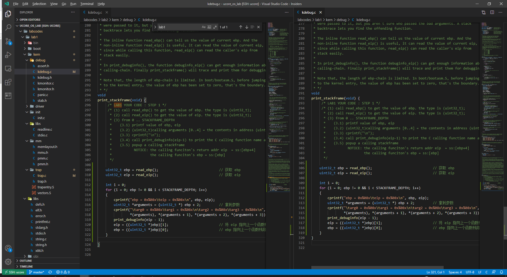
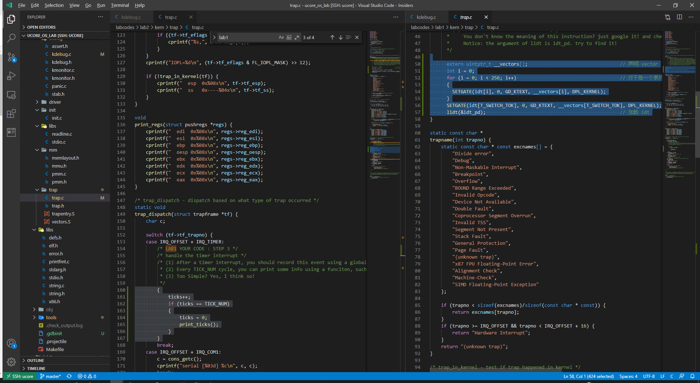
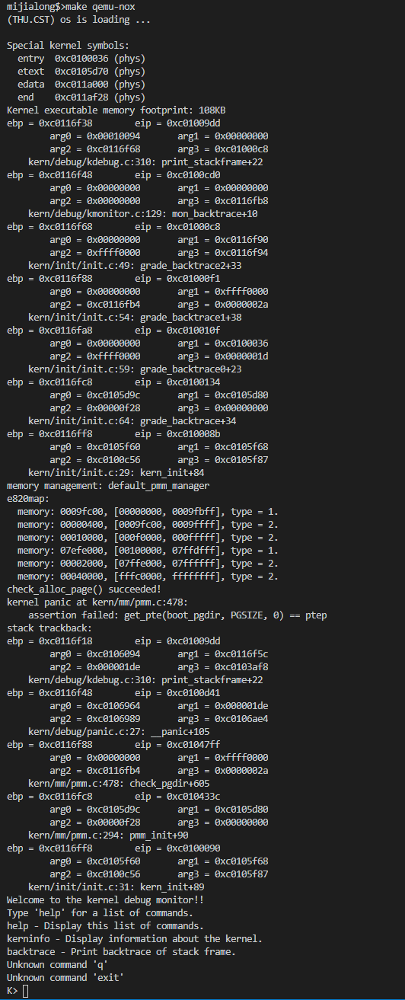
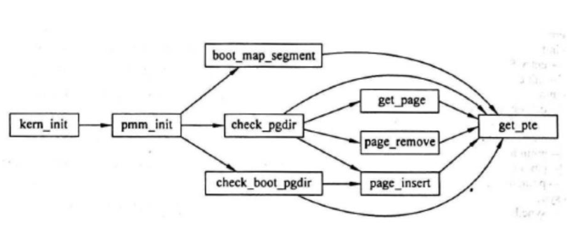
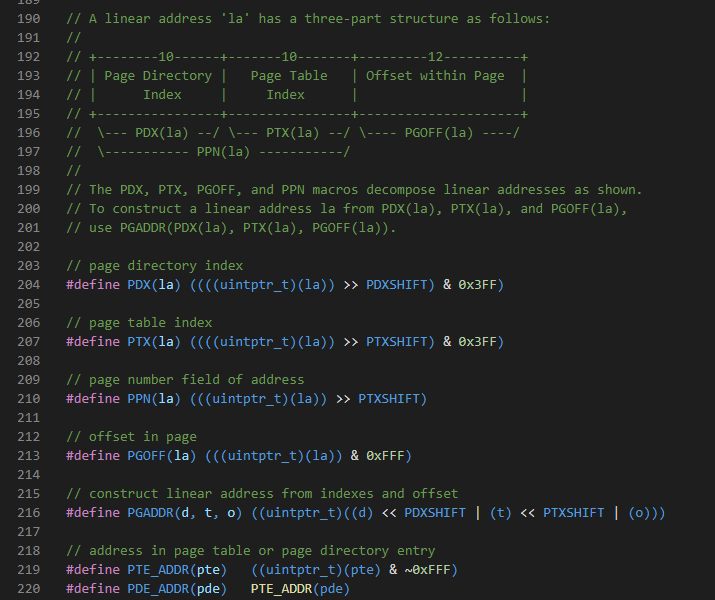
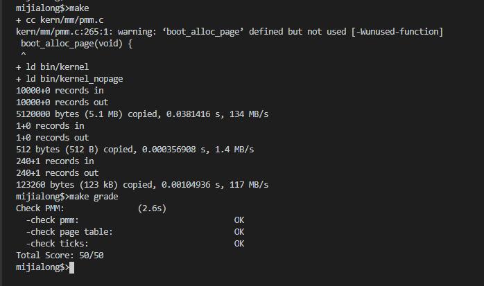
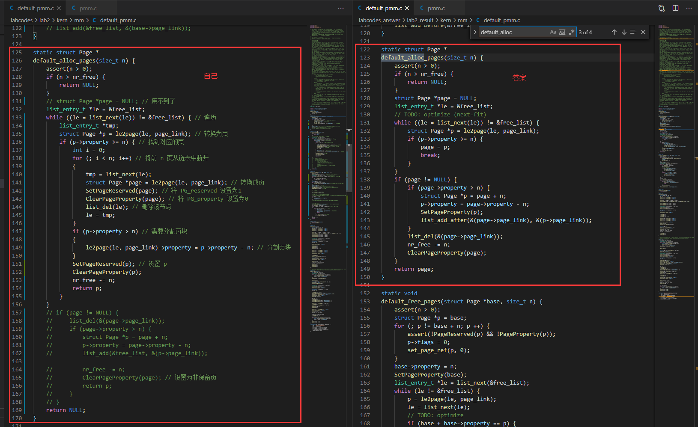
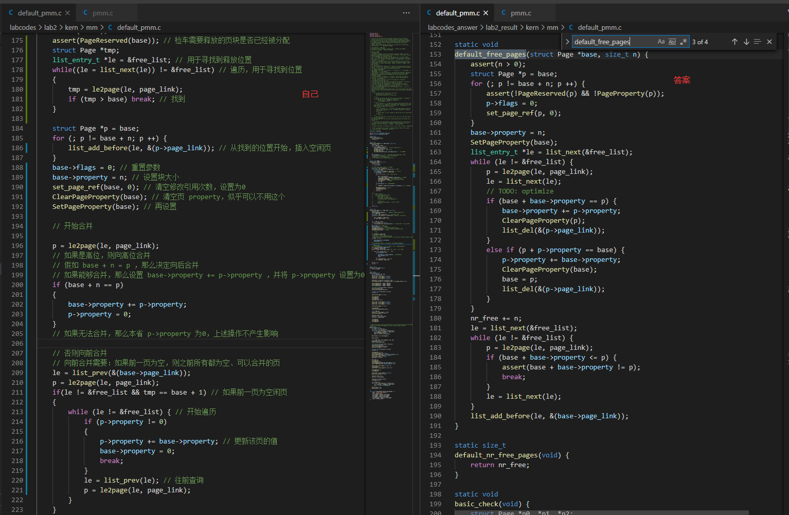

# 实验3

## 个人信息

- 数据科学与计算机学院
- 2018级 软工3班
- 18342075
- 米家龙

## 目录

- [实验3](#实验3)
  - [个人信息](#个人信息)
  - [目录](#目录)
  - [实验名称](#实验名称)
  - [实验目的](#实验目的)
  - [实验内容](#实验内容)
  - [实验要求](#实验要求)
  - [实验环境](#实验环境)
  - [实验过程](#实验过程)
    - [练习0：填写已有实验](#练习0填写已有实验)
    - [练习1：实现 **first-fit** 连续物理内存分配算法](#练习1实现-first-fit-连续物理内存分配算法)
      - [查看 default_pmm.c 相关代码](#查看-default_pmmc-相关代码)
      - [list.h 中的相关数据结构和函数](#listh-中的相关数据结构和函数)
      - [查看 memlayout.h 中的相关代码](#查看-memlayouth-中的相关代码)
      - [1. 修改 default_init() 函数](#1-修改-default_init-函数)
      - [2. 修改 default_init_memmap() 函数](#2-修改-default_init_memmap-函数)
      - [3. 修改 default_alloc_pages() 函数](#3-修改-default_alloc_pages-函数)
      - [4. 修改 default_free_pages() 函数](#4-修改-default_free_pages-函数)
      - [查看运行结果](#查看运行结果)
    - [练习2：实现寻找虚拟地址对应的页表项](#练习2实现寻找虚拟地址对应的页表项)
      - [查看给出的注释](#查看给出的注释)
      - [补充 get_pte() 函数](#补充-get_pte-函数)
      - [回答问题](#回答问题)
        - [1. 请描述页目录项（Page Directory Entry） 和页表项（Page Table Entry）中每个组成部分的含义以及对ucore而言的潜在用处。](#1-请描述页目录项page-directory-entry-和页表项page-table-entry中每个组成部分的含义以及对ucore而言的潜在用处)
        - [2. 如果ucore执行过程中访问内存， 出现了页访问异常， 请问硬件要做哪些事情？](#2-如果ucore执行过程中访问内存-出现了页访问异常-请问硬件要做哪些事情)
    - [练习3：释放某虚拟地址所在的页并取消对应二级页表项的映射](#练习3释放某虚拟地址所在的页并取消对应二级页表项的映射)
  - [实验结果](#实验结果)
  - [实验总结](#实验总结)
    - [完成实验后，请分析ucore_lab中提供的参考答案，并请在实验报告中说明你的实现与参考答案的区别](#完成实验后请分析ucore_lab中提供的参考答案并请在实验报告中说明你的实现与参考答案的区别)
      - [练习1](#练习1)
        - [1. default_init()](#1-default_init)
        - [2. default_init_memmap()](#2-default_init_memmap)
        - [3. default_alloc_pages()](#3-default_alloc_pages)
        - [4. default_free_pages()](#4-default_free_pages)
      - [练习2](#练习2)
      - [练习3](#练习3)
    - [列出你认为本实验中重要的知识点，以及与其对应的OS原理中的知识点，并简要说明你对二者的含义，关系， 差异等方面的理解（也可能出现实验中的知识点没有对应的原理知识点）](#列出你认为本实验中重要的知识点以及与其对应的os原理中的知识点并简要说明你对二者的含义关系-差异等方面的理解也可能出现实验中的知识点没有对应的原理知识点)
    - [列出你认为OS原理中很重要，但在实验中没有对应上的知识点](#列出你认为os原理中很重要但在实验中没有对应上的知识点)
    - [总结](#总结)

## 实验名称

实验3 物理内存管理

## 实验目的

- 理解基于段页式内存地址的转换机制
- 理解页表的建立和使用方法
- 理解物理内存的管理方法

## 实验内容

- 了解如何发现系统中的物理内存
- 了解如何建立对物理内存的初步管理，即了解连续物理内存的管理
- 了解页表的相关操作，即如何建立页表实现虚拟内存到物理内存之间的映射，对段页内存管理机制有一个比较全面的了解

> 本实验里面实现的内存管理还是非常基本的，并没有涉及到对实际机器（如 cache）的优化

## 实验要求

- 练习0：填写已有实验
- 练习1：实现 **first-fit** 连续物理内存分配算法（*需要编程*）
- 练习2：实现寻找虚拟地址对应的页表项（*需要编程*）
- 练习3：释放某虚拟地址所在的页并取消对应二级页表项的映射（*需要编程*）

## 实验环境

使用老师提供的`mooc-os-2015.vdi`，在虚拟机中创建 64 位的 Ubuntu 虚拟机并加载该 vdi ，获得了版本为：

```bash
Linux moocos-VirtualBox 3.13.0-24-generic #46-Ubuntu SMP Thu Apr 10 19:11:08 UTC 2014 x86_64 x86_64 x86_64 GNU/Linux
```

的虚拟机操作系统

并且使用 vscode 配合 Remote SSH 插件，实现通过远程终端在 windows 环境的对文件的编辑

## 实验过程

### 练习0：填写已有实验

将实验2的代码填入本实验代码中有 **LAB1** 的注释相应部分

已知在实验2中被修改过的文件为 `kern/debug/kdebug.c` 和 `kern/trap/trap.c` ，因此主要注意这两个文件即可

修改如图





### 练习1：实现 **first-fit** 连续物理内存分配算法

首次适应算法从空闲分区表的**第一个表目**起查找该表，把**最先能够满足要求**的空闲区分配给作业，这种方法目的在于**减少查找时间**。

- 优先利用内存**中低址部分**的空闲分区，从而保留了高址部分的大空闲区，为后续作业留下了大空间
- 减少了查找时间
- 会造成**外部碎片**

> 可能会修改 default_pmm.c 中的 default_init，default_init_memmap，default_alloc_pages，default_free_pages 等相关函数，需要仔细查看和理解 default_pmm.c 的注释

#### 查看 default_pmm.c 相关代码

查看注释，了解到需要修改如下函数

- default_init()
- default_init_memmap()
- default_alloc_pages()
- default_free_pages()

根据注释提示，查看其他相关代码

#### list.h 中的相关数据结构和函数

双链表 list_entry 数组结构，用于储存地址结构

```cpp
struct list_entry {
    struct list_entry *prev, *next;
};

typedef struct list_entry list_entry_t; // 为什么要重命名，没有想明白
```

并存在这些函数

- list_init() 初始化一个 list_entry 双链表
- list_add() / list_add_after() 两者等价，将新元素插入到**列表元素**与**列表元素的下一个**之间
- list_add_before() 将新元素插入到**列表元素前一个**和**列表元素**之间
- list_del() 将传入的条目删除
- list_del() 从列表中删除一个条目并且重新初始化它
- list_empty() 判断列表是否为空
- list_next() 获取列表的后一项
- list_prev() 获取列表的前一项
- __list_add() 列表增加的具体实现
- __list_del() 列表删除的具体实现

#### 查看 memlayout.h 中的相关代码

先查看结构体 `Page` 的定义

```cpp
struct Page {
    int ref;                        // 映射此物理页的虚拟页个数（该物理页被引用的次数）
    uint32_t flags;                 // 物理页的标志
    unsigned int property;          // first-fit manager 的空闲块数量
    list_entry_t page_link;         // 双向链表，用于连接各个页
};
```

查看 `le2page()` 函数

```cpp
// 将列表转换成页
#define le2page(le, member)                 \
    to_struct((le), struct Page, member)
```

#### 1. 修改 default_init() 函数

根据注释提醒的内容，需要

- 设定 frea_list 为0
- 设定 nr_free 为0

查看 default_init()，发现该函数可以直接使用

```cpp
free_area_t free_area;

#define free_list (free_area.free_list)
#define nr_free (free_area.nr_free)

static void
default_init(void) {
    list_init(&free_list);
    nr_free = 0;
}
```

在 `memlayout.h` 中查询到 `free_area_t` 结构体的相关定义

```cpp
/* 双向链表，用于储存未使用的页 */
typedef struct {
    list_entry_t free_list;         // 列表头
    unsigned int nr_free;           // 未被使用的页的数量
} free_area_t;
```

#### 2. 修改 default_init_memmap() 函数

相关调用为：

1. kern_init
2. pmm_init
3. page_init
4. init_memmap
5. pmm_manager
6. init_memmap

该函数是用于**初始化空闲块**；而为了初始化一个块，则需要初始化该块的**每页**，具体操作为：

1. 设置 `p->flags` 中的 `PG_property` 位（可以参考 `pmm_init` 中设定 `p->flags` 的 `PG_reserved` ）
  - 如果该页为空，并且不是空闲块的第一页，那么 `p->property` 应为0
  - 如果该页为空，是空闲块的第一页，那么 `p->property` 应为该块中**页的总数**
2. 设置 `p->ref` 为0，因为页是空闲并且无引用
3. 使用 `p->page_link()` 函数将该页与 `free_list` 链接起来
4. 更新空闲内存页的总数 `nr_free += n`

在 `memlayout.h` 中找到了相关的定义和函数，可以使用这些函数来设置 `p->flags`

```cpp
/* Flags describing the status of a page frame */
#define PG_reserved                 0       // if this bit=1: the Page is reserved for kernel, cannot be used in alloc/free_pages; otherwise, this bit=0 
#define PG_property                 1       // if this bit=1: the Page is the head page of a free memory block(contains some continuous_addrress pages), and can be used in alloc_pages; if this bit=0: if the Page is the the head page of a free memory block, then this Page and the memory block is alloced. Or this Page isn't the head page.

// 检查是否为保留页
#define PageReserved(page)          test_bit(PG_reserved, &((page)->flags))
// 设置为保留页
#define SetPageProperty(page)       set_bit(PG_property, &((page)->flags))
```

原函数为：

```cpp
static void
default_init_memmap(struct Page *base, size_t n) {
    assert(n > 0);
    struct Page *p = base;
    for (; p != base + n; p ++) {
        assert(PageReserved(p));
        p->flags = p->property = 0;
        set_page_ref(p, 0);
    }
    base->property = n;
    SetPageProperty(base);
    nr_free += n;
    list_add(&free_list, &(base->page_link));
}
```

修改后为：

```cpp
static void
default_init_memmap(struct Page *base, size_t n) {
    assert(n > 0); // 计算表达式，如果结果为假，则通过 stderr 打印出错信息，然后调用 abort 中止程序
    struct Page *p = base;
    for (; p != base + n; p ++) {
        assert(PageReserved(p)); // 检查是否为保留页，是则中止
        p->flags = p->property = 0;
        SetPageProperty(p); // 设置为保留页
        set_page_ref(p, 0); // 设置 p->ref 为0
        list_add_before(&free_list, &(p->page_link)); // 插入空闲列表，此处参照注释

    }
    base->property = n; // 这是第一页，因此 property 需要设置为总页数
    // SetPageProperty(base); // 在循环中已经设置好了
    nr_free += n; // 空闲内存页的总数变化
    // list_add(&free_list, &(base->page_link));
}
```

#### 3. 修改 default_alloc_pages() 函数

该函数是为了搜索 free_list 中的空闲的块（块大小大于等于 n），如果找到，则重新设置大小，并且返回块的地址，步骤如下：

1. 循环搜索检查 `p->property` 是否大于 n
  - 如果找到 `p`，意味着找到了空闲的、页数量大于等于 n 的块，设置 `PG_reserved` 为1，`PG_property` 为0，并且将这个页从链表中断开
    - 如果 `p->property` > n 那么我们需要从新计算剩下的页的数量
  - 重新计算 `nr_free` 的数量
  - 返回 `p`
2. 无法找到对应的块（块大小 >= n），返回 `NULL`

原函数为：

```cpp
static struct Page *
default_alloc_pages(size_t n) {
    assert(n > 0);
    if (n > nr_free) {
        return NULL;
    }
    struct Page *page = NULL;
    list_entry_t *le = &free_list;
    while ((le = list_next(le)) != &free_list) {
        struct Page *p = le2page(le, page_link);
        if (p->property >= n) {
            page = p;
            break;
        }
    }
    if (page != NULL) {
        list_del(&(page->page_link));
        if (page->property > n) {
            struct Page *p = page + n;
            p->property = page->property - n;
            list_add(&free_list, &(p->page_link));
    }
        nr_free -= n;
        ClearPageProperty(page);
    }
    return page;
}
```

修改后为

```cpp
static struct Page *
static struct Page *
default_alloc_pages(size_t n) {
    assert(n > 0);
    if (n > nr_free) {
        return NULL;
    }
    // struct Page *page = NULL; // 用不到了
    list_entry_t *le = &free_list;
    while ((le = list_next(le)) != &free_list) { // 遍历
        list_entry_t *tmp;
        struct Page *p = le2page(le, page_link); // 转换为页
        if (p->property >= n) { // 找到对应的页
            int i = 0;
            for (i; i < n; i++) // 将前 n 页从链表中断开
            {
                tmp = list_next(le);
                struct Page *page = le2page(le, page_link); // 转换成页
                SetPageReserved(page); // 将 PG_reserved 设置为1
                ClearPageProperty(page); // 将 PG_property 设置为0
                list_del(le); // 删除该节点
                le = tmp;
            }
            if (p->property > n) // 需要分割页块
            {
                le2page(le, page_link)->property = p->property - n; // 分割页块
            }
            SetPageReserved(p); // 设置 p
            ClearPageProperty(p);
            nr_free -= n;
            return p;
        }
    }
    return NULL;
}
```

#### 4. 修改 default_free_pages() 函数

该函数作用在于重新将页链接回 free_list ，或者将小的空闲块合并进大块里，步骤如下：

1. 根据块中的基址，在 free_list 中搜索到它正确的位置，然后插入到页中
2. 重置页的位置，相关参数为 `p->ref` 和 `p->flags`
3. 尝试合并块（需要正确修改 `p->property`）

思路为：遍历链表，从中找到第一页地址**大于**释放的第一页的地址

- 判断 *所释放的页的基地址* + *所释放的页的数量* 是否等于*找到的地址*
  - 如果是，进行合并
- 找到该页之前的第一个 `p->property` > 0 的页，判断该页和上一页是否连续
  - 如果是，进行合并

原函数为：

```cpp
static void
default_free_pages(struct Page *base, size_t n) {
    assert(n > 0);
    struct Page *p = base;
    for (; p != base + n; p ++) {
        assert(!PageReserved(p) && !PageProperty(p));
        p->flags = 0;
        set_page_ref(p, 0);
    }
    base->property = n;
    SetPageProperty(base);
    list_entry_t *le = list_next(&free_list);
    while (le != &free_list) {
        p = le2page(le, page_link);
        le = list_next(le);
        if (base + base->property == p) {
            base->property += p->property;
            ClearPageProperty(p);
            list_del(&(p->page_link));
        }
        else if (p + p->property == base) {
            p->property += base->property;
            ClearPageProperty(base);
            base = p;
            list_del(&(p->page_link));
        }
    }
    nr_free += n;
    list_add(&free_list, &(base->page_link));
}
```

修改后为：

```cpp
static void
default_free_pages(struct Page *base, size_t n) {
    assert(n > 0);
    assert(PageReserved(base)); // 检车需要释放的页块是否已经被分配
    struct Page *tmp;
    list_entry_t *le = &free_list; // 用于寻找到释放位置
    while((le = list_next(le)) != &free_list) // 遍历，用于寻找到位置
    {
        tmp = le2page(le, page_link);
        if (tmp > base) break; // 找到
    }

    struct Page *p = base;
    for (; p != base + n; p ++) {
        list_add_before(le, &(p->page_link)); // 从找到的位置开始，插入空闲页
    }
    base->flags = 0; // 重置参数
    base->property = n; // 设置块大小
    set_page_ref(base, 0); // 清空修改引用次数，设置为0
    ClearPageProperty(base); // 清空页 property，似乎可以不用这个
    SetPageProperty(base); // 再设置

    // 开始合并
    
    p = le2page(le, page_link);
    // 如果是高位，则向高位合并

    // 假如 base + n = p ，那么决定向后合并
    // 如果能够合并，那么设置 base->property += p->property ，并将 p->property 设置为0
    if (base + n == p) 
    {
        base->property += p->property;
        p->property = 0;
    }
    // 如果无法合并，那么 p->property 本来就为0，上述操作不产生影响


    // 否则向前合并
    // 向前合并需要：如果前一页为空，则之前所有都为空、可以合并的页
    le = list_prev(&(base->page_link));
    p = le2page(le, page_link);
    if(le != &free_list && tmp == base + 1) // 如果前一页为空闲页
    {
        while (le != &free_list) { // 开始遍历
            if (p->property != 0)
            {
                p->property += base->property; // 更新该页的值
                base->property = 0;
                break;
            }
            le = list_prev(le); // 往前查询
            p = le2page(le, page_link);
        }
    }
    nr_free += n;
    return;
}
```

#### 查看运行结果



感觉自己代码逻辑比较混乱，暂时只能按照注释的提示来进行编写

### 练习2：实现寻找虚拟地址对应的页表项

从参考资料中得到 get_pte() 函数的调用关系图



通过设置页表和对应的页表项，可建立虚拟内存地址和物理内存地址的对应关系。其中的 get_pte 函数是设置页表项环节中的一个重要步骤。此函数找到一个虚地址对应的二级页表项的内核虚地址，如果此二级页表项不存在， 则分配一个包含此项的二级页表。本练习需要补全 kern/mm/pmm.c 中的 get_pte 函数，实现其功能。请仔细查看和理解 get_pte 函数中的注释。

> x86 体系中，内存地址分成 **逻辑地址**（又称**虚拟地址**）、**线性地址**和**物理地址**
> 
> 这三者的关系为：程序产生逻辑地址；逻辑地址加上对应的段偏移量（基地址）变成线性地址；线性地址在分页机制下经过变换产生物理地址

#### 查看给出的注释

在注释中，给出了一些宏和函数

- PDX(la) 返回虚拟地址 la 的页目录索引
- KADDR(pa) : 返回物理地址 pa 对应的虚拟地址
- set_page_ref(page,1) : 设置该页被引用**1**次
- page2pa(page): 得到 page 所管理的那一页的物理地址
- struct Page * alloc_page() : 分配一页
- memset(void *s, char c, size_t n) : 设置 s 指向地址的前 n 个字节的值为 c

其他定义：

- `PTE_P           0x001` 对应地址的物理内存页存在
- `PTE_W           0x002` 对应地址的物理内存页可写
- `PTE_U           0x004` 对应地址的物理内存页可读

查询 `pte` 数据结构，得到

```cpp
typedef uintptr_t pte_t;
typedef unsigned int uint32_t;
typedef uint32_t uintptr_t;
```

可以得到 `pte_t` 本质上就是 `unsigned int`

#### 补充 get_pte() 函数

通过查阅老师给的资料，阅读 `mmu.h` 中的注释，可以得到，32 位线性地址被分为3部分：



- Directory ，一级页表，存在高10位中，可以通过 `PDX(la)` 获取
- Table ，二级页表，存在中间10位中，可以通过 `PTX(la)` 获取
- Offset ，偏移量，存在低12位中，可通过 `PGOFF(la)` 获取

从而可以发现，每页大小为 $2^{12} = 4096$ b ，即 4kb

补充 `get_pte()` 函数之后为：

```cpp
pte_t *
get_pte(pde_t *pgdir, uintptr_t la, bool create) {
#if 0
    pde_t *pdep = NULL;   // (1) find page directory entry
    if (0) {              // (2) check if entry is not present
                          // (3) check if creating is needed, then alloc page for page table
                          // CAUTION: this page is used for page table, not for common data page
                          // (4) set page reference
        uintptr_t pa = 0; // (5) get linear address of page
                          // (6) clear page content using memset
                          // (7) set page directory entry's permission
    }
    return NULL;          // (8) return page table entry
#endif
// 上面的东西没有动

    pte_t *pdir = &pgdir[PDX(la)]; // 获取一级页表位置
    if (!((*pdir) & PTE_P)) // 如果不存在，则需要判断是否需要创建二级页表
    {
        struct Page *p;
        // 如果 create 为0，则返回 NULL
        // 如果 create 不为0，则创建页表：
        //                              如果失败，返回 NULL
        //                              如果创建成功，返回对应二级页表的线性地址
        if (create == 0 || (p = alloc_page()) == NULL) // 利用短路实现
            return NULL;
        set_page_ref(p, 1);                 // 设置该页表引用次数 +1
        uintptr_t pa = page2pa(p);          // 得到物理地址
                                            // 但是没有找到对应的函数，只能先通过获取物理地址再转化
        memset(KADDR(pa), 0, PGSIZE);       // 将物理地址转化为虚拟地址，
                                            // 并且由于该页虚拟地址未被映射，因此需要初始化
        // *pdir = pa | PTE_P;              // 设置存在
        // *pdir = *pdir | PTE_U;           // 设置可读
        // *pdir = *pdir | PTE_W;           // 设置可写
        *pdir = pa | PTE_P | PTE_U | PTE_W; // 统一设置更加方便
    }

    return &((pte_t *)KADDR(PDE_ADDR(*pdir)))[PTX(la)]; // 得到二级页表对应的线性地址
}
```

使用 make 进行编译，出现了如下报错

```bash
kern/mm/pmm.c: In function ‘get_pte’:
kern/mm/pmm.c:365:30: error: ‘false’ undeclared (first use in this function)
     if (((*pdir) & PTE_P) == false) // 如果不存在，则需要判断是否需要创建二级页表
                              ^
kern/mm/pmm.c:365:30: note: each undeclared identifier is reported only once for each function it appears in
kern/mm/pmm.c: At top level:
kern/mm/pmm.c:265:1: warning: ‘boot_alloc_page’ defined but not used [-Wunused-function]
 boot_alloc_page(void) {
 ^
```

了解到 pte_t 并不能够通过 false 进行判断，因此改为 `if (!((*pdir) & PTE_P))` 作为判断，修改后函数如下：

```cpp
pte_t *
get_pte(pde_t *pgdir, uintptr_t la, bool create) {
#if 0
    pde_t *pdep = NULL;   // (1) find page directory entry
    if (0) {              // (2) check if entry is not present
                          // (3) check if creating is needed, then alloc page for page table
                          // CAUTION: this page is used for page table, not for common data page
                          // (4) set page reference
        uintptr_t pa = 0; // (5) get linear address of page
                          // (6) clear page content using memset
                          // (7) set page directory entry's permission
    }
    return NULL;          // (8) return page table entry
#endif
// 上面的东西没有动

    pte_t *pdir = &pgdir[PDX(la)]; // 获取一级页表位置
    if (!((*pdir) & PTE_P)) // 如果不存在，则需要判断是否需要创建二级页表
    {
        struct Page *p;
        // 如果 create 为0，则返回 NULL
        // 如果 create 不为0，则创建页表：
        //                              如果失败，返回 NULL
        //                              如果创建成功，返回对应二级页表的线性地址
        if (create == 0 || (p = alloc_page()) == NULL) // 利用短路实现
            return NULL;
        set_page_ref(p, 1);                 // 如果要查找该页表，则需要设置该页表引用次数 +1
        uintptr_t pa = page2pa(p);          // 得到物理地址
                                            // 但是没有找到对应的函数，只能先通过获取物理地址再转化
        memset(KADDR(pa), 0, PGSIZE);       // 将物理地址转化为虚拟地址，
                                            // 并且由于该页虚拟地址未被映射，因此需要初始化
        // *pdir = pa | PTE_P;              // 设置存在
        // *pdir = *pdir | PTE_U;           // 设置可读
        // *pdir = *pdir | PTE_W;           // 设置可写
        // *pdir = pa | PTE_P | PTE_U | PTE_W; // 统一设置更加方便
        *pdir = pa | PTE_USER
    }

    return &((pte_t *)KADDR(PDE_ADDR(*pdir)))[PTX(la)]; // 得到二级页表对应的线性地址
}
```

#### 回答问题

##### 1. 请描述页目录项（Page Directory Entry） 和页表项（Page Table Entry）中每个组成部分的含义以及对ucore而言的潜在用处。

查阅 `mmu.h` 可以得到如下代码

```cpp
/* page table/directory entry flags */
#define PTE_P           0x001                   // Present
#define PTE_W           0x002                   // Writeable
#define PTE_U           0x004                   // User
#define PTE_PWT         0x008                   // Write-Through
#define PTE_PCD         0x010                   // Cache-Disable
#define PTE_A           0x020                   // Accessed
#define PTE_D           0x040                   // Dirty
#define PTE_PS          0x080                   // Page Size
#define PTE_MBZ         0x180                   // Bits must be zero
#define PTE_AVAIL       0xE00                   // Available for software use
                                                // The PTE_AVAIL bits aren't used by the kernel or interpreted by the
                                                // hardware, so user processes are allowed to set them arbitrarily.
```

可以得到如下表格

|   名称    | 地址所在位 |             作用             |
| :-------: | :--------: | :--------------------------: |
|   PTE_P   |     0      |            存在位            |
|   PTE_W   |     1      |             可写             |
|   PTE_U   |     2      |    访问该页所需要的特权级    |
|  PTE_PWT  |     3      |    是否使用 write-through    |
|  PTE_PCD  |     4      |   是否使用缓存，1位不使用    |
|   PTE_A   |     5      |         是否被使用过         |
|   PTE_D   |     6      |             脏位             |
|  PTE_PS   |     7      |            页大小            |
|  PTE_MBZ  |     8      |           必须为0            |
| PTE_AVAIL |    9~11    | 内核和中断无效，用户可以设置 |

而对于 PTE 和 PDE ，他们的前20位分别表示

- PTE 前20位表示该 PTE 条目指向的**物理页的物理地址**
- PDE 前20位表示该 PDE 对应的页表起始位置，即**物理地址**

##### 2. 如果ucore执行过程中访问内存， 出现了页访问异常， 请问硬件要做哪些事情？

1. 将引发异常的地址储存在 `cr2` 寄存器中
2. 判断特权级
   - 如果是内核态，将 `EFLAGS` 、 `CS` 和 `EIP` 以及页访问代码 `error code` 依次压入**中断栈**中
   - 如果是用户态，需要先压入 `ss` 和 `esp` ，在压入上面三种，然后切换到内核态
3. 引发页错误，根据**中断描述符表**查询并且跳转到对应页错误的 `ISR` 处执行，然后将该页错误交给软件处理

### 练习3：释放某虚拟地址所在的页并取消对应二级页表项的映射

- 当释放一个包含某虚地址的物理内存页时，需要让对应此物理内存页的管理数据结构Page做相关的清除处理，使得此物理内存页成为空闲；
- 另外还需把表示虚地址与物理地址对应关系的二级页表项清除。
- 请仔细查看和理解 `page_remove_pte()` 函数中的注释。为此，需要补全在 `kern/mm/pmm.c` 中的 `page_remove_pte()` 函数。


阅读注释，可以了解到相关的宏的函数：

- struct Page \*page pte2page(\*ptep): 从 ptep 指针中得到对应的页
- free_page : 释放一个页
- page_ref_dec(page) : 减少引用次数，但需要注意：当次数为0时，需要释放该页
- tlb_invalidate(pde_t *pgdir, uintptr_t la) : 使 TLB 的条目失效，但该页表需处于处理器当前正在使用的页表中

在 pmm.h 中找到 PADDR 的相关定义

```cpp
static inline struct Page *
pte2page(pte_t pte) {
    if (!(pte & PTE_P)) {
        panic("pte2page called with invalid pte");
    }
    return pa2page(PTE_ADDR(pte));
}

static inline int
page_ref_dec(struct Page *page) {
    page->ref -= 1;
    return page->ref;
}

// invalidate a TLB entry, but only if the page tables being
// edited are the ones currently in use by the processor.
void
tlb_invalidate(pde_t *pgdir, uintptr_t la) {
    if (rcr3() == PADDR(pgdir)) {
        invlpg((void *)la);
    }
}

/* *
 * PADDR - takes a kernel virtual address (an address that points above KERNBASE),
 * where the machine's maximum 256MB of physical memory is mapped and returns the
 * corresponding physical address.  It panics if you pass it a non-kernel virtual address.
 * */
#define PADDR(kva) ({                                                   \
            uintptr_t __m_kva = (uintptr_t)(kva);                       \
            if (__m_kva < KERNBASE) {                                   \
                panic("PADDR called with invalid kva %08lx", __m_kva);  \
            }                                                           \
            __m_kva - KERNBASE;                                         \
        })
```

其他声明

- `PTE_P           0x001` 控制位，表示存在

具体步骤：

1. 检查页表条目是否存在
2. 找到 pte 相关的页
3. 减少该页的引用次数
4. 当引用次数变为0时，释放该页
5. 清除二级页表条目
6. 刷新 tlb

补充后函数为：

```cpp
//page_remove_pte - free an Page sturct which is related linear address la
//                - and clean(invalidate) pte which is related linear address la
//note: PT is changed, so the TLB need to be invalidate 
static inline void
page_remove_pte(pde_t *pgdir, uintptr_t la, pte_t *ptep) {
#if 0
    if (0) {                      //(1) check if this page table entry is present
        struct Page *page = NULL; //(2) find corresponding page to pte
                                  //(3) decrease page reference
                                  //(4) and free this page when page reference reachs 0
                                  //(5) clear second page table entry
                                  //(6) flush tlb
    }
#endif

    if ((*ptep) & PTE_P) // 只有存在的时候才会进后续
    {
        struct Page *p = pte2page(*ptep); // 获取到页
        if (page_ref_dec(p) == 0) // 减少引用次数，同时判断次数是否为0
            free_page(p); // 如果只被上一级页表引用一次，那么可以直接释放页和对应的二级页表
        // 如果引用超过1次，那么不能释放页表，但是可以取消二级页表的映射
        // 无论是否释放页，都要取消二级页表的映射

        *ptep = 0;
        tlb_invalidate(pgdir, la);
    }

    // 如果不存在，什么都不干
    return;
}
```

## 实验结果

使用 `make qemu-nox` 在终端查看运行结果


使用 `make grade` 进行测试，结果如下



## 实验总结

### 完成实验后，请分析ucore_lab中提供的参考答案，并请在实验报告中说明你的实现与参考答案的区别

#### 练习1

##### 1. default_init()

该函数不需要修改

##### 2. default_init_memmap()


区别：

- 答案是在结尾才将页链接上去
- 我是每次都对页进行初始化，并且加入列表

##### 3. default_alloc_pages()



区别：

- 答案的循环只用于寻找到对应的页，找到后进行 `break` 操作，再做后续操作，比较简洁
- 我是在大循环中对每个页进行操作，比较繁琐，需要多个判断，并且 `while` 循环中还有一个 `for` 循环，比较耗费操作时间

##### 4. default_free_pages()



区别：

- 和上一个函数相反，我使用了循环配合 `break` 寻找对应的位置
- 答案则在循环中完成了大部分操作，并且答案善于使用 `absort()` 宏简化操作

#### 练习2


思路一致，我使用了 `PTE_USER` 使代码可读性更强

#### 练习3


思路一致，无区别

### 列出你认为本实验中重要的知识点，以及与其对应的OS原理中的知识点，并简要说明你对二者的含义，关系， 差异等方面的理解（也可能出现实验中的知识点没有对应的原理知识点）

本次实验涉及到

- CPU 段页式内存管理
- CPU 进入页机制的方法
- 连续物理内存分配方法 first-fit
- 虚拟地址（逻辑地址），线性地址和物理地址三者之间的关系和转换方法

对应到 os 原理中：

- 内存页管理
- 连续物理内存管理

理解：

- 实验中的知识点是原理中的具体应用，需要考虑到具体的操作，会更加的复杂繁琐
- 前者为后者提供具体的内存管理功能的详细操作和底层支持
- 前者涉及到了除开操作系统之外的一些知识，比如说数据结构和算法，使得实现起来稍微麻烦一些

### 列出你认为OS原理中很重要，但在实验中没有对应上的知识点

- 其他两种内存分配算法：best-fit 和 worst-fit ，但是如果要实现这两种算法，花费时间可能会更长，并且一个文件的代码无法同时测试三种算法
- 虚拟内存的创建、实现和管理
- 出现了页错误时，软件具体如何处理
- 对于多线程/进程的创建、管理和调度，以及进程之间的互斥

### 总结

本次实验是从比较基本的 first-fit 算法开始进行实现，使我更加直观地了解了段页式内存的地址转换机制，页表及其条目的建立和使用，以及物理内存的管理；实现起来还是有点难度，而且工作量并不小，需要查看其他的文件的代码比较多，容易混淆；所幸每个练习的注释都十分的详细，按照注释的步骤和提示查阅资料，从而一步一步理解代码，最终实现了对应的功能，还是比较开心的。