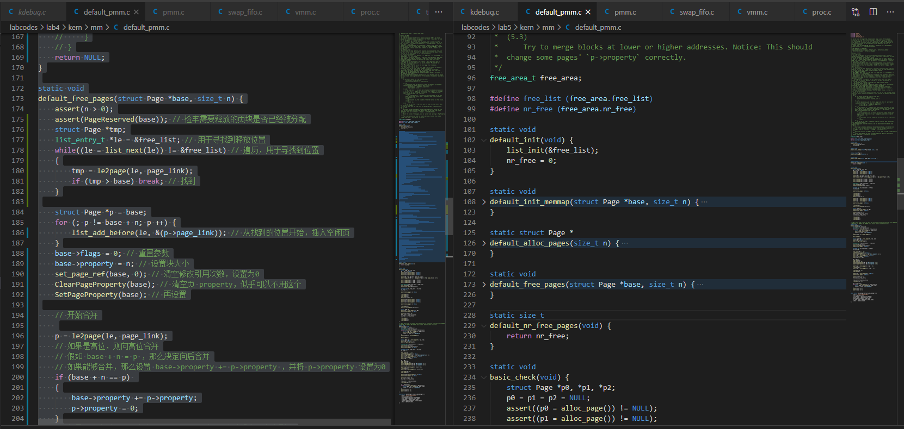

# 实验6

## 个人信息

- 数据科学与计算机学院
- 2018级 软工3班
- 18342075
- 米家龙

## 目录

[TOC]

## 实验名称

实验6 用户进程管理

## 实验目的

- 了解第一个用户进程创建机制
- 了解系统调用框架的实现机制 
- 了解ucore如何实现系统调用 `sys_fork`/`sys_exec`/`sys_exit`/`sys_wait` 来进行进程管理

## 实验要求

实验5（ucore lab4）完成了内核线程，但到目前为止，所有的运行都在内核态执行。

本实验6 （ucore lab5）将创建用户进程，让用户进程在用户态执行，且在需要 ucore 支持时，可通过系统调用来让 ucore 提供服务。

为此需要构造出第一个用户进程，并通过系统调用 `sys_fork`/`sys_exec`/`sys_exit`/`sys_wait` 来支持运行不同的应用程序，完成对用户进程的执行过程的基本管理。

## 实验内容

- 练习0：填写已有实验
- 练习1：加载应用程序并执行（需要编码）
- 练习2：父进程复制自己的内存空间给子进程（需要编码）
- 练习3：阅读分析源代码，理解进程执行 fork/exec/wait/exit 的 实现，以及系统调用的实现（不需要编码）

## 实验环境

使用老师提供的`mooc-os-2015.vdi`，在虚拟机中创建 64 位的 Ubuntu 虚拟机并加载该 vdi ，获得了版本为：

```bash
Linux moocos-VirtualBox 3.13.0-24-generic #46-Ubuntu SMP Thu Apr 10 19:11:08 UTC 2014 x86_64 x86_64 x86_64 GNU/Linux
```

的虚拟机操作系统

并且使用 vscode 配合 Remote SSH 插件，实现通过远程终端在 windows 环境的对文件的编辑和运行

### 2. WSL

WSL 配置如下：

```bash
root@LAPTOP-QTCGESHO:/mnt/d/blog/work/matrix/step1/001# uname -a
Linux LAPTOP-QTCGESHO 4.4.0-19041-Microsoft #1-Microsoft Fri Dec 06 14:06:00 PST 2019 x86_64 x86_64 x86_64 GNU/Linux
```

## 实验过程

### 练习0：填写已有实验

本实验依赖ucore实验1/2/3/4。请把你做的ucore实验1/2/3/4的代码填入本实验中代码中有“LAB1”,“LAB2” ,“LAB3”，“LAB4”的注释相应部分。

需要修改的文件如下：

- kern/debug/kdebug.c 
- kern/mm/default_pmm.c 
- kern/mm/pmm.c 
- kern/mm/vmm.c 
- kern/mm/swap_fifo.c 
- kern/trap/trap.c  
- kern/process/proc.c  

### 练习1：加载应用程序并执行

> `do_execv` 函数调用 `load_icode` （位于kern/process/proc.c中）来加载并解 析一个处于内存中的ELF执行文件格式的应用程序，建立相应的用户内 存空间来放置应用程序的代码段、数据段等，且要设置好 **proc_struct** 结构中的成员变量 `trapframe` 中的内容，确保在执行此进程后，能够从应用程序设定的起始执行地址开始执行。需设置正确的 `trapframe` 内容。

#### 回答问题

> 描述当创建一个用户态进程并加载了应用程序后，CPU是如何让这个应用程序最 终在用户态执行起来的。即这个用户态进程被 ucore 选择占用 CPU 执行 （**RUNNING 态**）到具体执行应用程序第一条指令的整个经过。

### 练习2：父进程复制自己的内存空间给子进程

> 创建子进程的函数 `do_fork` 在执行中将拷贝当前进程（即父进程） 的用户内存地址空间中的合法内容到新进程中（子进程），完成内存资源的复制。具体是通过 `copy_range` 函数（位于 kern/mm/pmm.c中）实现的，请补充 `copy_range` 的实现，确保能够正确执行

#### 简要设计“COW 机制”

### 练习3：阅读分析源代码

请在实验报告中简要说明你对 `fork`/`exec`/`wait`/`exit` 函数的分析。并回答如下问题：
- 请分析 `fork`/`exec`/`wait`/`exit` 在实现中是如何影响进程的执行状态的？
- 请给出ucore中一个用户态进程的执行状态生命周期图（包执行状态，执行状态之间的变换关系，以及产生变换的事件或函数调用）。（字符方式画即可）

## 实验结果

运行 `make grade` 命令，结果如下


## 实验总结

### 对比 ucore_lab 中提供的参考答案，描述区别

### 重要并且对应的知识点

### 实验中没有对应上的知识点