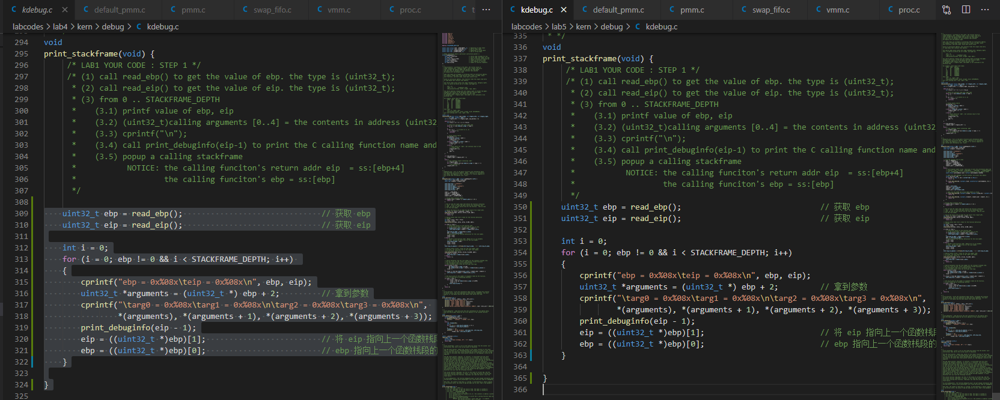
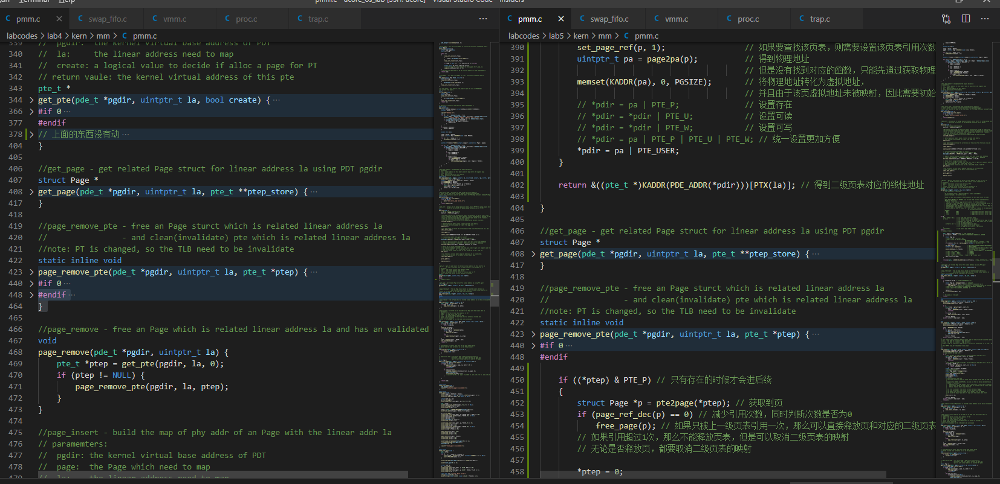
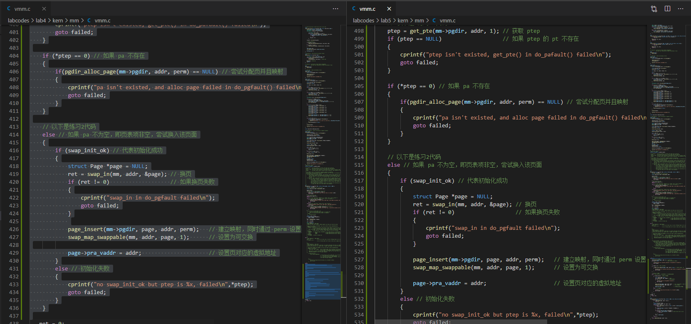
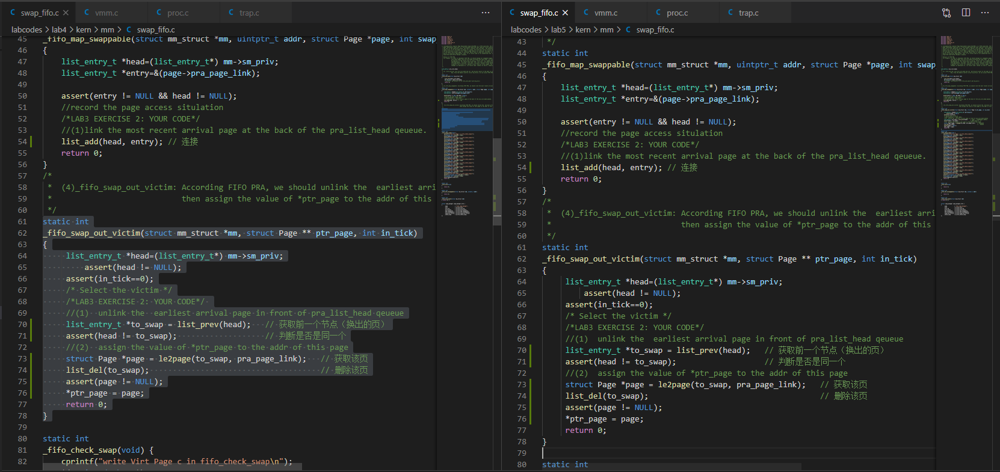
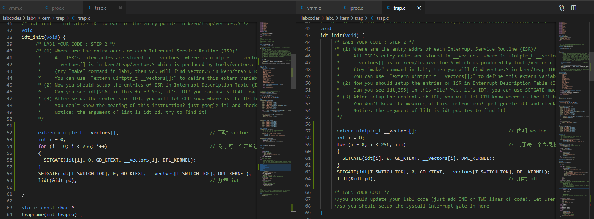
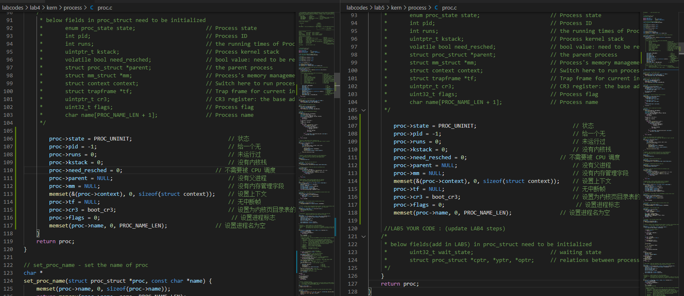
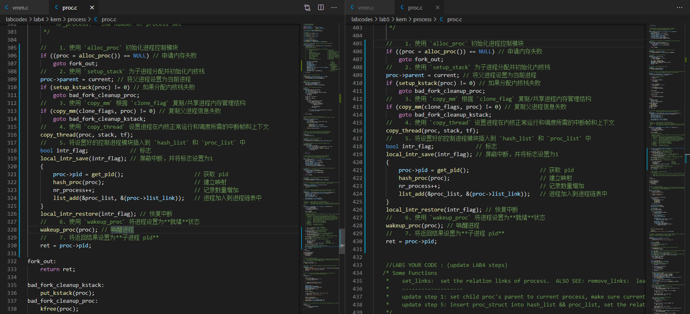
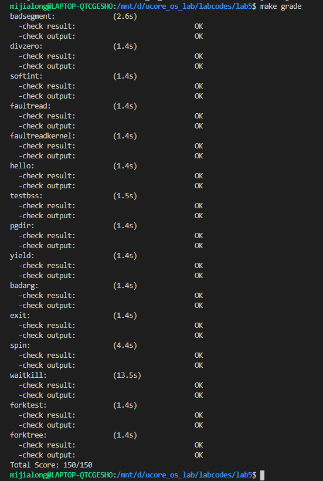

# 实验6

## 个人信息

- 数据科学与计算机学院
- 2018级 软工3班
- 18342075
- 米家龙

## 目录

[TOC]

## 实验名称

实验6 用户进程管理

## 实验目的

- 了解第一个用户进程创建机制
- 了解系统调用框架的实现机制 
- 了解ucore如何实现系统调用 `sys_fork`/`sys_exec`/`sys_exit`/`sys_wait` 来进行进程管理

## 实验要求

实验5（ucore lab4）完成了内核线程，但到目前为止，所有的运行都在内核态执行。

本实验6 （ucore lab5）将创建用户进程，让用户进程在用户态执行，且在需要 ucore 支持时，可通过系统调用来让 ucore 提供服务。

为此需要构造出第一个用户进程，并通过系统调用 `sys_fork`/`sys_exec`/`sys_exit`/`sys_wait` 来支持运行不同的应用程序，完成对用户进程的执行过程的基本管理。

## 实验内容

- 练习0：填写已有实验
- 练习1：加载应用程序并执行（需要编码）
- 练习2：父进程复制自己的内存空间给子进程（需要编码）
- 练习3：阅读分析源代码，理解进程执行 fork/exec/wait/exit 的 实现，以及系统调用的实现（不需要编码）

## 实验环境

使用老师提供的`mooc-os-2015.vdi`，在虚拟机中创建 64 位的 Ubuntu 虚拟机并加载该 vdi ，获得了版本为：

```bash
mijialong@LAPTOP-QTCGESHO:/mnt/d/ucore_os_lab/labcodes/lab5$ uname -a
Linux LAPTOP-QTCGESHO 4.4.0-19041-Microsoft #1-Microsoft Fri Dec 06 14:06:00 PST 2019 x86_64 x86_64 x86_64 GNU/Linux
```

的虚拟机操作系统

并且使用 vscode 配合 Remote SSH 插件，实现通过远程终端在 windows 环境的对文件的编辑和运行

### 2. WSL

WSL 配置如下：

```bash
Linux LAPTOP-QTCGESHO 4.4.0-19041-Microsoft #1-Microsoft Fri Dec 06 14:06:00 PST 2019 x86_64 x86_64 x86_64 GNU/Linux
```

## 实验过程

### 练习0：填写已有实验

本实验依赖ucore实验1/2/3/4。请把你做的ucore实验1/2/3/4的代码填入本实验中代码中有“LAB1”,“LAB2” ,“LAB3”，“LAB4”的注释相应部分。

需要修改的文件如下：

- kern/debug/kdebug.c 
- kern/mm/default_pmm.c 
- kern/mm/pmm.c 
- kern/mm/vmm.c 
- kern/mm/swap_fifo.c 
- kern/trap/trap.c  
- kern/process/proc.c  

### 练习1：加载应用程序并执行

> `do_execv` 函数调用 `load_icode` （位于kern/process/proc.c中）来加载并解析一个处于内存中的ELF执行文件格式的应用程序，建立相应的用户内 存空间来放置应用程序的代码段、数据段等，且要设置好 **proc_struct** 结构中的成员变量 `trapframe` 中的内容，确保在执行此进程后，能够从应用程序设定的起始执行地址开始执行。需设置正确的 `trapframe` 内容。

查看 `load_icode` 函数，了解到其目的是加载 EOF 格式的二进制内容作为最近进程的新内容，主要工作是建立一个让用户进程正常运行的环境，具体完成的工作为：
1. 为进程创建一个新的 *mm* （调用 `mm_create` 函数）
2. 创建一个新的页表目录，并且让 *mm->pgdir* 指向该页表目录的内核虚拟地址 （调用 `setup_pgdir`函数）
3. 复制 *TEXT/DATA* 段，在进程内存空间中建立 *BSS* 段，具体过程
   1. 得到 ELF 格式二进制程序的文件头
   2. 获取该程序的程序段头的进入点
   3. 判断该程序是否有效
   4. 寻找到程序段头
   5. 调用 `mm_map` 函数设置新的 *vma*
   6. 申请内存，然后复制每个程序段的内容到进程的内存中，具体过程：
      1. 复制二进制文件的 *TEXT/DATA* 段
      2. 建立二进制程序的 *BSS* 段
4. 创建用户栈内存
5. 设置当前进程的 mm ， sr3 ，并且将 **CR3 寄存器**设置为**页目录的物理地址**
6. 设置用户环境的中断帧

阅读第6步的注释：
```cpp {.line-numbers}
/* LAB5:EXERCISE1 YOUR CODE
  * should set tf_cs,tf_ds,tf_es,tf_ss,tf_esp,tf_eip,tf_eflags
  * NOTICE: If we set trapframe correctly, then the user level process can return to USER MODE from kernel. So
  *          tf_cs should be USER_CS segment (see memlayout.h)
  *          tf_ds=tf_es=tf_ss should be USER_DS segment
  *          tf_esp should be the top addr of user stack (USTACKTOP)
  *          tf_eip should be the entry point of this binary program (elf->e_entry)
  *          tf_eflags should be set to enable computer to produce Interrupt
  */
```

完成完整的 `load_icode` 函数：
```cpp {.line-numbers}
static int
load_icode(unsigned char *binary, size_t size)
{
    if (current->mm != NULL)
    {
        panic("load_icode: current->mm must be empty.\n");
    }

    int ret = -E_NO_MEM;
    struct mm_struct *mm;
    //(1) create a new mm for current process
    if ((mm = mm_create()) == NULL)
    {
        goto bad_mm;
    }
    //(2) create a new PDT, and mm->pgdir= kernel virtual addr of PDT
    if (setup_pgdir(mm) != 0)
    {
        goto bad_pgdir_cleanup_mm;
    }
    //(3) copy TEXT/DATA section, build BSS parts in binary to memory space of process
    struct Page *page;
    //(3.1) get the file header of the bianry program (ELF format)
    struct elfhdr *elf = (struct elfhdr *)binary;
    //(3.2) get the entry of the program section headers of the bianry program (ELF format)
    struct proghdr *ph = (struct proghdr *)(binary + elf->e_phoff);
    //(3.3) This program is valid?
    if (elf->e_magic != ELF_MAGIC)
    {
        ret = -E_INVAL_ELF;
        goto bad_elf_cleanup_pgdir;
    }

    uint32_t vm_flags, perm;
    struct proghdr *ph_end = ph + elf->e_phnum;
    for (; ph < ph_end; ph++)
    {
        //(3.4) find every program section headers
        if (ph->p_type != ELF_PT_LOAD)
        {
            continue;
        }
        if (ph->p_filesz > ph->p_memsz)
        {
            ret = -E_INVAL_ELF;
            goto bad_cleanup_mmap;
        }
        if (ph->p_filesz == 0)
        {
            continue;
        }
        //(3.5) call mm_map fun to setup the new vma ( ph->p_va, ph->p_memsz)
        vm_flags = 0, perm = PTE_U;
        if (ph->p_flags & ELF_PF_X)
            vm_flags |= VM_EXEC;
        if (ph->p_flags & ELF_PF_W)
            vm_flags |= VM_WRITE;
        if (ph->p_flags & ELF_PF_R)
            vm_flags |= VM_READ;
        if (vm_flags & VM_WRITE)
            perm |= PTE_W;
        if ((ret = mm_map(mm, ph->p_va, ph->p_memsz, vm_flags, NULL)) != 0)
        {
            goto bad_cleanup_mmap;
        }
        unsigned char *from = binary + ph->p_offset;
        size_t off, size;
        uintptr_t start = ph->p_va, end, la = ROUNDDOWN(start, PGSIZE);

        ret = -E_NO_MEM;

        //(3.6) alloc memory, and  copy the contents of every program section (from, from+end) to process's memory (la, la+end)
        end = ph->p_va + ph->p_filesz;
        //(3.6.1) copy TEXT/DATA section of bianry program
        while (start < end)
        {
            if ((page = pgdir_alloc_page(mm->pgdir, la, perm)) == NULL)
            {
                goto bad_cleanup_mmap;
            }
            off = start - la, size = PGSIZE - off, la += PGSIZE;
            if (end < la)
            {
                size -= la - end;
            }
            memcpy(page2kva(page) + off, from, size);
            start += size, from += size;
        }

        //(3.6.2) build BSS section of binary program
        end = ph->p_va + ph->p_memsz;
        if (start < la)
        {
            /* ph->p_memsz == ph->p_filesz */
            if (start == end)
            {
                continue;
            }
            off = start + PGSIZE - la, size = PGSIZE - off;
            if (end < la)
            {
                size -= la - end;
            }
            memset(page2kva(page) + off, 0, size);
            start += size;
            assert((end < la && start == end) || (end >= la && start == la));
        }
        while (start < end)
        {
            if ((page = pgdir_alloc_page(mm->pgdir, la, perm)) == NULL)
            {
                goto bad_cleanup_mmap;
            }
            off = start - la, size = PGSIZE - off, la += PGSIZE;
            if (end < la)
            {
                size -= la - end;
            }
            memset(page2kva(page) + off, 0, size);
            start += size;
        }
    }
    //(4) build user stack memory
    vm_flags = VM_READ | VM_WRITE | VM_STACK;
    if ((ret = mm_map(mm, USTACKTOP - USTACKSIZE, USTACKSIZE, vm_flags, NULL)) != 0)
    {
        goto bad_cleanup_mmap;
    }
    assert(pgdir_alloc_page(mm->pgdir, USTACKTOP - PGSIZE, PTE_USER) != NULL);
    assert(pgdir_alloc_page(mm->pgdir, USTACKTOP - 2 * PGSIZE, PTE_USER) != NULL);
    assert(pgdir_alloc_page(mm->pgdir, USTACKTOP - 3 * PGSIZE, PTE_USER) != NULL);
    assert(pgdir_alloc_page(mm->pgdir, USTACKTOP - 4 * PGSIZE, PTE_USER) != NULL);

    //(5) set current process's mm, sr3, and set CR3 reg = physical addr of Page Directory
    mm_count_inc(mm);
    current->mm = mm;
    current->cr3 = PADDR(mm->pgdir);
    lcr3(PADDR(mm->pgdir));

    //(6) setup trapframe for user environment
    struct trapframe *tf = current->tf;
    memset(tf, 0, sizeof(struct trapframe));
    /* LAB5:EXERCISE1 YOUR CODE
     * should set tf_cs,tf_ds,tf_es,tf_ss,tf_esp,tf_eip,tf_eflags
     * NOTICE: If we set trapframe correctly, then the user level process can return to USER MODE from kernel. So
     *          tf_cs should be USER_CS segment (see memlayout.h)
     *          tf_ds=tf_es=tf_ss should be USER_DS segment
     *          tf_esp should be the top addr of user stack (USTACKTOP)
     *          tf_eip should be the entry point of this binary program (elf->e_entry)
     *          tf_eflags should be set to enable computer to produce Interrupt
     */
    tf->tf_cs = USER_CS;
    tf->tf_ds = tf->tf_es = tf->tf_ss = USER_DS;
    tf->tf_esp = USTACKTOP;
    tf->tf_eip = elf->e_entry;
    tf->tf_eflags = FL_IF;
    ret = 0;
out:
    return ret;
bad_cleanup_mmap:
    exit_mmap(mm);
bad_elf_cleanup_pgdir:
    put_pgdir(mm);
bad_pgdir_cleanup_mm:
    mm_destroy(mm);
bad_mm:
    goto out;
}
```

#### 回答问题

> 描述当创建一个用户态进程并加载了应用程序后，CPU是如何让这个应用程序最终在用户态执行起来的。即这个用户态进程被 ucore 选择占用 CPU 执行 （**RUNNING 态**）到具体执行应用程序第一条指令的整个经过。

查看 `do_execv` 函数的代码，其主要工作调用 `exit_mmap` 函数和 `put_pgdir` 函数，**回收**自身所占的内存空间；调用 `load_icode` 函数，使用新的程序**覆盖**内存空间，最终形成一个执行新程序的新进程，流程为：
1. 清理空间：
   1. 如果 *mm* 不为 `NULL` ，贼设置页表为**内核空间页表**
   2. 如果 mm 的引用计数 - 1 后变为0，则说明该进程所占的内存空间空闲，分贝释放进程进程页表所占用户空间
   3. 将当前进程的 *mm* 内存管理指针设置为空
2. 加载代码：调用 `load_icode` 函数，完成 ELF 文件的读取、内存空间的申请、用户虚存空间的建立、加载并执行代码等操作

因此，答案的具体流程为：
1. `do_execv` 函数完成部分用户进程的创建，具体过程如上
2. `load_icode` 建立能够让用户进程正常运行的用户程序
3. `initproc` 按照产生系统调用的函数原路径返回，并在执行中断返回指令 `iret` 后，切换到用户进程的第一条语句位置 `_start` 处运行

### 练习2：父进程复制自己的内存空间给子进程

> 创建子进程的函数 `do_fork` 在执行中将拷贝当前进程（即父进程） 的用户内存地址空间中的合法内容到新进程中（子进程），完成内存资源的复制。具体是通过 `copy_range` 函数（位于 kern/mm/pmm.c中）实现的，请补充 `copy_range` 的实现，确保能够正确执行

根据上一个练习，并且查阅资料，可以了解到调用过程为
1. `do_fork`
2. `copy_mm`
3. `dup_mmap`
4. `copy_range`

查看代码，发现部分函数的代码在 LAB5 中存在需要更新的情况，于是分别进行修改

#### 更新代码

##### 1. alloc_proc 函数

更新后代码为：
```cpp {.line-numbers}
// alloc_proc - alloc a proc_struct and init all fields of proc_struct
static struct proc_struct *
alloc_proc(void)
{
  struct proc_struct *proc = kmalloc(sizeof(struct proc_struct));
  if (proc != NULL)
  {
    //LAB4:EXERCISE1 YOUR CODE
    /*
     * below fields in proc_struct need to be initialized
     *       enum proc_state state;                      // Process state
     *       int pid;                                    // Process ID
     *       int runs;                                   // the running times of Proces
     *       uintptr_t kstack;                           // Process kernel stack
     *       volatile bool need_resched;                 // bool value: need to be rescheduled to release CPU?
     *       struct proc_struct *parent;                 // the parent process
     *       struct mm_struct *mm;                       // Process's memory management field
     *       struct context context;                     // Switch here to run process
     *       struct trapframe *tf;                       // Trap frame for current interrupt
     *       uintptr_t cr3;                              // CR3 register: the base addr of Page Directroy Table(PDT)
     *       uint32_t flags;                             // Process flag
     *       char name[PROC_NAME_LEN + 1];               // Process name
     */

    proc->state = PROC_UNINIT;                           // 状态
    proc->pid = -1;                                      // 给一个无
    proc->runs = 0;                                      // 未运行过
    proc->kstack = 0;                                    // 没有内核栈
    proc->need_resched = 0;                              // 不需要被 CPU 调度
    proc->parent = NULL;                                 // 没有父进程
    proc->mm = NULL;                                     // 没有内存管理字段
    memset(&(proc->context), 0, sizeof(struct context)); // 设置上下文
    proc->tf = NULL;                                     // 无中断帧
    proc->cr3 = boot_cr3;                                // 设置为内核页目录表的基址
    proc->flags = 0;                                     // 设置进程标志
    memset(proc->name, 0, PROC_NAME_LEN);                // 设置进程名为空

    //LAB5 YOUR CODE : (update LAB4 steps)
    /*
     * below fields(add in LAB5) in proc_struct need to be initialized	
     *       uint32_t wait_state;                        // waiting state
     *       struct proc_struct *cptr, *yptr, *optr;     // relations between processes
	 */
    // 以下是新增代码
    proc->wait_state = 0;
    proc->cptr = proc->yptr = proc->optr = NULL;
  }
  return proc;
}
```

##### 2. do_fork 函数

更新后代码为：
```cpp
int do_fork(uint32_t clone_flags, uintptr_t stack, struct trapframe *tf)
{
    int ret = -E_NO_FREE_PROC;
    struct proc_struct *proc;
    if (nr_process >= MAX_PROCESS)
    {
        goto fork_out;
    }
    ret = -E_NO_MEM;
    //LAB4:EXERCISE2 YOUR CODE
    /*
     * Some Useful MACROs, Functions and DEFINEs, you can use them in below implementation.
     * MACROs or Functions:
     *   alloc_proc:   create a proc struct and init fields (lab4:exercise1)
     *   setup_kstack: alloc pages with size KSTACKPAGE as process kernel stack
     *   copy_mm:      process "proc" duplicate OR share process "current"'s mm according clone_flags
     *                 if clone_flags & CLONE_VM, then "share" ; else "duplicate"
     *   copy_thread:  setup the trapframe on the  process's kernel stack top and
     *                 setup the kernel entry point and stack of process
     *   hash_proc:    add proc into proc hash_list
     *   get_pid:      alloc a unique pid for process
     *   wakeup_proc:  set proc->state = PROC_RUNNABLE
     * VARIABLES:
     *   proc_list:    the process set's list
     *   nr_process:   the number of process set
     */

    //    1. 使用 `alloc_proc` 初始化进程控制模块
    if ((proc = alloc_proc()) == NULL) // 申请内存失败
        goto fork_out;
    //    2. 使用 `setup_stack` 为子进程分配并初始化内核栈
    proc->parent = current;           // 将父进程设置为当前进程
                                      // set child proc's parent to current process
    assert(current->wait_state == 0); // make sure current process's wait_state is 0
    if (setup_kstack(proc) != 0)      // 如果分配内核栈失败
        goto bad_fork_cleanup_proc;
    //    3. 使用 `copy_mm` 根据 `clone_flag` 复制/共享进程内存管理结构
    if (copy_mm(clone_flags, proc) != 0) // 复制父进程信息失败
        goto bad_fork_cleanup_kstack;
    //    4. 使用 `copy_thread` 设置进程在内核正常运行和调度所需的中断帧和上下文
    copy_thread(proc, stack, tf);
    //    5. 将设置好的控制进程模块插入到 `hash_list` 和 `proc_list` 中
    bool intr_flag;             // 标志
    local_intr_save(intr_flag); // 屏蔽中断，并将标志设置为1
    {
        proc->pid = get_pid(); // 获取 pid
        hash_proc(proc);       // 建立映射
        set_links(proc);       // set the relation links of process
    }
    local_intr_restore(intr_flag); // 恢复中断
    //    6. 使用 `wakeup_proc` 将进程设置为**就绪**状态
    wakeup_proc(proc); // 唤醒进程
    //    7. 将返回结果设置为**子进程 pid**
    ret = proc->pid;

    //LAB5 YOUR CODE : (update LAB4 steps)
    /* Some Functions
    *    set_links:  set the relation links of process.  ALSO SEE: remove_links:  lean the relation links of process 
    *    -------------------
	*    update step 1: set child proc's parent to current process, make sure current process's wait_state is 0
	*    update step 5: insert proc_struct into hash_list && proc_list, set the relation links of process
    */

fork_out:
    return ret;

bad_fork_cleanup_kstack:
    put_kstack(proc);
bad_fork_cleanup_proc:
    kfree(proc);
    goto fork_out;
}
```

##### 3. idt_init 函数（位于 kern/trap/trap.c）中

需要设置调用中断门，代码更新如下：
```cpp
/* idt_init - initialize IDT to each of the entry points in kern/trap/vectors.S */
void idt_init(void)
{
    /* LAB1 YOUR CODE : STEP 2 */
    /* (1) Where are the entry addrs of each Interrupt Service Routine (ISR)?
      *     All ISR's entry addrs are stored in __vectors. where is uintptr_t __vectors[] ?
      *     __vectors[] is in kern/trap/vector.S which is produced by tools/vector.c
      *     (try "make" command in lab1, then you will find vector.S in kern/trap DIR)
      *     You can use  "extern uintptr_t __vectors[];" to define this extern variable which will be used later.
      * (2) Now you should setup the entries of ISR in Interrupt Description Table (IDT).
      *     Can you see idt[256] in this file? Yes, it's IDT! you can use SETGATE macro to setup each item of IDT
      * (3) After setup the contents of IDT, you will let CPU know where is the IDT by using 'lidt' instruction.
      *     You don't know the meaning of this instruction? just google it! and check the libs/x86.h to know more.
      *     Notice: the argument of lidt is idt_pd. try to find it!
      */

    extern uintptr_t __vectors[]; // 声明 vector
    int i = 0;
    for (i = 0; i < sizeof(idt) / sizeof(struct gatedesc); i++) // 对于每一个表项进行设置
    {
        SETGATE(idt[i], 0, GD_KTEXT, __vectors[i], DPL_KERNEL);
    }
    SETGATE(idt[T_SYSCALL], 1, GD_KTEXT, __vectors[T_SYSCALL], DPL_USER);
    lidt(&idt_pd); // 加载 idt

    /* LAB5 YOUR CODE */
    //you should update your lab1 code (just add ONE or TWO lines of code), let user app to use syscall to get the service of ucore
    //so you should setup the syscall interrupt gate in here
}
```

##### 4. trap_dispatch 函数（位于 kern/trap/trap.c）中

更新后的代码部分：
```cpp
·····
#endif
        /* LAB1 YOUR CODE : STEP 3 */
        /* handle the timer interrupt */
        /* (1) After a timer interrupt, you should record this event using a global variable (increase it), such as ticks in kern/driver/clock.c
         * (2) Every TICK_NUM cycle, you can print some info using a funciton, such as print_ticks().
         * (3) Too Simple? Yes, I think so!
         */
        {
            ticks++;
            if (ticks == TICK_NUM)
            {
                assert(current != NULL);
                current->need_resched = 1;
            }
        }
        break;
        /* LAB5 YOUR CODE */
        /* you should upate you lab1 code (just add ONE or TWO lines of code):
         *    Every TICK_NUM cycle, you should set current process's current->need_resched = 1
         */

    case IRQ_OFFSET + IRQ_COM1:
······
```

##### 完善 copy_range 函数

查看注释，了解到具体过程：
1. 寻找 src_kvaddr （页的内核虚拟地址）
2. 寻找 dst_kvaddr （n页的内核虚拟地址）
3. *dst_kvaddr* 的内存复制到 *src_kvaddr* ，大小为 *PGSIZE*
4. 创建子进程页地址起始位置与物理地址的映射

完成代码：
```cpp
/* copy_range - copy content of memory (start, end) of one process A to another process B
 * @to:    the addr of process B's Page Directory
 * @from:  the addr of process A's Page Directory
 * @share: flags to indicate to dup OR share. We just use dup method, so it didn't be used.
 *
 * CALL GRAPH: copy_mm-->dup_mmap-->copy_range
 */
int copy_range(pde_t *to, pde_t *from, uintptr_t start, uintptr_t end, bool share)
{
  assert(start % PGSIZE == 0 && end % PGSIZE == 0);
  assert(USER_ACCESS(start, end));
  // copy content by page unit.
  do
  {
    //call get_pte to find process A's pte according to the addr start
    pte_t *ptep = get_pte(from, start, 0), *nptep;
    if (ptep == NULL)
    {
      start = ROUNDDOWN(start + PTSIZE, PTSIZE);
      continue;
    }
    //call get_pte to find process B's pte according to the addr start. If pte is NULL, just alloc a PT
    if (*ptep & PTE_P)
    {
      if ((nptep = get_pte(to, start, 1)) == NULL)
      {
        return -E_NO_MEM;
      }
      uint32_t perm = (*ptep & PTE_USER);
      //get page from ptep
      struct Page *page = pte2page(*ptep);
      // alloc a page for process B
      struct Page *npage = alloc_page();
      assert(page != NULL);
      assert(npage != NULL);
      int ret = 0;
      /* LAB5:EXERCISE2 YOUR CODE
         * replicate content of page to npage, build the map of phy addr of nage with the linear addr start
         *
         * Some Useful MACROs and DEFINEs, you can use them in below implementation.
         * MACROs or Functions:
         *    page2kva(struct Page *page): return the kernel vritual addr of memory which page managed (SEE pmm.h)
         *    page_insert: build the map of phy addr of an Page with the linear addr la
         *    memcpy: typical memory copy function
         *
         * (1) find src_kvaddr: the kernel virtual address of page
         * (2) find dst_kvaddr: the kernel virtual address of npage
         * (3) memory copy from src_kvaddr to dst_kvaddr, size is PGSIZE
         * (4) build the map of phy addr of  nage with the linear addr start
         */
      void *src_kvaddr = page2kva(page);         // 寻找旧页表的地址
      void *dst_kvaddr = page2kva(page);         // 获取新页表的地址
      memcpy(dst_kvaddr, src_kvaddr, PGSIZE);    // 内存复制
      ret = page_insert(to, npage, start, perm); // 建立映射

      assert(ret == 0);
    }
    start += PGSIZE;
  } while (start != 0 && start < end);
  return 0;
}
```

环境选择了 **WSL**

运行命令 `make qemu-nox` ，得到结果如下图


#### 简要设计“COW 机制”

> Copy-on-write（简称COW）的基本概念是指如果有多个使用者对一个资源A（比如内存块）进行读操作，则每个使用者只需获得一个指向同一个资源A的指针，就可以该资源了。若某使用者需要对这个资源A进行写操作，系统会对该资源进行拷贝操作，从而使得该“写操作”使用者获得一个该资源A的“私有”拷贝—资源B，可对资源B进行写操作。该“写操作”使用者对资源B的改变对于其他的使用者而言是不可见的，因为其他使用者看到的还是资源A。

根据上述概念，思路为：
- fork 时，父子进程暂时共享共同的物理内存页
- 其中一个进程需要修改内存时，额外创建一个私有物理内存页，复制共享内容，并在这上面进行修改

设计为：
- do_fork: 进行内容复制时，先不进行内容的复制，而是将父子进程的虚拟页**映射**同一个物理页，同时将父进程的 *PDE* 赋予子进程，将子进程对其的权限改为**不可写入（PTE_W = 0）**
- page_fault：由于上面函数的修改，使得子进程城市修改共享页面时会出现**页访问异常**，因此需要增加对该现象的异常处理：
  - **创建**一个新的页面，将当前共享页的内容**复制**
  - 建立出错的线性地址和新创建的物理页面的**映射**，设置 *PTE* 为**非共享**
  - 查询之前的物理页面是否还有其他进程共享
    - 若不是，则修改对应虚地址的 PTE ，设为**非共享**，同时权限变为**可写（PTE_W = 1）**
    - 若是，则不进行其他操作

### 练习3：阅读分析源代码

请在实验报告中简要说明你对 `fork`/`exec`/`wait`/`exit` 函数的分析。并回答如下问题：
- 请分析 `fork`/`exec`/`wait`/`exit` 在实现中是如何影响进程的执行状态的？
- 请给出ucore中一个用户态进程的执行状态生命周期图（包执行状态，执行状态之间的变换关系，以及产生变换的事件或函数调用）。（字符方式画即可）

#### 分析

##### 1. `fork` 函数

1. 检查总进程数目
2. 申请内存（调用 `alloc_proc` 函数）
3. 将父进程设置为当前进程
4. 分配**内核栈**（调用 `setup_kstack` 函数）
5. 将父进程信息复制到子进程（调用 `copy_mm` 函数）
6. 复制父进程的**中断帧**和**上下文**（调用 `copy_thread` 函数）
7. 为进程分配 *pid* （调用 `get_pid` 函数）
8. 在全局进程链表（*hash_list* 和 *proc_list*)中加入设置好的进程控制块
9. 返回获取到的 *pid*

##### 2. `exec` 函数

1. 检查进程名称（调用 `user_mem_check` 函数）和长度
2. 清理内存空间
3. 加载要执行的程序到内存中（调用 `load_icode` 函数）

##### 3. `wait` 函数

1. 判断 *pid*
   - 如果不为0，寻找 id 为 *pid* 的状态为 **ZOMBIE** 态的子进程
   - 如果为0，则寻找任意一个处于 **ZOMBIE** 态的子进程
2. 寻找对应状态的子进程
   - 如果不存在对应状态的子进程，则将当前状态置为 **SLEEPING** 态，标记为等待 **ZOMBIE** ，调用 `schedule` 函数执行新进程，知道有对应的子进程唤醒
   - 如果存在对应状态的子进程，父进程对其进行回收，释放资源

##### 4. `exit` 函数

1. 判断是否为用户进程
   - 是，回收内存空间
   - 不是，跳出
2. 将该子进程置为 **ZOMBIE** 态，并设置退出码为 `error_code`
3. 若父进程处于等待的状态，则使父进程回收该子进程
4. 若该子进程存在子进程，则将这些子进程的父进程设为 `init` ，并且使用 `init` 回收子进程
5. 执行新进程（调用 `schedule` 函数

##### 回答问题

- fork 不影响执行状态，标记子进程为 **RUNNABLE**
- exec 不影响执行状态，会修改当前进程中的执行程序
- wait 取决于是否存在 **ZOMBIE** 态的子进程
  - 如果存在，不改变状态
  - 不存在，当前进程置为 **SLEEPING** 态，等待执行 exit 的子进程唤醒
- exit 将当前进程置为 **ZOMBIE** 态，唤醒父进程进行资源回收

#### 生命周期图

```
process state changing:
                                            
  alloc_proc                        
      +                           
      +                          
      V                          
PROC_UNINIT -- proc_init/wakeup_proc 
                        |
+-----------------------+
|       RUNNING
|   +--<----<--+
|   + proc_run +
|   +-->---->--+ 
+-> PROC_RUNNABLE -- try_free_pages/do_wait/do_sleep --> PROC_SLEEPING --
    A      +                                                           +
    |      +--- do_exit --> PROC_ZOMBIE                                +
    +                                                                  + 
    -----------------------wakeup_proc----------------------------------
```

## 实验结果

运行 `make grade` 命令，结果如下



## 实验总结

### 对比 ucore_lab 中提供的参考答案，描述区别

无区别

### 重要并且对应的知识点

实验：
- 从内核态切换到用户态的方法
- ELF可执行文件的格式
- 用户进程的创建和管理
- 简单的进程调度
- 系统调用的实现

理论：
- 创建、管理、切换到用户态进程的具体实现
- 加载ELF可执行文件的具体实现
- 对系统调用机制的具体实现

关系：前者的知识点为后者具体在操作系统中实现具体的功能提供了基础知识

### 实验中没有对应上的知识点

- 操作系统的启动
- 操作系统对内存的管理
- 进程间的共享、互斥、同步问题
- 文件系统的实现