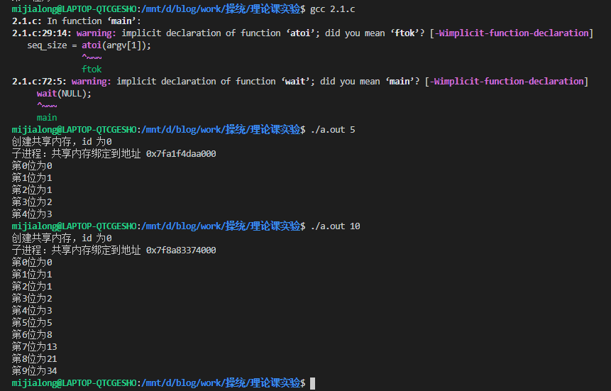
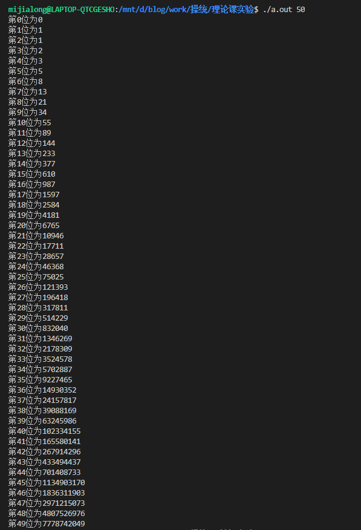
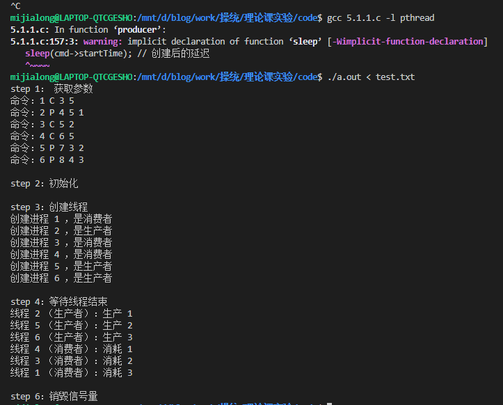
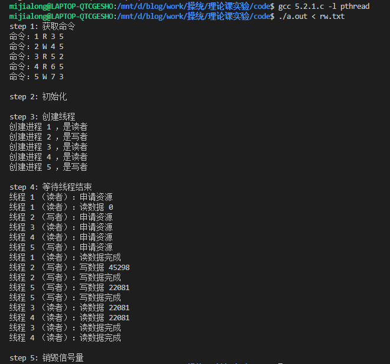

# 理论课实验

- 数据科学与计算机学院
- 软件工程3班
- 米家龙
- 18342075

## 目录

[TOC]

## 实验题目

1. 进程的创建实验
2. 进程间通信
3. 命令解释器
4. 线程实验——用线程生成 Fibonacci 数列
5. 同步互斥问题
   - 生产者消费者问题
   - 读者写者问题

## 实验环境

使用老师提供的`mooc-os-2015.vdi`，在虚拟机中创建 64 位的 Ubuntu 虚拟机并加载该 vdi ，获得了版本为：

```bash
Linux moocos-VirtualBox 3.13.0-24-generic #46-Ubuntu SMP Thu Apr 10 19:11:08 UTC 2014 x86_64 x86_64 x86_64 GNU/Linux
```

的虚拟机操作系统

并且使用 vscode 配合 Remote SSH 插件，实现通过远程终端在 windows 环境的对文件的编辑和运行

### 2. WSL

WSL 配置如下：

```shell
Linux LAPTOP-QTCGESHO 4.4.0-19041-Microsoft #1-Microsoft Fri Dec 06 14:06:00 PST 2019 x86_64 x86_64 x86_64 GNU/Linux
```

其中 gcc 和 g++ 版本如下图


## 1. 进程的创建实验

### 实验目的

1. 加深对进程概念的理解，明确进程和程序的区别。进一步认识并发执行的实质。
2. 认识进程生成的过程，学会使用fork生成子进程，并知道如何使子进程完成与父进程不同的工作。

### 实验内容

#### 1. 编译运行程序，解释现象（对应代码1.1.cpp）

代码如下
```cpp  
#include <sys/types.h>
#include <stdio.h>
#include <unistd.h>

int main()
{
  int pid1 = fork();
  printf("**1**\n");
  int pid2 = fork();
  printf("**2**\n");
  if (pid1 == 0)
  {
    int pid3 = fork();
    printf("**3**\n");
  }
  else
    printf("**4**\n");
  return 0;
}
```

分别在 WSL 和虚拟机中编译运行，运行结果如下


根据 `fork()` 函数的定义，了解到当执行fork()函数后，会生成一个子进程，子进程的执行从 `fork()` 的返回值开始且代码继续往下执行。 `fork()` 执行一次后会有两次返回值：第一次为原来的进程，即父进程会有一次返回值，表示新生成的子进程的进程ID；第二次为子进程的起始执行，返回值为0。

查看 WSL 输出顺序，推导出代码执行过程如下：
1. *主进程*创建*子进程1*
2. *主进程*和*子进程1*输出 `**1**\n`
3. *主进程*创建*子进程2*，*子进程1*创建*子进程12*
4. *主进程*和*子进程1*和*子进程2*和*子进程12*输出 `**2**\n`
5. 各个进程判断自己的 **pid1** 是否为0，其中*主进程*和*子进程2*的 **pid1** ==存在且相同==
6. *主进程*和*子进程2*输出 `**4**\n`，*子进程1*和*子进程12*创建*子进程13*和*子进程123*
7. *子进程1*和*子进程12*和*子进程13*和*子进程123*输出 `**3**\n`

发现 WSL 和虚拟机中编译运行的结果不同，在虚拟机上多次运行，输出结果也不完全相同，是因为线程的执行的顺序不同导致的，但对于单个线程来说，执行的步骤没有区别

|        代码         |          主进程           |          子进程1           |            子进程2            |            子进程12            |                  子进程13                  |            子进程123             |
| :-----------------: | :-----------------------: | :------------------------: | :---------------------------: | :----------------------------: | :----------------------------------------: | :------------------------------: |
| `int pid1 = fork()` | 创建*子进程*1， pid1 != 0 |    创建成功， pid1 = 0     |               \               |               \                |                     \                      |                \                 |
| `printf("**1**\n")` |      输出 `**1**\n`       |       输出 `**1**\n`       |               \               |               \                |                     \                      |                \                 |
| `int pid2 = fork()` | 创建*子进程2*， pid2 != 0 | 创建*子进程12*， pid2 != 0 | 创建成功 pid1 != 0， pid2 = 0 | 创建成功， pid1 = 0， pid2 = 0 |                     \                      |                \                 |
| `printf("**2**\n")` |      输出 `**2**\n`       |       输出 `**2**\n`       |        输出 `**2**\n`         |         输出 `**2**\n`         |                     \                      |                \                 |
|  `if (pid1 == 0)`   |      判断 -> 不进入       |        判断 -> 进入        |        判断 -> 不进入         |          判断 -> 进入          |                     \                      |                \                 |
| `int pid3 = fork()` |             \             | 创建*子进程13*，pid3 != 0  |               \               |  创建*子进程123*， pid3 != 0   | 创建成功， pid1 = 0， pid2 != 0， pid3 = 0 | 创建成功，pid1 = pid2 = pid3 = 0 |
| `printf("**3**\n")` |             \             |       输出 `**3**\n`       |               \               |         输出 `**3**\n`         |               输出 `**3**\n`               |          输出 `**3**\n`          |
| `printf("**4**\n")` |      输出 `**4**\n`       |             \              |        输出 `**4**\n`         |               \                |                     \                      |

#### 2. 通过实验完成习题3.4 （对应代码1.2.c）

习题3.4的代码如下
```cpp  
#include <sys/types.h>
#include <stdio.h>
#include <unistd.h>

int value = 5;

int main()
{
  pid_t pid;
  pid = fork();

  if (pid == 0)
    value += 15;
  else if (pid > 0)
  {
    wait(NULL);
    printf("PAREMT: value = %d", value);
    exit(0);
  }
}
```

尝试在 WSL 中运行，发现会报错，报错原因是缺少 `wait()` 和 `exit()` 函数，于是在虚拟机中运行，虽然会 Warning 提示 `exit()` 函数的问题，但是可以运行，运行结果如下


经过查阅资料后了解到，c++ 中缺少上述函数，而在 c 语言中则并不会，因此要求代码使用 c 语言来编写

#### 3. 编程练习（对应代码1.3.cpp）

> 编写一段程序，使用系统调用 `fork()` 创建两个子进程。当此程 序运行时，在系统中有一个父进程和两个子进程活动。让每一 个进程在屏幕上显示一个字符；父进程显示字符“a”；子进程分别显示字符“b”和字符“c”。试观察记录屏幕上的显示结果，并分析原因

代码如下
```cpp  
#include <sys/types.h>
#include <stdio.h>
#include <unistd.h>
#include <iostream>

using namespace std;

int main()
{
  cout << 'a' << endl;

  // 创建子进程b
  pid_t pid_b = fork();
  if (pid_b == 0) // 确认是子进程b
  {
    cout << 'b' << endl;
    pid_t pid_c = fork();

    if (pid_c == 0) // 确认是子进程c
    {
      cout << 'c' << endl;
    }
  }

  return 0;
}
```

运行结果如下


出现该现象的原因是因为：
1. *主进程*输出“a”
2. *主进程*创建的*子进程b*
3. 只有*子进程b*才会运行接下来的代码
   1. 输出“b”
   2. 创建*子进程c*
   3. 只有*子进程c*才会运行接下来的代码
      1. 输出“c”

## 2. 进程间的通信

### 实验目的

进程间共享内存实验，初步了解这种进程间通讯

### 实验内容

> 完成课本第三章的练习3.10的程序

代码如下
```cpp  
#include <sys/types.h>
#include <sys/shm.h>
#include <sys/stat.h>
#include <stdio.h>
#include <unistd.h>

#define PERMS (S_IRUSR | S_IWUSR) // 定义权限
#define MAX_SEQUEENCE 10          // 定义队列长度

typedef struct
{
  long fib_squenece[MAX_SEQUEENCE];
  int sequence_size;
} shared_data;

int main(int argc, char **argv)
{
  int seq_size;
  pid_t pid;
  int seg_id;              // 共享内存段的 id
  shared_data *shared_mem; // 共享内存段的指针

  if (argc != 2) // 参数不够
  {
    fprintf(stderr, "Usage: ./shm-fib <int sequence size>\n");
    return -1;
  }

  seq_size = atoi(argv[1]);
  if (seq_size > MAX_SEQUEENCE) // 超出长度
  {
    fprintf(stderr, "队列长度需要小于 %d\n", MAX_SEQUEENCE);
    return -1;
  }

  // 创建内存段
  if (seg_id = shmget(IPC_PRIVATE, sizeof(shared_data), PERMS) == -1)
  {
    fprintf(stderr, "无法创建合适的内存段\n");
    return 1;
  }

  printf("创建共享内存，id 为%d\n", seg_id);

  // 创建共享内存
  if ((shared_mem = (shared_data *)shmat(seg_id, 0, 0)) == (shared_data *)-1)
  {
    fprintf(stderr, "无法绑定到段 %d\n", seg_id);
    return 0;
  }
  shared_mem->sequence_size = seq_size;

  if ((pid = fork()) == (pid_t)-1) // 创建线程失败
    return 1;

  if (pid == 0) // 如果是子进程
  {
    printf("子进程：共享内存绑定到地址 %p\n", shared_mem);

    shared_mem->fib_squenece[0] = 0;
    shared_mem->fib_squenece[1] = 1;

    for (int i = 2; i < shared_mem->sequence_size; i++)
      shared_mem->fib_squenece[i] =
          shared_mem->fib_squenece[i - 1] + shared_mem->fib_squenece[i - 2];

    // 清空
    shmdt((void *)shared_mem);
  }
  else
  {
    wait(NULL);

    for (int i = 0; i < shared_mem->sequence_size; i++)
      printf("第%d位为%ld\n", i, shared_mem->fib_squenece[i]);

    // 清空
    shmdt((void *)shared_mem);
    shmctl(seg_id, IPC_RMID, NULL);
  }

  return 0;
}
```

尝试在虚拟机中运行代码，发现会出现如下错误


而在 WSL 运行，则可以运行，如下图



## 3. 命令解释器（对应代码3.1.c）

### 实验内容

> - 完成课本上第三章的项目：实现shell
> - 实现程序的后台运行

代码如下：
```cpp
#include <sys/types.h>
#include <sys/wait.h>
#include <stdio.h>
#include <stdlib.h>
#include <unistd.h>
#include <pthread.h>

#define MAX_LINE 80

char operation[10][MAX_LINE];
int index = 0;

void setup(char inputBuffer[], char **args, int *background);
void History(int signal);

// 主函数
int main(int argc, char **argv)
{
  char inputBuffer[MAX_LINE];   // 存放命令
  int background = 0;           // 1代表后台运行
  char *args[MAX_LINE / 2 + 1]; // 最多40个参数
  signal(SIGINT, History);

  while (1)
  {
    background = 0;
    printf("COMMAND->");
    fflush(stdout); // 需要刷新，不然无法显示
    setup(inputBuffer, args, &background);

    pid_t pid;
    if ((pid = fork()) == (pid_t)-1) // 创建失败
    {
      fprintf(stderr, "\n创建线程失败，线程id为%d\n", pid);
      fflush(stderr);
      exit(-1);
    }
    if (pid == 0) // 判断是子进程
    {
      execvp(args[0], args);
      exit(0);
    }
    else if (background == 0)
      wait(0);
    else if (background == 1)
      continue;
  }
}

void setup(char inputBuffer[], char *args[], int *background)
{
  int length = read(STDIN_FILENO, inputBuffer, MAX_LINE); // 命令的字符数目
  int start = -1;                                         // 命令的第一个字符位置
  int ct = 0;                                             // 下一个参数存入 args[] 的位置

  if (length == 0)
    exit(0);
  if (length < 0) // 读取错误
  {
    perror("命令错误");
    exit(-1);
  }

  for (int i = 0; i < length; i++) // 遍历缓冲区
  {
    operation[index][i] = inputBuffer[i];
    switch (inputBuffer[i])
    {
    // 字符为分割参数的空格或制表符(tab)'\t'
    case ' ':
    case '\t':
    {
      if (start != -1)
      {
        args[ct] = &inputBuffer[start];
        ct++;
      }
      inputBuffer[i] = '\0'; // 终止符
      start = -1;
      break;
    }
    case '\n': // 命令行结束
    {
      if (start != -1)
      {
        args[ct] = &inputBuffer[start];
        ct++;
      }

      inputBuffer[i] = '\0';
      break;
    }
    default: // 其他字符
    {
      if (start == -1)
        start = i;
      if (inputBuffer[i] == '&')
      {
        *background = 1;
        inputBuffer[i] = '\0';
      }
    }
    }
  }
  args[ct] = NULL;

  operation[index][length] = '\0';
  if (inputBuffer[0] != '\0' && inputBuffer[0] != '\n' && inputBuffer[0] != ' ' && inputBuffer[0] != SIGINT)
    index = (index + 1) % 10;
}

void History(int signal)
{
  printf("\n");
  fflush(stdout);
  int num = 0;
  for (int i = 0; i < 10; i++)
  {
    if (operation[(i + index) % 10][0] != '\0' && operation[(i + index) % 10][0] != '\n' && operation[(i + index) % 10][0] != ' ' && operation[(i + index) % 10][0] != SIGINT)
    {
      printf("%d: %s", (num++) + 1, operation[(i + index) % 10]);
      fflush(stdout);
      num %= 10;
    }
  }
  // printf("\ntest\n");
  // fflush(stdout);
}
```

运行代码情况如下：


## 4. 线程实验（对应代码4.1.c）

> 用 pthread 线程库，按照第四章习题4.11的 要求生成并输出 *Fibonacci* 数列

代码如下
```cpp
#include <stdio.h>
#include <stdlib.h>
#include <pthread.h>

#define MAX_SIZE 256

int fib[MAX_SIZE]; // 储存用的数组

void *run(void *arg)
{
  int upper = atoi(arg); // 上限

  if (upper == 0)
    pthread_exit(0);
  else
  {
    fib[0] = 0;
    fib[1] = 1;

    for (int i = 2; i < upper; i++)
      fib[i] = fib[i - 1] + fib[i - 2];
  }

  pthread_exit(0);
}

int main(int argc, char **argv[])
{
  pthread_t tid;        // 线程 id
  pthread_attr_t tattr; // 线程属性

  if (argc != 2) // 参数不够
  {
    fprintf(stderr, "Usage: ./a.out <int value>\n");
    return -1;
  }

  int parem = atoi(argv[1]);
  if (parem < 0)
  {
    fprintf(stderr, "参数为%d，需要大于0", parem);
    return -1;
  }

  pthread_attr_init(&tattr);                  // 初始化属性
  pthread_create(&tid, &tattr, run, argv[1]); // 创建线程

  pthread_join(tid, NULL); // 等待结束

  for (int i = 0; i < parem; i++)
    printf("第%d位为%d\n", i, fib[i]);
    // printf("%d is %d\n", i, fib[i]);

  return 0;
}
```

尝试编译，结果出现如下报错


查阅资料后了解到，如果需要使用 pthread 库，不仅需要在环境中安装 *manpages-posix* 软件包，还需要在编译时加入参数 `-lpthread` 链接到对应的库

使用命令 `sudo apt install manpages-posix` 安装了对应的软件包后，对代码进行编译运行，结果如下


但是在将参数加大后，发现会出现溢出的情况，于是将对应的数组类型从 `int` 改为 `long` ，优化后代码如下



但对于更大的数据， `long` 数据类型依然有其局限性

## 5. 同步互斥问题

### 生产者消费者问题（对应代码5.1.1.c）

> 利用线程同步机制，实现消费者-生产者问题

#### 1. 互斥锁/互斥量（mutex）

互斥锁的属性：
1. 原子性。对mutex的加锁和解锁操作是原子的，一个线程进行 mutex 操作的过程中，其他线程不能对同一个 mutex 进行其他操作。
2. 单一性。拥有 mutex 的线程除非释放 mutex ，否则其他线程不能拥有此 mutex 。
3. 非忙等待。等待 mutex 的线程处于等待状态，直到要等待的 mutex 处于未加锁状态，这时操作系统负责唤醒等待此 mutex 的线程。

#### 2. 信号量

* POSIX 信号量在多线程编程中可以起到同步或互斥的作用。 用 POSIX 信号量可以实现传统操作系统P、V操作(即对应课本 的wait、signal)。 
* 由于 POSIX 信号量不是内核负责维护，所以当进程退出后，POSIX 信号量自动消亡。

#### 具体实现

> 由于项目要求是对 `full` 和 `empty` 采用标准计数信号量，而 `mutex` 采用二进制信号量，因此可以分别使用信号量和互斥锁进行实现

代码实现如下：
```cpp
#include <stdio.h>
#include <pthread.h>
#include <stdlib.h>
#include <semaphore.h>

typedef int buffer_item;
#define BUFFER_SIZE 5
#define MAX_THREAD 10

buffer_item buffer[BUFFER_SIZE];

typedef struct
{
  int thread_id; // 线程 id
  char role;     // P 生产者， C 消费者
  int startTime; // 线程创建后开始行动的时间
  int lastTime;  // 生产/消费持续时间
  int products;  // 产品（只有生产者才有）
} ThreadArgs;    // 线程的参数

pthread_mutex_t mutex;
sem_t full, empty;

int pBufferIndex = 0, cBufferIndex = 0; // 分别作为生产者/消费者在缓冲区上面的索引

int insertItem(buffer_item item);
int removeItem(int threadId);
void *producer(void *param);
void *consumer(void *param);

int main(int argc, char *argv[])
{
  // 1. 运行可执行文件时需要三个参数
  printf("step 1： 获取参数\n");
  ThreadArgs cmds[MAX_THREAD + 1];
  int threadId, threadNum = 0;
  char role;
  while (scanf("%d %c", &threadId, &role) != EOF)
  {
    // 默认角色是 C
    // printf("%c", role);
    if (role == 'P' || role == 'C')
    {
      cmds[threadNum].thread_id = threadId;
      cmds[threadNum].role = role;
      int startTime, lastTime;
      scanf("%d %d", &startTime, &lastTime);
      cmds[threadNum].startTime = startTime;
      cmds[threadNum].lastTime = lastTime;
    }
    if (role == 'P') // 生产者多一个参数
    {
      int products;
      scanf("%d", &products);
      cmds[threadNum].products = products;
    }
    threadNum++;
  }

  for (int i = 0; i < threadNum; i++)
  {
    if (cmds[i].role == 'P')
      printf("命令：%d %c %d %d %d\n",
             cmds[i].thread_id, cmds[i].role,
             cmds[i].startTime, cmds[i].lastTime, cmds[i].products);
    else
      printf("命令：%d %c %d %d\n",
             cmds[i].thread_id, cmds[i].role,
             cmds[i].startTime, cmds[i].lastTime);
  }

  // 2. 初始化缓冲区 buffer
  printf("\nstep 2：初始化\n");
  pthread_mutex_init(&mutex, NULL);
  sem_init(&full, 0, 0);
  sem_init(&empty, 0, BUFFER_SIZE);
  pthread_t threads[MAX_THREAD + 1];
  for (int i = 0; i < 5; i++)
    buffer[i] = 0;

  // 3. 创建线程

  printf("\nstep 3：创建线程\n");
  for (int i = 0; i < threadNum; i++)
  {
    if (cmds[i].role == 'P')
    {
      pthread_create(&threads[i], NULL, producer, &cmds[i]);
      printf("创建进程 %d ，是生产者\n", cmds[i].thread_id);
    }
    else if (cmds[i].role == 'C')
    {
      pthread_create(&threads[i], NULL, consumer, &cmds[i]);
      printf("创建进程 %d ，是消费者\n", cmds[i].thread_id);
    }
  }

  // 4. 等待结束
  printf("\nstep 4：等待线程结束\n");

  for (int i = 0; i < threadNum; i++)
  {
    pthread_join(threads[i], NULL);
  }

  // 6. 退出
  printf("\nstep 6：销毁信号量\n");
  pthread_mutex_destroy(&mutex);
  sem_destroy(&full);
  sem_destroy(&empty);
  return 0;
}

/**
 * 插入对象到缓冲区中
 * @param item buffer_item（本质上是 int）
 * @return 0成功，1失败
*/
int insertItem(buffer_item item)
{
  // printf("尝试插入元素\n");

  if (buffer[pBufferIndex] == 0)
  {
    buffer[pBufferIndex] = item;
    pBufferIndex = (pBufferIndex + 1) % BUFFER_SIZE;
    return 0;
  }
  return 1;
}

/**
 * @todo
 * 从缓冲区中删除对应的对象
 * @param threadId int ，代表线程 id
 * @return 0成功，1失败
*/
int removeItem(int threadId)
{
  if (buffer[cBufferIndex] != 0)
  {
    printf("线程 %d （消费者）：消耗 %d\n", threadId, buffer[cBufferIndex]);
    buffer[cBufferIndex] = 0;
    cBufferIndex = (cBufferIndex + 1) % BUFFER_SIZE;
    return 0;
  }
  return 1;
}

/**
 * 生产者函数
 * @param threadArg ThreadArg ，代表命令
*/
void *producer(void *param)
{
  ThreadArgs *cmd = (ThreadArgs *)param;
  sleep(cmd->startTime); // 创建后的延迟

  while (1)
  {
    sem_wait(&empty);
    pthread_mutex_lock(&mutex); // 锁了

    if (insertItem(cmd->products))
      printf("线程 %d （生产者）：插入失败\n", cmd->thread_id);
    else
    {
      printf("线程 %d （生产者）：生产 %d\n", cmd->thread_id, cmd->products);
      sleep(cmd->lastTime);
    }
    pthread_mutex_unlock(&mutex);
    sem_post(&full);
    pthread_exit(0);
  }
}

/**
 * 消费者函数
 * @param threadArg ThreadArg ，代表命令
*/
void *consumer(void *param)
{
  ThreadArgs *cmd = (ThreadArgs *)param;
  sleep(cmd->startTime);

  while (1)
  {
    sem_wait(&full);
    pthread_mutex_lock(&mutex); // 锁了

    if (removeItem(cmd->thread_id))
      printf("线程 %d （消费者）：消耗失败\n", cmd->thread_id);
    else
      sleep(cmd->lastTime);

    pthread_mutex_unlock(&mutex); // 解锁
    sem_post(&empty);
    pthread_exit(0);
  }
}
```

运行结果如下：


### 读者写者问题

#### 1. 读者优先（对应代码5.2.1.c）

> 读者优先指的是除非有写者在写文件，否则读者不需要等待。（读者队列为空时才会写）

代码如下：
```cpp
#include <stdio.h>
#include <pthread.h>
#include <semaphore.h>
#include <sys/types.h>
#include <stdlib.h>
#include <unistd.h>

/**
 * 职能
 * @param Reader 代表读者
 * @param Writer 代表写者
*/
typedef enum
{
  Reader,
  Writer
} Role;

/**
 * 线程命令
 * @param threadId int 代表线程 id
 * @param role Role 代表职能
 * @param startTime int 创建线程之后的延迟
 * @param lastTime int 读/写操作持续时间
*/
typedef struct
{
  int threadId;
  Role role;
  int startTime;
  int lastTime;
} ThreadArgs;

#define MAX_THREAD 15

sem_t writing;      // 正在写，写-写互斥
sem_t reading;      // 正在读
sem_t readingCount; // 阅读队列
sem_t writingCount; // 写队列

int writerCount = 0; // 读者数量
int readerCount = 0; // 写者数量
int buffer = 0;

/**
 * 读者函数
 * @param threadArg ThreadArg
*/
void *reader(void *param);

/**
 * 写者函数
 * @param threadArg ThreadArg
*/
void *writer(void *param);

int main(int argc, char *argv[])
{
  // 1. 获取命令
  printf("step 1: 获取命令\n");
  int threadNum = 0;
  int threadId, startTime, lastTime;
  char role;
  ThreadArgs cmds[MAX_THREAD + 1];
  while (scanf("%d %c %d %d", &threadId, &role, &startTime, &lastTime) != EOF)
  {
    cmds[threadNum].threadId = threadId;
    cmds[threadNum].startTime = startTime;
    cmds[threadNum].lastTime = lastTime;
    cmds[threadNum].role = role == 'W' ? Writer : (role == 'R' ? Reader : ' ');
    threadNum++;
  }

  for (int i = 0; i < threadNum; i++)
    printf("命令：%d %c %d %d\n",
           cmds[i].threadId,
           cmds[i].role == Writer ? 'W' : (cmds[i].role == Reader ? 'R' : 'E'),
           cmds[i].startTime, cmds[i].lastTime);

  // 2. 初始化
  printf("\nstep 2: 初始化\n");
  sem_init(&reading, 0, 1);
  sem_init(&writing, 0, 1);
  sem_init(&writingCount, 0, 1);
  sem_init(&readingCount, 0, 1);

  // 3. 创建线程
  printf("\nstep 3: 创建线程\n");
  pthread_t threads[MAX_THREAD + 1];
  for (int i = 0; i < threadNum; i++)
  {
    if (cmds[i].role == Reader)
    {
      pthread_create(&threads[i], NULL, reader, &cmds[i]);
      printf("创建进程 %d ，是读者\n", cmds[i].threadId);
    }
    else if (cmds[i].role == Writer)
    {
      pthread_create(&threads[i], NULL, writer, &cmds[i]);
      printf("创建进程 %d ，是写者\n", cmds[i].threadId);
    }
  }

  // 4. 等待线程结束
  printf("\nstep 4: 等待线程结束\n");
  for (int i = 0; i < threadNum; i++)
    pthread_join(threads[i], NULL);

  // 5. 销毁信号量
  printf("\nstep 5: 销毁信号量\n");

  sem_destroy(&reading);
  sem_destroy(&writing);
  sem_destroy(&writingCount);
  sem_destroy(&readingCount);

  exit(1);
  return 1;
}

void *writer(void *param)
{
  ThreadArgs *cmd = (ThreadArgs *)param;
  sleep(cmd->startTime);
  while (1)
  {
    // 申请资源
    printf("线程 %d （写者）：申请资源\n", cmd->threadId);
    sem_wait(&writingCount);
    writerCount++;        // 写者数量增加
    if (writerCount == 1) // 避免死锁
      sem_wait(&reading); // 读写互斥
    sem_post(&writingCount);
    sem_wait(&writing);

    // 正式开始写
    buffer = rand() % 65535; // 写入的数据
    printf("线程 %d （写者）：写数据 %d\n", cmd->threadId, buffer);
    sleep(cmd->lastTime);
    printf("线程 %d （写者）：写数据完成\n", cmd->threadId);

    // 释放资源
    sem_post(&writing);
    sem_wait(&writingCount);
    writerCount--;
    if (writerCount == 0)
      sem_post(&reading);
    sem_post(&writingCount);

    pthread_exit(0);
  }
}

void *reader(void *param)
{
  ThreadArgs *cmd = (ThreadArgs *)param;
  sleep(cmd->startTime);
  while (1)
  {
    // 申请资源
    printf("线程 %d （读者）：申请资源\n", cmd->threadId);
    sem_wait(&reading);
    sem_wait(&readingCount);
    readerCount++;
    if (readerCount == 1) // 如果只有一位则需要等，如果已经有读者正在阅读，那么可以直接读
      sem_wait(&writing);
    sem_post(&readingCount);
    sem_post(&reading); // 由于必然会占用 writing ，那么读写互斥达成，释放 reading 给别的读者

    // 正式开读
    printf("线程 %d （读者）：读数据 %d\n", cmd->threadId, buffer);
    sleep(cmd->lastTime);
    printf("线程 %d （读者）：读数据完成\n", cmd->threadId);

    // 回收资源
    sem_wait(&readingCount);
    readerCount--;
    if (readerCount == 0)
      sem_post(&writing); // 没有读者时，释放可写信号
    sem_post(&readingCount);

    pthread_exit(0);
  }
}
```

运行结果如下：


##### 2. 写者优先（对应代码5.2.3.c）

代码如下：
```cpp
#include <stdio.h>
#include <pthread.h>
#include <semaphore.h>
#include <sys/types.h>
#include <stdlib.h>
#include <unistd.h>

/**
 * 职能
 * @param Reader 代表读者
 * @param Writer 代表写者
*/
typedef enum
{
  Reader,
  Writer
} Role;

/**
 * 线程命令
 * @param threadId int 代表线程 id
 * @param role Role 代表职能
 * @param startTime int 创建线程之后的延迟
 * @param lastTime int 读/写操作持续时间
*/
typedef struct
{
  int threadId;
  Role role;
  int startTime;
  int lastTime;
} ThreadArgs;

#define MAX_THREAD 15

sem_t writing;      // 正在写，写-写互斥
sem_t reading;      // 正在读
sem_t readingCount; // 阅读队列
sem_t writingCount; // 写队列

int writerCount = 0; // 读者数量
int readerCount = 0; // 写者数量
int buffer = 0;

/**
 * 读者函数
 * @param threadArg ThreadArg
*/
void *reader(void *param);

/**
 * 写者函数
 * @param threadArg ThreadArg
*/
void *writer(void *param);

int main(int argc, char *argv[])
{
  // 1. 获取命令
  printf("step 1: 获取命令\n");
  int threadNum = 0;
  int threadId, startTime, lastTime;
  char role;
  ThreadArgs cmds[MAX_THREAD + 1];
  while (scanf("%d %c %d %d", &threadId, &role, &startTime, &lastTime) != EOF)
  {
    cmds[threadNum].threadId = threadId;
    cmds[threadNum].startTime = startTime;
    cmds[threadNum].lastTime = lastTime;
    cmds[threadNum].role = role == 'W' ? Writer : (role == 'R' ? Reader : ' ');
    threadNum++;
  }

  for (int i = 0; i < threadNum; i++)
    printf("命令：%d %c %d %d\n",
           cmds[i].threadId,
           cmds[i].role == Writer ? 'W' : (cmds[i].role == Reader ? 'R' : 'E'),
           cmds[i].startTime, cmds[i].lastTime);

  // 2. 初始化
  printf("\nstep 2: 初始化\n");
  sem_init(&reading, 0, 1);
  sem_init(&writing, 0, 1);
  sem_init(&writingCount, 0, 1);
  sem_init(&readingCount, 0, 1);

  // 3. 创建线程
  printf("\nstep 3: 创建线程\n");
  pthread_t threads[MAX_THREAD + 1];
  for (int i = 0; i < threadNum; i++)
  {
    if (cmds[i].role == Reader)
    {
      pthread_create(&threads[i], NULL, reader, &cmds[i]);
      printf("创建进程 %d ，是读者\n", cmds[i].threadId);
    }
    else if (cmds[i].role == Writer)
    {
      pthread_create(&threads[i], NULL, writer, &cmds[i]);
      printf("创建进程 %d ，是写者\n", cmds[i].threadId);
    }
  }

  // 4. 等待线程结束
  printf("\nstep 4: 等待线程结束\n");
  for (int i = 0; i < threadNum; i++)
    pthread_join(threads[i], NULL);

  // 5. 销毁信号量
  printf("\nstep 5: 销毁信号量\n");

  sem_destroy(&reading);
  sem_destroy(&writing);
  sem_destroy(&writingCount);
  sem_destroy(&readingCount);

  exit(1);
  return 1;
}

void *writer(void *param)
{
  ThreadArgs *cmd = (ThreadArgs *)param;
  sleep(cmd->startTime);
  while (1)
  {
    // 申请资源
    printf("线程 %d （写者）：申请资源\n", cmd->threadId);
    sem_wait(&writingCount);
    writerCount++;
    if (writerCount == 1)
      sem_wait(&reading);
    sem_post(&writingCount);
    sem_wait(&writing); // 写者优先

    // 正式开始写
    buffer = rand() % 65535; // 写入的数据
    printf("线程 %d （写者）：写数据 %d\n", cmd->threadId, buffer);
    sleep(cmd->lastTime);
    printf("线程 %d （写者）：写数据完成\n", cmd->threadId);

    // 释放资源
    sem_wait(&writingCount);
    writerCount--;
    if (writerCount == 0)
      sem_post(&reading);
    sem_post(&writing);
    sem_post(&writingCount);
    pthread_exit(0);
  }
}

void *reader(void *param)
{
  ThreadArgs *cmd = (ThreadArgs *)param;
  sleep(cmd->startTime);
  while (1)
  {
    // 申请资源
    printf("线程 %d （读者）：申请资源\n", cmd->threadId);
    sem_wait(&readingCount);
    readerCount++;
    if (readerCount == 1)
      sem_wait(&writing);
    sem_post(&readingCount);
    sem_wait(&reading);

    // 正式开读
    printf("线程 %d （读者）：读数据 %d\n", cmd->threadId, buffer);
    sleep(cmd->lastTime);
    printf("线程 %d （读者）：读数据完成\n", cmd->threadId);

    // 回收资源
    sem_post(&reading);
    sem_wait(&readingCount);
    readerCount--;
    // if (readerCount == 0)
    sem_post(&writing); // 没有读者时，释放可写信号
    sem_post(&readingCount);

    pthread_exit(0);
  }
}
```

运行结果如下：
