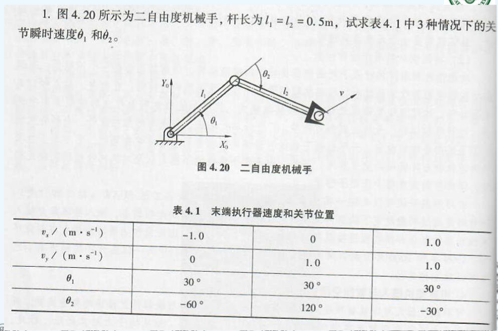
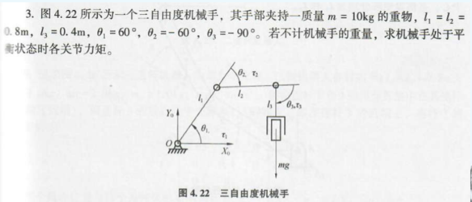
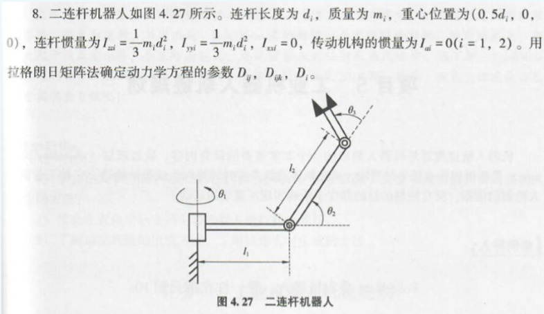
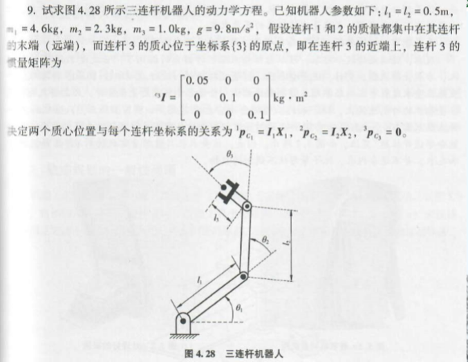

# 机器人导论第二次作业

- 米家龙
- 18342075

## 1

已知二自由度雅克比行列式为：

$$
\begin{aligned}
  & J = \begin{bmatrix}
  -l_{1}{\rm sin}\theta_1-l_{2}{\rm sin}(\theta_1 + \theta_2) && -l_2{\rm sin}(\theta_1 + \theta_2) \\
  l_1{\rm cos}\theta_1 + l_2{\rm cos}(\theta_1 + \theta_2) && l_2{\rm cos}(\theta_1 + \theta_2)
  \end{bmatrix}
  \\
  & \dot{q} = J^{-1} \cdot q \cdot V
\end{aligned}
$$

可以得到

$$
\begin{bmatrix}
  \dot{\theta_1} \\
  \dot{\theta_2}
\end{bmatrix} = 
\begin{bmatrix}
  -l_{1}{\rm sin}\theta_1-l_{2}{\rm sin}(\theta_1 + \theta_2) && -l_2{\rm sin}(\theta_1 + \theta_2) \\
  l_1{\rm cos}\theta_1 + l_2{\rm cos}(\theta_1 + \theta_2) && l_2{\rm cos}(\theta_1 + \theta_2)
\end{bmatrix}^{-1} \cdot
\begin{bmatrix}
  v_x \\
  v_y
\end{bmatrix}
$$

分别代入一下三种情况，可以得到

$$
\begin{aligned}
  & 1. \begin{bmatrix}
      \dot{\theta_1} \\
      \dot{\theta_2}
    \end{bmatrix} = 
    \begin{bmatrix}
      2 \\
      -4
    \end{bmatrix} \\
  & 2. \begin{bmatrix}
      \dot{\theta_1} \\
      \dot{\theta_2}
    \end{bmatrix} = 
    \begin{bmatrix}
      \frac{2}{\sqrt{3}} \\
      -\frac{4}{\sqrt{3}}
    \end{bmatrix} \\
  & 3. \begin{bmatrix}
      \dot{\theta_1} \\
      \dot{\theta_2}
    \end{bmatrix} = 
    \begin{bmatrix}
      0 \\
      2\sqrt{3} - 2
    \end{bmatrix} \\
\end{aligned}
$$

## 2

当机械手平衡时，各个关节的角速度和加速度都为0，即 
$$
\begin{aligned}
& \dot{\theta_1} = \dot{\theta_2} = \dot{\theta_3} = \ddot{\theta_1} = \ddot{\theta_2} = \ddot{\theta_3} = 0
\end{aligned}
$$

因此对于连杆1，可以得到
$$
\begin{aligned}
  & E_{k1} = \frac{1}{2}m_1v_1^2 \\
  & E_{p1} = m_1gl_1{\rm sin}\theta_1
\end{aligned}
$$

对于连杆2，可以得到
$$
\begin{aligned}
  & x_2 = l_1{\rm cos}\theta_1 + l_2{\rm cos}(\theta_1 + \theta_2) \\
  & y_2 = l_1{\rm sin}\theta_1 + l_2{\rm sin}(\theta_1 + \theta_2) \\
  & v_2^2 = \dot{x_2}^2 + \dot{y_2}^2 \\
  \\ 
  & E_{k2} = \frac{1}{2}m_2v_2^2 \\
  & E_{p2} = m_2gy_2
\end{aligned}
$$

由于忽略机器手自身重力，因此 $m_1 = m_2 = 0$ ,可以得到上述两连杆的动能和势能都为0

对于连杆3，可以得到
$$
\begin{aligned}
  & x_3 = l_1{\rm cos}\theta_1 + l_2{\rm cos}(\theta_1 + \theta_2) + l_3{\rm cos}(\theta_1 + \theta_2 + \theta_3) \\
  & y_3 = l_1{\rm sin}\theta_1 + l_2{\rm sin}(\theta_1 + \theta_2) + l_3{\rm sin}(\theta_1 + \theta_2 + \theta_3) \\
  & v_3^2 = \dot{x_3}^2 + \dot{y_3}^2 \\
  \\
  & E_{k3} = \frac{1}{2}m_3v_3^2 \\
  & E_{p3} = m_3gy_3
\end{aligned}
$$

根据拉格朗日函数，可以得到
$$
\begin{aligned}
  & \begin{aligned}
  L & = E_{k3} - E_{p3} \\
    & = (E_{k1} + E_{k2} + E_{k3}) - (E_{p1} + E_{p2} + E_{p3}) \\
    & = - m_3g \ [l_1{\rm sin}\theta_1 + l_2{\rm sin}(\theta_1 + \theta_2) + l_3{\rm sin}(\theta_1 + \theta_2 + \theta_3)]
  \end{aligned}
  \\ \\
  & \begin{aligned}
    \tau_1 & = \frac{ \ {\rm d} \ }{ \ {\rm d} \ t}\frac{\partial L}{\partial \dot{\theta_1}} - \frac{\partial L}{\partial \theta_1} \\
           & = m_3g \ [l_1{\rm cos}\theta_1 + l_2{\rm cos}(\theta_1 + \theta_2) + l_3{\rm cos}(\theta_1 + \theta_2 + \theta_3)] \\
           & = 120 \\
    \tau_2 & = \frac{{\rm d}}{{\rm d}t}\frac{\partial L}{\partial \dot{\theta_2}} - \frac{\partial L}{\partial \theta_2} \\
           & =  m_3g \ [l_2{\rm cos}(\theta_1 + \theta_2) + l_3{\rm cos}(\theta_1 + \theta_2 + \theta_3)] \\
    \tau_3 & = \frac{\rm d}{{\rm d}t}\frac{\partial L}{\partial \dot{\theta_3}} - \frac{\partial L}{\partial \theta_3} \\
           & = m_3g \ l_3{\rm cos}(\theta_1 + \theta_2 + \theta_3) \\
           & = 0
  \end{aligned}
\end{aligned}
$$

## 3

对于上述两个连杆，可以得到

$$
\begin{aligned}
  & E_{k1} = \frac{1}{2} I_{zz1} \ \dot{\theta_1}^2 + \frac{1}{8}m_1d_1^2\dot{\theta_1}^2 \\
  & E_{p1} = 0 \\
  & E_{k2} = \frac{1}{2} I_{zz2} \ \dot{\theta_2}^2 + \frac{1}{8}m_2d_2^2\dot{\theta_2}^2 + \frac{1}{8}m_2(l_2{\rm cos}\theta_2 + d_1)^2 \theta_2^2 + (\frac{1}{2}I_{yy2} \ {\rm cos}^2\theta_2)\dot{\theta_1} \\
  & E_{p2} = \frac{1}{2} \ mg d_2 \ {\rm sin}\theta_2
\end{aligned}
$$

根据拉格朗日方程可以得到
$$
\begin{aligned}
  & \begin{aligned}
    L & = E_k - E_p \\
      & = (E_{k1} + E_{k2}) - (E_{p1} + E_{p2}) \\ \\
    \end{aligned} \\
  & \begin{aligned}
      \tau_1 & = \frac{\rm d}{{\rm d}t}\frac{\partial L}{\partial \dot{\theta_1}} 
                  - \frac{\partial L}{\partial \theta_1} \\
             & = \ddot{\theta_2} \ (\frac{7}{12} \ m_1d_1^2 
                  + \frac{7}{12}m_2l_2^2{\rm cos}^2\theta_2 
                  + m_2d_1^2 
                  + m_2d_1d_2{\rm cos}\theta_2) \\
    \end{aligned} \\
  & \begin{aligned}
      \tau_2 & = \frac{\rm d}{{\rm d}t}\frac{\partial L}{\partial \dot{\theta_2}} - \frac{\partial L}{\partial \theta_2} \\
             & = \frac{7}{12}m_2d_2^2\ddot{\theta_2} 
                  + (\frac{7}{12}m_2d_2^2{\rm sin}\theta_2{\rm cos}\theta_2)\dot{\theta_1}^2 
                  + (\frac{1}{2} m_2d_1d_2{\rm sin}\theta_2)\theta_1^2
                  + \frac{1}{2}m_2gd_2{\rm cos}\theta_2
    \end{aligned}
\end{aligned}
$$

最终可以得到
$$
\begin{aligned}
  & D_{11} = \frac{7}{12} \ m_1d_1^2 
              + \frac{7}{12}m_2l_2^2{\rm cos}^2\theta_2 
              + m_2d_1^2 
              + m_2d_1d_2{\rm cos}\theta_2 \\
  & D_{22} = \frac{7}{12}m_2d_2^2 \\
  & D_{211} = \frac{7}{12}m_2d_2^2 + \frac{1}{2} m_2d_1d_2{\rm sin}\theta_2 \\
  & D_{2} = \frac{1}{2}m_2gd_2{\rm cos}\theta_2
\end{aligned}
$$

## 4

通过对连杆进行分析，得到：

$$
\begin{aligned}
  & E_{k1} = \frac{1}{2}m_1l_1^2\dot{\theta_1}^2 \\
  & E_{p1} = m_1gl_1 \ {\rm sin} \theta_1 \\ 
  \\
  & x_2 = l_1 \ {\rm cos}\theta_1 + l_2 {\rm cos}(\theta_1 + \theta_2) \\
  & y_2 = l_1 \ {\rm sin}\theta_1 + l_2 {\rm sin}(\theta_1 + \theta_2) \\
  & v_2^2 = \dot{x_2}^2 + \dot{y_2}^2 \\
  & E_{k2} = \frac{1}{2}m_2v_2^2 \\
  & E_{p2} = m_2gly_2 \\
  \\
  & \text{由于连杆3的质心在坐标｛3｝的原点，因此} \\
  & x_3 = l_1{\rm cos}\theta_1 + l_2{\rm cos}(\theta_1 + \theta_2)  \\
  & y_3 = l_1{\rm sin}\theta_1 + l_2{\rm sin}(\theta_1 + \theta_2)  \\
  & v_3^2 = \dot{x_3}^2 + \dot{y_3}^2 \\
  & E_{k3} = \frac{1}{2}m_3v_3^2 = \frac{1}{2} I_{zz} (\dot{\theta_1} + \dot{\theta_2} + \dot{\theta_3}) \\
  & E_{p3} = m_3gy_3
\end{aligned}
$$

通过拉格朗日方程可以得到
$$
\begin{aligned}
  & \begin{aligned}
  L & = E_{k3} - E_{p3} \\
    & = (E_{k1} + E_{k2} + E_{k3}) - (E_{p1} + E_{p2} + E_{p3}) \\
  \end{aligned}
  \\ \\
  & \begin{aligned}
    \tau_1 = & \frac{\rm d}{{\rm d}t}\frac{\partial L}{\partial \dot{\theta_1}} - \frac{\partial L}{\partial \theta_1} \\
           = & (2.4 + 1.15 \ {\rm cos}\theta_2) \ \ddot{\theta_1} + (0.675 + 0.575 \ {\rm cos}\theta_2) \ \ddot{\theta_2} \\
             & \ + 0.1 \ \ddot{\theta_3} + 38.71 \ {\rm cos} \theta_1 + 16.17 \ {\rm cos}(\theta_1 + \theta_2) \\ 
    \tau_2 = & \frac{\rm d}{{\rm d}t}\frac{\partial L}{\partial \dot{\theta_2}} - \frac{\partial L}{\partial \theta_2} \\
           = & (0.675 + 0.575 \ {\rm cos}\theta_2) \ \ddot{\theta_1} + 0.675 \ \ddot{\theta_2} + 0.1 \ \ddot{\theta_3} \\
             & \  + 0.575 \ {\rm sin}\theta_2(\dot{\theta_1}^2 + \dot{\theta_1}\dot{\theta_2}) + 16.17 \ {\rm cos}(\theta_1 + \theta_2) \\
    \tau_3 = & \frac{\rm d}{{\rm d}t}\frac{\partial L}{\partial \dot{\theta_3}} - \frac{\partial L}{\partial \theta_3} \\
           = & 0.1 \ (\ddot{\theta_1} + \ddot{\theta_2} + \ddot{\theta_3}) \\
  \end{aligned}
\end{aligned}
$$