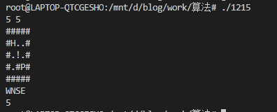
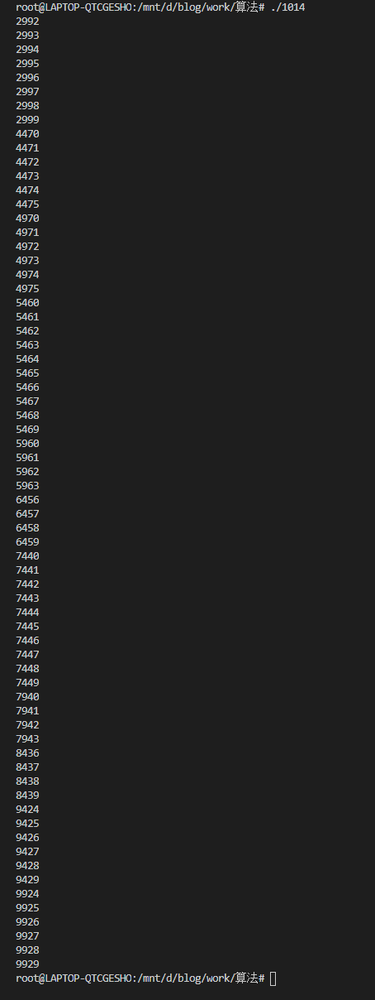

# 中山大学数据科学与计算机学院本科生实验报告

课程名称：**算法设计与分析**

任课教师：**张子臻**

|   年级   |    2018     | 专业（方向） |     软件工程     |
| :------: | :---------: | :----------: | :--------------: |
|   学号   |  18342075   |     姓名     |      米家龙      |
|   电话   | 18566916535 |    Email     | 781131011@qq.com |
| 开始日期 | 2020-07-09  |   完成日期   |    2020-07-10    |

## 第1题

### 1. 实验题目

1215 脱离地牢

### 2. 实验目的

熟悉并了解搜索的相关操作：

- 广度优先搜索 bfs
- 深度优先搜索 dfs

### 3. 程序设计

该题为最短路问题，并且每一步代价相同，可以通过搜索解决。

- 如果使用 dfs ，那么会因为“反复横跳”——两个位置来回移动可能导致无效操作太多（这点可以通过记录当前位置的状态来解决），并且由于步数最大为**255**，会使得递归层数过高导致内存开销大，运行时间长
- 使用 bfs ，通过循环进行搜索，通过时间增大减少内存开销

关于状态：由于 P 的每一步会影响到 `P` 和 `H` 两个的状态，因此状态的记录需要变成 `(Px, Py, Hx, Hy)` ，从而记录该位置的状态

相关定义：

```cpp
// 定义上下左右
#define UP 'N'
#define DOWN 'S'
#define LEFT 'W'
#define RIGHT 'E'

// 定义 墙|熔浆|通路
#define WALL '#'
#define MELT '!'
#define ROAD '.'

// 定义两个人
#define Paris 'P'
#define Helen 'H'

const int maxn = 21;
vector<string> map;                // 地图
int n, m;                          // 地图的行，列
const string MOVE_ACTION = "NSWE"; // 运动的操作
string H_way = "";                 // 表示 H 的运动
int res[maxn][maxn][maxn][maxn];   // 记录当前位置的状态

struct Node
{
  int Px, Py, Hx, Hy;

  // 初始化
  Node(int Px, int Py, int Hx, int Hy) : Px(Px), Py(Py), Hx(Hx), Hy(Hy) {}
};
queue<Node> q;

// 初始化储存状态的四维数组
void init()
{
  for (int i = 0; i < maxn; i++)
  {
    for (int j = 0; j < maxn; j++)
    {
      for (int k = 0; k < maxn; k++)
      {
        for (int l = 0; l < maxn; l++)
        {
          res[i][j][k][l] = -1;
          // cout << res[i][j][k][l] << ' ';
        }
      }
    }
  }
}
```

拿到地图后，需要寻找到 `P` 和 `H` 的坐标信息：

```cpp
void FindLocation(int &Px, int &Py, int &Hx, int &Hy, int n, int m)
{
  for (int i = 0; i < m; i++)
  {
    for (int j = 0; j < n; j++)
    {
      // cout << map[i][j] << endl;
      if (map[i][j] == Paris)
      {
        Px = i;
        Py = j;
        map[i][j] = '.'; // 清除位置
      }
      else if (map[i][j] == Helen)
      {
        Hx = i;
        Hy = j;
        map[i][j] = '.'; // 清除位置
      }
      if (Hx && Hy && Px && Py)
        return;
    }
  }
}
```

移动相关，用于计算横纵坐标的函数，定义**从上到下**为横坐标正方向，定义**从左往右**为纵坐标正方向：

```cpp
int goX(int x, char positon)
{
  int res = x;
  if (positon == UP)
  {
    res--;
    return res < 0 ? x : res; // 越界返回 x ，否则返回 res
  }
  if (positon == DOWN)
  {
    res++;
    return res >= n ? x : res; // 越界返回 x ，否则返回 res
  }
  return x; // 移动指令不匹配
}

int goY(int y, char position)
{
  int res = y;
  if (position == LEFT)
  {
    res--;
    return res < 0 ? y : res; // 越界返回 y ，否则返回 res
  }
  if (position == RIGHT)
  {
    res++;
    return res >= m ? y : res; // 越界返回 y ，否则返回 res
  }
  return y;
}
```

关于状态：
1. 对当前 `P` 位置的`上`、`下`、`左`、`右`四种方向进行循环
2. 在进行一个方向移动的时候，判断下一个位置是否能够到达
   - 如果能够达到，则通过 `H_way` 判断 `H` 的下一个位置是否能够到达
     - 如果是 `.` ，则可以到达，然后判断两者位置是否重合，是则返回结果，否则进行递归
     - 如果是 `!` ，则跳过，进入下一次循环
     - 如果是 `#` , 则不动，然后判断两者位置是否重合，是则返回结果，否则进行递归
   - 如果不能到达，则跳过，进入下一次循环

```cpp
int bfs(int Px, int Py, int Hx, int Hy)
{
  init();
  q.push(Node(Px, Py, Hx, Hy));
  res[Px][Py][Hx][Hy] = 0;
  while (!q.empty()) // 开始 bfs
  {
    Node node = q.front(); // 获取第一个
    q.pop();               // 同时删除掉
    for (int i = 0; i < MOVE_ACTION.length(); i++)
    {
      int newPx = goX(node.Px, MOVE_ACTION[i]);
      int newPy = goY(node.Py, MOVE_ACTION[i]);
      int newHx = goX(node.Hx, H_way[i]);
      int newHy = goY(node.Hy, H_way[i]);
      // printf("%d %d %d %d\n", newPx, newPy, newHx, newHy);

      if (map[newPx][newPy] == ROAD && map[newHx][newHy] != MELT) // 两人都能走
      {
        if (map[newHx][newHy] == WALL) // 如果 H 下一块是岩石, 则需要恢复到刚才的位置
        {
          newHx = node.Hx;
          newHy = node.Hy;
        }
        // printf("real : %d %d %d %d\n", newPx, newPy, newHx, newHy);
        if (make_pair(node.Px, node.Py) == make_pair(newHx, newHy) &&
                make_pair(node.Hx, node.Hy) == make_pair(newPx, newPy) ||
            make_pair(newPx, newPy) == make_pair(newHx, newHy)) // 如果下一步能够重合
        {
          // printf("%d %d %d %d %d\n", newPx, newPy, newHx, newHy, res[node.Px][node.Py][node.Hx][node.Hy] + 1);

          return res[node.Px][node.Py][node.Hx][node.Hy] + 1;
        }
        if (res[newPx][newPy][newHx][newHy] < 0) // 如果该状态没出现过
        {
          res[newPx][newPy][newHx][newHy] = res[node.Px][node.Py][node.Hx][node.Hy] + 1;
          q.push(Node(newPx, newPy, newHx, newHy));
        }
        // printf("saved: %d %d %d %d %d\n", newPx, newPy, newHx, newHy, res[newPx][newPy][newHx][newHy]);
      }
    }
  }

  return -1;
}
```

### 4. 程序运行与测试

运行样例：



在 Sicily 进行提交，会出现如下错误答案的报错，在第三个测试处报错，尚且不清楚原因所在：


### 5. 实验总结与心得

该题本质上就是个最短路，不过需要考虑修改状态的格式来储存位置的状态，同时减少无意义移动，但是对于第三个测试的输入，尚不清楚还需要考虑怎样的特殊情况

### 附录、提交文件清单

```cpp
#include <iostream>
#include <vector>
#include <queue>
#include <cstdio>

using namespace std;

// 定义上下左右
#define UP 'N'
#define DOWN 'S'
#define LEFT 'W'
#define RIGHT 'E'

// 定义 墙|熔浆|通路
#define WALL '#'
#define MELT '!'
#define ROAD '.'

// 定义两个人
#define Paris 'P'
#define Helen 'H'

const int maxn = 21;
vector<string> map;                // 地图
int n, m;                          // 地图的行，列
const string MOVE_ACTION = "NSWE"; // 运动的操作
string H_way = "";                 // 表示 H 的运动
int res[maxn][maxn][maxn][maxn];   // 记录当前位置的状态

struct Node
{
  int Px, Py, Hx, Hy;

  // 初始化
  Node(int Px, int Py, int Hx, int Hy) : Px(Px), Py(Py), Hx(Hx), Hy(Hy) {}
};
queue<Node> q;

int goX(int x, char positon)
{
  int res = x;
  if (positon == UP)
  {
    res--;
    return res < 0 ? x : res; // 越界返回 x ，否则返回 res
  }
  if (positon == DOWN)
  {
    res++;
    return res >= n ? x : res; // 越界返回 x ，否则返回 res
  }
  return x; // 移动指令不匹配
}

int goY(int y, char position)
{
  int res = y;
  if (position == LEFT)
  {
    res--;
    return res < 0 ? y : res; // 越界返回 y ，否则返回 res
  }
  if (position == RIGHT)
  {
    res++;
    return res >= m ? y : res; // 越界返回 y ，否则返回 res
  }
  return y;
}

// 寻找两个人的位置
void FindLocation(int &Px, int &Py, int &Hx, int &Hy, int n, int m)
{
  for (int i = 0; i < m; i++)
  {
    for (int j = 0; j < n; j++)
    {
      // cout << map[i][j] << endl;
      if (map[i][j] == Paris)
      {
        Px = i;
        Py = j;
        map[i][j] = '.'; // 清除位置
      }
      else if (map[i][j] == Helen)
      {
        Hx = i;
        Hy = j;
        map[i][j] = '.'; // 清除位置
      }
      if (Hx && Hy && Px && Py)
        return;
    }
  }
}

// 初始化储存状态的四维数组
void init()
{
  for (int i = 0; i < maxn; i++)
  {
    for (int j = 0; j < maxn; j++)
    {
      for (int k = 0; k < maxn; k++)
      {
        for (int l = 0; l < maxn; l++)
        {
          res[i][j][k][l] = -1;
          // cout << res[i][j][k][l] << ' ';
        }
      }
    }
  }
}

int bfs(int Px, int Py, int Hx, int Hy)
{
  init();
  q.push(Node(Px, Py, Hx, Hy));
  res[Px][Py][Hx][Hy] = 0;
  while (!q.empty()) // 开始 bfs
  {
    Node node = q.front(); // 获取第一个
    q.pop();               // 同时删除掉
    for (int i = 0; i < MOVE_ACTION.length(); i++)
    {
      int newPx = goX(node.Px, MOVE_ACTION[i]);
      int newPy = goY(node.Py, MOVE_ACTION[i]);
      int newHx = goX(node.Hx, H_way[i]);
      int newHy = goY(node.Hy, H_way[i]);
      // printf("%d %d %d %d\n", newPx, newPy, newHx, newHy);

      if (map[newPx][newPy] == ROAD && map[newHx][newHy] != MELT) // 两人都能走
      {
        if (map[newHx][newHy] == WALL) // 如果 H 下一块是岩石, 则需要恢复到刚才的位置
        {
          newHx = node.Hx;
          newHy = node.Hy;
        }
        // printf("real : %d %d %d %d\n", newPx, newPy, newHx, newHy);
        if (make_pair(node.Px, node.Py) == make_pair(newHx, newHy) &&
                make_pair(node.Hx, node.Hy) == make_pair(newPx, newPy) ||
            make_pair(newPx, newPy) == make_pair(newHx, newHy)) // 如果下一步能够重合
        {
          // printf("%d %d %d %d %d\n", newPx, newPy, newHx, newHy, res[node.Px][node.Py][node.Hx][node.Hy] + 1);

          return res[node.Px][node.Py][node.Hx][node.Hy] + 1;
        }
        if (res[newPx][newPy][newHx][newHy] < 0) // 如果该状态没出现过
        {
          res[newPx][newPy][newHx][newHy] = res[node.Px][node.Py][node.Hx][node.Hy] + 1;
          q.push(Node(newPx, newPy, newHx, newHy));
        }
        // printf("saved: %d %d %d %d %d\n", newPx, newPy, newHx, newHy, res[newPx][newPy][newHx][newHy]);
      }
    }
  }

  return -1;
}

int main()
{
  n = m = 0;
  cin >> n >> m;
  map.clear();
  for (int i = 0; i < n; i++)
  {
    string line = "";
    cin >> line;
    map.push_back(line);
  }

  cin >> H_way;
  int Hx, Hy, Px, Py;
  Px = Py = Hx = Hy = 0;
  FindLocation(Px, Py, Hx, Hy, n, m);

  int res = bfs(Px, Py, Hx, Hy);
  if (res == 0)
    cout << "Impossible" << endl;
  else
    cout << res << endl;
}
```

## 第2题

### 1. 实验题目

1014 Specialized Four-Dig

### 2. 实验目的

使用枚举简化搜索的操作与开销

### 3. 程序设计

由于只是对四位数进行判断，也就是从**1000~9999**，数据量不到1万，较小；而且判断该数10/12/16进制下的的四位之和，只需要做四次除法即可，因此可以直接进行枚举

计算 n 进制下的位数之和：

```cpp
int fourDig(int num, int tar)
{
  int res = 0;
  while (num != 0)
  {
    res += num % tar;
    num /= tar;
  }
  return res;
}
```

### 4. 程序运行与测试

由于没有输入，直接运行查看输出



并且在 Sicily 提交能够通过

### 5. 实验总结与心得

总体比较简单，只需要对每个数进行判断即可，可以通过对函数进行拓展化，只用一个函数就可以实现多种进制的转换

### 附录、提交文件清单

```cpp
#include <iostream>

using namespace std;

int fourDig(int num, int tar)
{
  int res = 0;
  while (num != 0)
  {
    res += num % tar;
    num /= tar;
  }
  return res;
}

int main()
{
  for (int i = 1000; i < 10000; i++)
  {
    int ten = fourDig(i, 10);
    int twe = fourDig(i, 12);
    int hex = fourDig(i, 16);
    if (ten == twe && twe == hex && ten == hex)
      cout << i << endl;
  }
  return 0;
}
```

## 第3题

### 1. 实验题目

1709 PropBot

### 2. 实验目的

使用枚举简化搜索的操作与开销

### 3. 程序设计

由于时间最多24秒，所有的可能性最多为 $2^{24}$ ，如果使用循环进行 bfs 的话，可能花费时间过于多，不能够满足时间限制，于是选择使用递归进行相关的计算

相关定义：

```cpp
const int maxt = 24;                                                                                                                                 // 好像没什么用
double tarX, tarY;                                                                                                                                   // 代表目标位置
double betweenMin;                                                                                                                                   // 结果
const double fourFive = sqrt(2) / 2;                                                                                                                 // 45度计算用
const double angles[][2] = 
{
  {0, 1}, 
  {fourFive, fourFive}, 
  {1, 0}, 
  {fourFive, -fourFive}, 
  {0, -1}, 
  {-fourFive, fourFive}, 
  {-1, 0}, 
  {-1, fourFive}
};   // 定义角度，0~7
```

递归的操作：

- 如果剩余时间为0，终止递归，返回两点之间的距离
- 如果剩余时间不为0
  - 选择以当前角度向前移动，横纵坐标分别加上增量，然后进行下一次递归调用
  - 选择顺时针旋转，角度增加45度，进行下一次递归

函数如下图：

```cpp
void prop(double x, double y, int angle, int leftTime)
{
  if (leftTime == 0)
  {
    double res = sqrt(pow(abs(x - tarX), 2) + pow(abs(y - tarY), 2));
    // printf("x = %.6lf y = %.6lf between = %.6lf\n", x, y, res);
    betweenMin = betweenMin < res ? betweenMin : res;
    // return sqrt(pow(abs(x - tarX), 2) + pow(abs(y - tarY), 2));
  }
  // return sqrt(pow(abs(x - tarX), 2) + pow(abs(y - tarY), 2));
  else
  {
    double newX = x + 10 * angles[angle][0];
    double newY = y + 10 * angles[angle][1];
    prop(newX, newY, angle, leftTime - 1);
    prop(x, y, (angle + 1) % 8, leftTime - 1);
    // return goAhead < anglePlus ? goAhead : anglePlus;
  }
}
```

在通过样例测试之后，在 Sicily 提交会 WA ，经同学提醒后发现是计算机在做数值计算后会因为截断误差的累积，最终造成了答案的错误，因此，应该将八个方向设置为4个轴，其中2个轴用于储存45度角相关，另外两个为 x y 轴，并对其进行量化的储存，最后才进行计算，从而避免累积的截断误差。

对 `prop()` 函数进行优化，优化后代码如下

```cpp
const double angles_opt[][4] = {{0, 1, 0, 0}, {0, 0, 1, 0}, {1, 0, 0, 0}, {0, 0, 0, -1}, {0, -1, 0, 0}, {0, 0, -1, 0}, {-1, 0, 0, 0}, {0, 0, 0, 1}}; // 定义角度，0~7 优化后

void prop_opt(double x, double y, int a, int b, int angle, int leftTime)
{
  if (leftTime == 0)
  {
    double finalX = (x + (a - b) * fourFive) * 10; // 最终的横坐标
    double finalY = (y + (b + a) * fourFive) * 10; // 最终的纵坐标
    double res = sqrt(pow(abs(finalX - tarX), 2) + pow(abs(finalY - tarY), 2));
    betweenMin = betweenMin < res ? betweenMin : res;
  }
  // return sqrt(pow(abs(x - tarX), 2) + pow(abs(y - tarY), 2));
  else
  {
    double newX = x + angles_opt[angle][0];
    double newY = y + angles_opt[angle][1];
    double newA = a + angles_opt[angle][2];
    double newB = b + angles_opt[angle][3];
    prop_opt(newX, newY, newA, newB, angle, leftTime - 1);
    prop_opt(x, y, a, b, (angle + 1) % 8, leftTime - 1);
    // return goAhead < anglePlus ? goAhead : anglePlus;
  }
}
```

### 4. 程序运行与测试

使用样例进行测试：


在第一个样例中，可以明显感受出计算时间较长（约半秒），说明递归深度较大，但仍能够满足题目限制

使用修改后的 `prop_opt()` 函数在 Sicily 进行提交后能够通过

### 5. 实验总结与心得

该题由于由于选项和层数较少，因此可以暴力枚举做出，然而使用了递归，在层数过大的时候可以直接感受出运行时间的增长。

最主要的问题其实还是在误差上，如何减少截断误差本该是一个比较基础的常识，这次犯了这样的错误后，应该吸取教训

### 附录、提交文件清单

```cpp
#include <iostream>
#include <math.h>
#include <queue>

using namespace std;

const int maxt = 24;                                                                                                                                 // 好像没什么用
double tarX, tarY;                                                                                                                                   // 代表目标位置
double betweenMin;                                                                                                                                   // 结果
const double fourFive = sqrt(2) / 2;                                                                                                                 // 45度计算用
const double angles[][2] = {{0, 1}, {fourFive, fourFive}, {1, 0}, {fourFive, -fourFive}, {0, -1}, {-fourFive, fourFive}, {-1, 0}, {-1, fourFive}};   // 定义角度，0~7
const double angles_opt[][4] = {{0, 1, 0, 0}, {0, 0, 1, 0}, {1, 0, 0, 0}, {0, 0, 0, -1}, {0, -1, 0, 0}, {0, 0, -1, 0}, {-1, 0, 0, 0}, {0, 0, 0, 1}}; // 定义角度，0~7 优化后

void prop(double x, double y, int angle, int leftTime)
{
  if (leftTime == 0)
  {
    double res = sqrt(pow(abs(x - tarX), 2) + pow(abs(y - tarY), 2));
    // printf("x = %.6lf y = %.6lf between = %.6lf\n", x, y, res);
    betweenMin = betweenMin < res ? betweenMin : res;
    // return sqrt(pow(abs(x - tarX), 2) + pow(abs(y - tarY), 2));
  }
  // return sqrt(pow(abs(x - tarX), 2) + pow(abs(y - tarY), 2));
  else
  {
    double newX = x + 10 * angles[angle][0];
    double newY = y + 10 * angles[angle][1];
    prop(newX, newY, angle, leftTime - 1);
    prop(x, y, (angle + 1) % 8, leftTime - 1);
    // return goAhead < anglePlus ? goAhead : anglePlus;
  }
}

void prop_opt(double x, double y, int a, int b, int angle, int leftTime)
{
  if (leftTime == 0)
  {
    double finalX = (x + (a - b) * fourFive) * 10; // 最终的横坐标
    double finalY = (y + (b + a) * fourFive) * 10; // 最终的纵坐标
    double res = sqrt(pow(abs(finalX - tarX), 2) + pow(abs(finalY - tarY), 2));
    betweenMin = betweenMin < res ? betweenMin : res;
  }
  // return sqrt(pow(abs(x - tarX), 2) + pow(abs(y - tarY), 2));
  else
  {
    double newX = x + angles_opt[angle][0];
    double newY = y + angles_opt[angle][1];
    double newA = a + angles_opt[angle][2];
    double newB = b + angles_opt[angle][3];
    prop_opt(newX, newY, newA, newB, angle, leftTime - 1);
    prop_opt(x, y, a, b, (angle + 1) % 8, leftTime - 1);
    // return goAhead < anglePlus ? goAhead : anglePlus;
  }
}

int main()
{
  int n;
  cin >> n;
  for (int i = 0; i < n; i++)
  {
    int leftTime;
    cin >> leftTime >> tarX >> tarY;
    betweenMin = sqrt(pow(abs(tarX), 2) + pow(abs(tarY), 2));
    // bfs(0, 0, leftTime);
    // printf("%.6lf\n", betweenMin);
    prop_opt(0, 0, 0, 0, 2, leftTime);
    printf("%.6lf\n", betweenMin);
  }
}

/*
2
24 5.0 5.0
9 7.0 17.0

0.502525
0.100505
*/
```